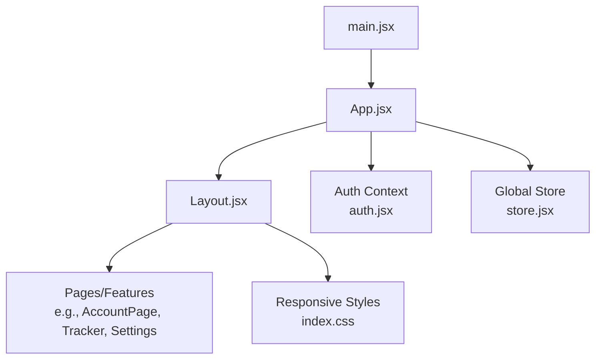
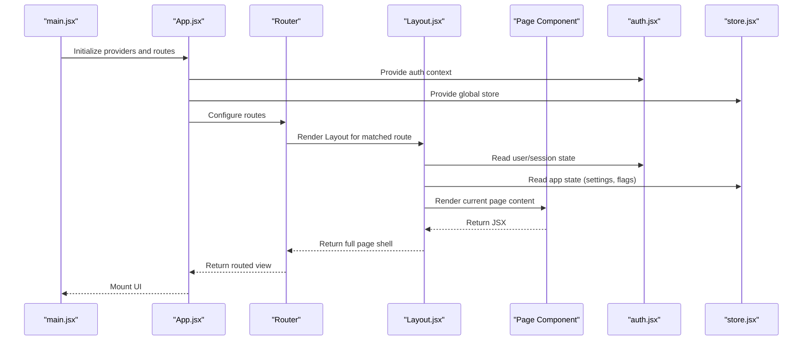
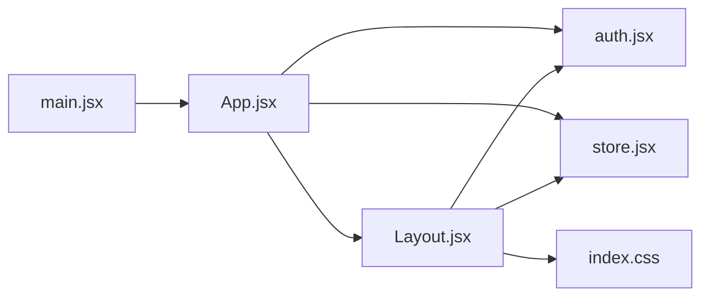

# Layout Components

<cite>
**Referenced Files in This Document**
- [Layout.jsx](file://src/components/Layout.jsx)
- [App.jsx](file://src/App.jsx)
- [main.jsx](file://src/main.jsx)
- [store.jsx](file://src/store.jsx)
- [auth.jsx](file://src/auth.jsx)
- [index.css](file://src/index.css)
</cite>

## Table of Contents
1. [Introduction](#introduction)
2. [Project Structure](#project-structure)
3. [Core Components](#core-components)
4. [Architecture Overview](#architecture-overview)
5. [Detailed Component Analysis](#detailed-component-analysis)
6. [Dependency Analysis](#dependency-analysis)
7. [Performance Considerations](#performance-considerations)
8. [Troubleshooting Guide](#troubleshooting-guide)
9. [Conclusion](#conclusion)

## Introduction
This document explains the Layout components in ApplyGuard PH with a focus on the main Layout component that wraps all application pages. It covers structure, navigation integration, responsive design patterns, global state and context usage, routing behavior, and how child components are rendered within the layout. The goal is to help both new and experienced contributors understand how consistent UI patterns are provided across the app and how mobile-responsive behavior is implemented.

## Project Structure
The Layout-related code resides under src/components and integrates with the application entry points and global store:
- Application entry point initializes providers and routes
- App orchestrates authentication and page-level routing
- Layout provides the shell for pages (header, navigation, content area, footer)
- Global store and auth context supply shared state consumed by the layout and pages
- CSS defines responsive styles used by the layout

**Diagram sources**
- [main.jsx](file://src/main.jsx)
- [App.jsx](file://src/App.jsx)
- [Layout.jsx](file://src/components/Layout.jsx)
- [auth.jsx](file://src/auth.jsx)
- [store.jsx](file://src/store.jsx)
- [index.css](file://src/index.css)

**Section sources**
- [main.jsx](file://src/main.jsx)
- [App.jsx](file://src/App.jsx)
- [Layout.jsx](file://src/components/Layout.jsx)
- [store.jsx](file://src/store.jsx)
- [auth.jsx](file://src/auth.jsx)
- [index.css](file://src/index.css)

## Core Components
- Layout component
  - Primary wrapper for all pages
  - Provides header, navigation menu, main content area, and optional footer
  - Integrates with routing to render current page content
  - Applies responsive behaviors for mobile and desktop
  - Consumes global state (e.g., user session, theme, feature flags) via context or store hooks
- App component
  - Sets up providers (auth, store) and top-level routing
  - Guards routes based on authentication state
  - Renders Layout around route-matched pages
- Auth context
  - Supplies user session and auth actions consumed by Layout (e.g., showing login/logout controls)
- Global store
  - Holds application-wide state consumed by Layout (e.g., settings, notifications)

Key responsibilities:
- Consistent chrome across pages (header, nav, content container)
- Navigation integration (active link highlighting, route transitions)
- Responsive layout (collapsible sidebar/menu on small screens)
- State-driven UI (show/hide sections based on auth and store values)

**Section sources**
- [Layout.jsx](file://src/components/Layout.jsx)
- [App.jsx](file://src/App.jsx)
- [auth.jsx](file://src/auth.jsx)
- [store.jsx](file://src/store.jsx)
- [index.css](file://src/index.css)

## Architecture Overview
The Layout sits at the root of the UI tree. App configures providers and routes; Layout renders the persistent shell and delegates page rendering to routed components.

**Diagram sources**
- [main.jsx](file://src/main.jsx)
- [App.jsx](file://src/App.jsx)
- [Layout.jsx](file://src/components/Layout.jsx)
- [auth.jsx](file://src/auth.jsx)
- [store.jsx](file://src/store.jsx)

## Detailed Component Analysis

### Layout Component
Responsibilities:
- Wraps all pages with consistent header, navigation, and content area
- Manages navigation state (e.g., active link, mobile menu toggle)
- Integrates with routing to render children
- Applies responsive classes and layout containers
- Consumes global state from auth and store contexts/hooks

Structure overview:
- Header bar with logo/title and actions (e.g., profile, settings)
- Navigation menu (desktop sidebar or top nav; collapsible on mobile)
- Main content region where routed pages are rendered
- Optional footer with links or status

Navigation integration:
- Uses router primitives to detect current path and highlight active items
- Supports programmatic navigation for actions like “Go to Dashboard”
- Maintains collapsed/expanded state for mobile drawer

Responsive behavior:
- Uses CSS media queries and utility classes to switch between desktop and mobile layouts
- Collapses navigation into a drawer or bottom bar on small screens
- Adjusts spacing and typography for readability on mobile

State and context usage:
- Reads user/session info from auth context to show appropriate header actions
- Subscribes to store state for features like dark mode, language, or notifications
- Updates local UI state for menu open/close and scroll position if needed

Child rendering:
- Renders children prop (the currently matched page) inside the content area
- Ensures consistent padding, margins, and max-width constraints

Example usage pattern:
- Wrap route elements with Layout so every page inherits the shell
- Pass props to control header visibility or navigation variants when necessary

**Section sources**
- [Layout.jsx](file://src/components/Layout.jsx)
- [index.css](file://src/index.css)

### App Component
Responsibilities:
- Initializes providers (auth, store) and sets up routing
- Guards routes based on authentication
- Renders Layout around protected routes
- Handles initial loading and error boundaries if present

Routing and guards:
- Defines public vs. protected routes
- Redirects unauthenticated users to login
- Preserves intended destination after login

Provider wiring:
- Wraps entire app with auth context provider
- Wraps with global store provider
- Ensures Layout has access to these contexts

**Section sources**
- [App.jsx](file://src/App.jsx)
- [auth.jsx](file://src/auth.jsx)
- [store.jsx](file://src/store.jsx)

### Auth Context
Responsibilities:
- Exposes user session, login/logout methods, and loading/error states
- Used by Layout to conditionally render header actions and navigation items

Integration points:
- Layout reads current user and toggles UI accordingly
- Protected routes check auth before rendering

**Section sources**
- [auth.jsx](file://src/auth.jsx)
- [Layout.jsx](file://src/components/Layout.jsx)
- [App.jsx](file://src/App.jsx)

### Global Store
Responsibilities:
- Centralized state for app-wide settings, feature flags, and UI preferences
- Consumed by Layout for things like theme, language, notification badges

Integration points:
- Layout subscribes to relevant slices of state
- Actions dispatched from Layout update global UI state

**Section sources**
- [store.jsx](file://src/store.jsx)
- [Layout.jsx](file://src/components/Layout.jsx)

### Responsive Design Patterns
Patterns used:
- CSS media queries to adjust layout at breakpoints
- Utility classes for spacing, grid, and flexbox
- Drawer-style navigation on mobile
- Content width constraints for readability

Implementation notes:
- Layout applies responsive classes to the root container
- Navigation switches between sidebar and drawer based on viewport
- Touch-friendly targets and spacing on mobile

**Section sources**
- [index.css](file://src/index.css)
- [Layout.jsx](file://src/components/Layout.jsx)

## Dependency Analysis
High-level dependencies among layout-related modules:

**Diagram sources**
- [main.jsx](file://src/main.jsx)
- [App.jsx](file://src/App.jsx)
- [Layout.jsx](file://src/components/Layout.jsx)
- [auth.jsx](file://src/auth.jsx)
- [store.jsx](file://src/store.jsx)
- [index.css](file://src/index.css)

**Section sources**
- [main.jsx](file://src/main.jsx)
- [App.jsx](file://src/App.jsx)
- [Layout.jsx](file://src/components/Layout.jsx)
- [auth.jsx](file://src/auth.jsx)
- [store.jsx](file://src/store.jsx)
- [index.css](file://src/index.css)

## Performance Considerations
- Keep Layout lightweight; avoid heavy computations in render
- Memoize expensive subcomponents and derived values
- Use lazy loading for non-critical route chunks
- Debounce resize handlers if listening to window events
- Prefer CSS-based responsive changes over JS toggling when possible
- Minimize re-renders by selecting only required store slices

[No sources needed since this section provides general guidance]

## Troubleshooting Guide
Common issues and checks:
- Routes not rendering inside Layout
  - Ensure Layout wraps route elements and children are passed correctly
  - Verify router configuration and route paths
- Navigation not highlighting active item
  - Confirm current path detection logic matches route definitions
  - Check for case sensitivity or trailing slash differences
- Mobile menu not opening/closing
  - Validate event handlers and state updates
  - Inspect z-index and overlay styles
- Header actions not reflecting auth state
  - Ensure auth context is provided above Layout
  - Check loading state handling during initial auth resolution
- Styles not applying on mobile
  - Verify media query breakpoints match device widths
  - Confirm CSS import order and specificity

**Section sources**
- [Layout.jsx](file://src/components/Layout.jsx)
- [App.jsx](file://src/App.jsx)
- [auth.jsx](file://src/auth.jsx)
- [index.css](file://src/index.css)

## Conclusion
The Layout component is the backbone of ApplyGuard PH’s UI consistency. It centralizes navigation, responsive behavior, and global state consumption while delegating page-specific rendering to routed components. By keeping Layout focused on shell concerns and leveraging context/store for shared state, the app maintains a clean separation of concerns and a predictable structure for adding new pages and features.

[No sources needed since this section summarizes without analyzing specific files]