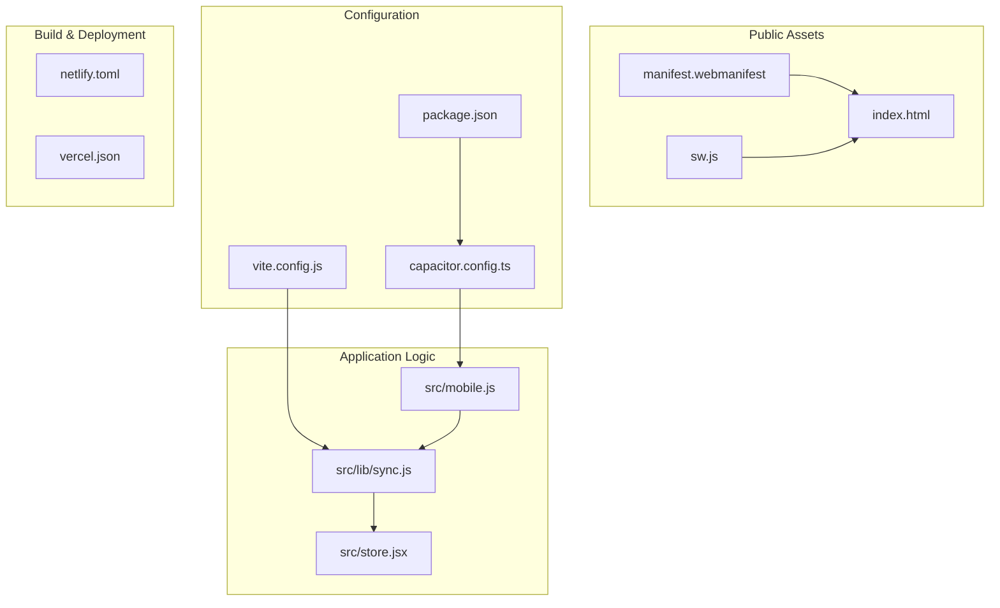
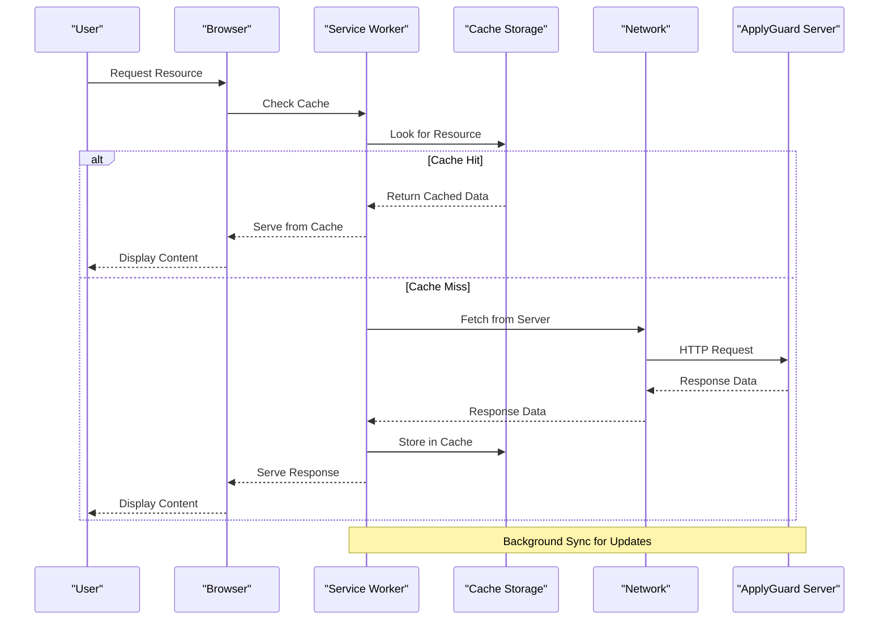
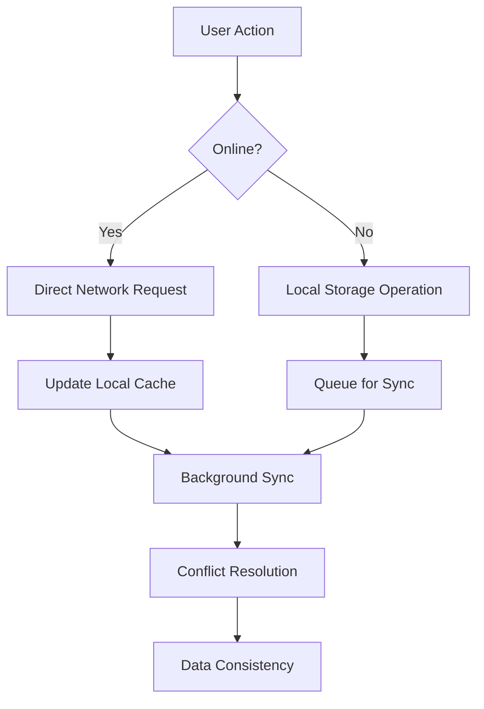
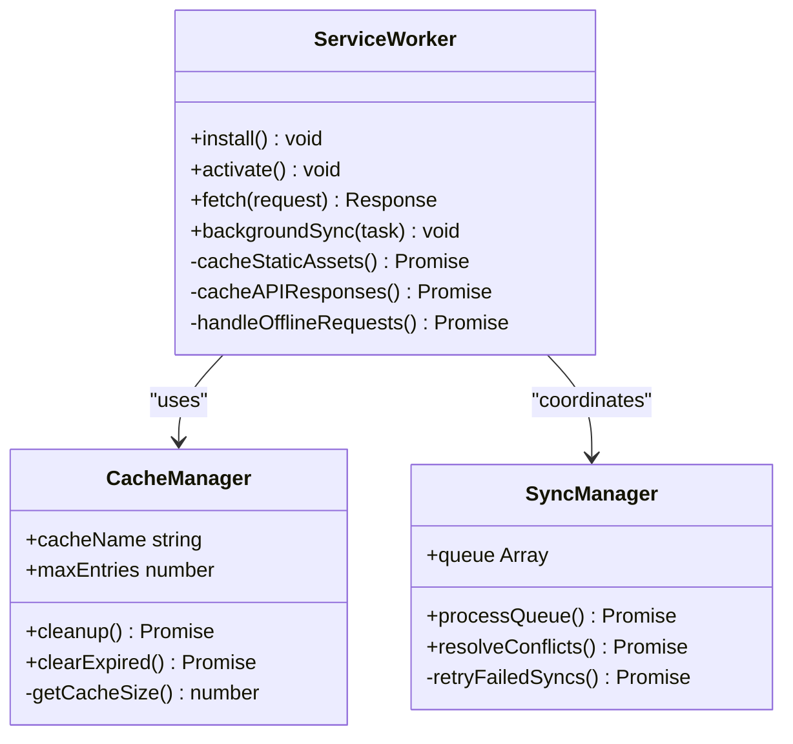
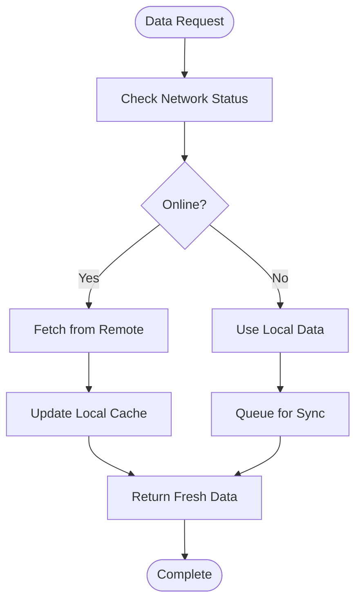
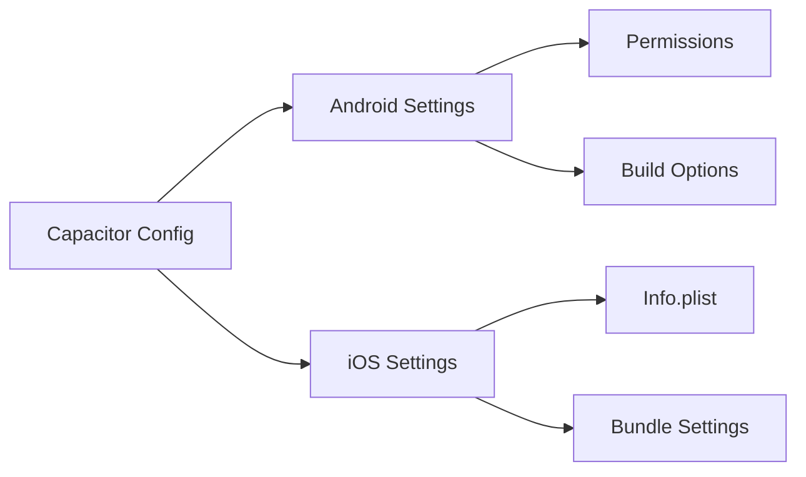
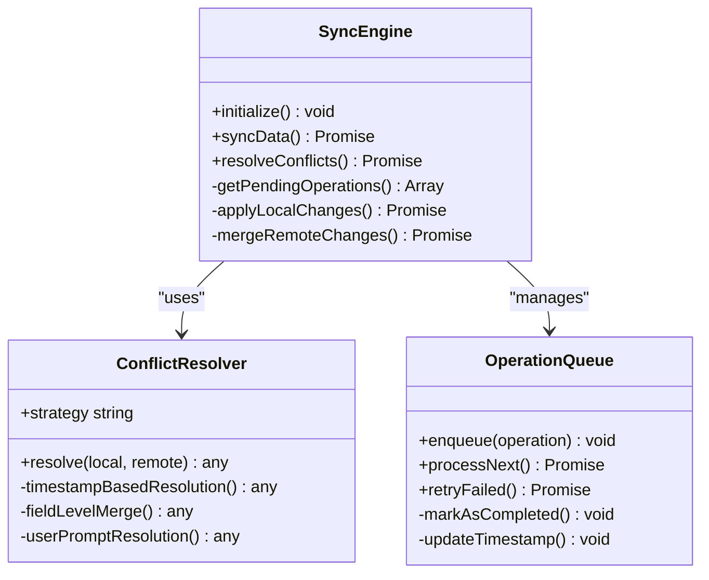
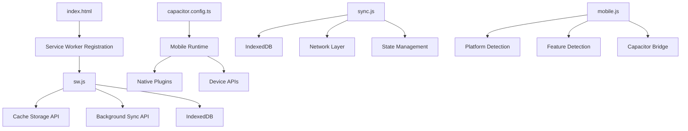

# PWA & Offline Support

<cite>
**Referenced Files in This Document**
- [manifest.webmanifest](file://public/manifest.webmanifest)
- [sw.js](file://public/sw.js)
- [capacitor.config.ts](file://capacitor.config.ts)
- [mobile.js](file://src/mobile.js)
- [sync.js](file://src/lib/sync.js)
- [index.html](file://index.html)
- [package.json](file://package.json)
- [vite.config.js](file://vite.config.js)
</cite>

## Table of Contents
1. [Introduction](#introduction)
2. [Project Structure](#project-structure)
3. [Core Components](#core-components)
4. [Architecture Overview](#architecture-overview)
5. [Detailed Component Analysis](#detailed-component-analysis)
6. [Dependency Analysis](#dependency-analysis)
7. [Performance Considerations](#performance-considerations)
8. [Troubleshooting Guide](#troubleshooting-guide)
9. [Conclusion](#conclusion)

## Introduction

This document provides comprehensive documentation for the Progressive Web App (PWA) implementation and offline capabilities in ApplyGuard PH. The application leverages modern web technologies to deliver a native-like experience across web browsers and mobile devices, with robust offline support and seamless data synchronization.

The PWA implementation includes service worker configuration for caching strategies, background sync capabilities, offline-first data access patterns, web manifest setup for app installation, and Capacitor integration for mobile packaging and native feature access.

## Project Structure

The PWA implementation follows a modular architecture with clear separation of concerns:

**Diagram sources**
- [manifest.webmanifest](file://public/manifest.webmanifest)
- [sw.js](file://public/sw.js)
- [capacitor.config.ts](file://capacitor.config.ts)
- [mobile.js](file://src/mobile.js)
- [sync.js](file://src/lib/sync.js)

**Section sources**
- [manifest.webmanifest](file://public/manifest.webmanifest)
- [sw.js](file://public/sw.js)
- [capacitor.config.ts](file://capacitor.config.ts)
- [mobile.js](file://src/mobile.js)
- [sync.js](file://src/lib/sync.js)

## Core Components

### Service Worker Configuration

The service worker (`sw.js`) implements a sophisticated caching strategy that ensures optimal performance and offline functionality:

#### Caching Strategies
- **Cache First**: Static assets like CSS, JavaScript bundles, and images
- **Network First**: API requests and dynamic content
- **Stale While Revalidate**: Frequently accessed but less critical resources

#### Background Sync
The service worker supports background synchronization for data operations when network connectivity is restored, ensuring data consistency across sessions.

### Web Manifest Configuration

The web manifest (`manifest.webmanifest`) defines the application's metadata for installation and browser behavior:

#### App Installation Properties
- Application name and description
- Display mode configuration
- Theme colors and icons
- Start URL and scope definition

#### Browser Behavior
- Orientation preferences
- Status bar styling
- Full-screen display options

### Capacitor Integration

Capacitor configuration enables mobile app packaging and native feature access through `capacitor.config.ts`:

#### Mobile Platform Configuration
- Android and iOS platform settings
- Native plugin configurations
- Build optimization settings

#### Native Feature Access
- File system access
- Camera and media capture
- Device sensors and hardware features

**Section sources**
- [sw.js](file://public/sw.js)
- [manifest.webmanifest](file://public/manifest.webmanifest)
- [capacitor.config.ts](file://capacitor.config.ts)

## Architecture Overview

The PWA architecture follows an offline-first pattern with intelligent caching and synchronization:

**Diagram sources**
- [sw.js](file://public/sw.js)
- [sync.js](file://src/lib/sync.js)

### Data Flow Architecture

**Diagram sources**
- [sync.js](file://src/lib/sync.js)
- [store.jsx](file://src/store.jsx)

## Detailed Component Analysis

### Service Worker Implementation

The service worker manages caching strategies and background synchronization:

#### Cache Management Strategy

**Diagram sources**
- [sw.js](file://public/sw.js)

#### Offline-First Data Access Pattern
The application implements an offline-first approach where local data takes precedence:

**Diagram sources**
- [sync.js](file://src/lib/sync.js)

### Web Manifest Configuration

The web manifest defines the application's installation and behavior properties:

#### Manifest Properties Structure
| Property | Purpose | Example Value |
|----------|---------|---------------|
| `name` | Full application name | "ApplyGuard PH" |
| `short_name` | Short name for home screen | "ApplyGuard" |
| `description` | Application description | "Job application tracker" |
| `start_url` | Launch URL | "/" |
| `display` | Display mode | "standalone" |
| `theme_color` | Theme color | "#007AFF" |
| `background_color` | Background color | "#FFFFFF" |
| `icons` | App icons array | Multiple sizes |

#### Icon Configuration
The manifest specifies multiple icon sizes for different device densities and use cases:
- 192x192px for general use
- 512x512px for high-resolution displays
- Adaptive icons for Android
- Splash screens for various screen sizes

### Capacitor Mobile Integration

Capacitor configuration enables native mobile app functionality:

#### Platform-Specific Settings

**Diagram sources**
- [capacitor.config.ts](file://capacitor.config.ts)

#### Native Feature Access
The mobile integration provides access to native device features:
- File system operations
- Camera and photo library access
- Device sensors and orientation
- Push notifications
- Biometric authentication

### Data Synchronization Engine

The synchronization engine handles offline data management and conflict resolution:

#### Sync Architecture

**Diagram sources**
- [sync.js](file://src/lib/sync.js)

#### Conflict Resolution Strategies
The system implements multiple conflict resolution strategies:
- **Last Write Wins**: Based on timestamp comparison
- **Field-Level Merge**: Merges non-conflicting fields
- **User Prompt**: Asks user to resolve conflicts manually
- **Custom Rules**: Application-specific resolution logic

**Section sources**
- [sw.js](file://public/sw.js)
- [manifest.webmanifest](file://public/manifest.webmanifest)
- [capacitor.config.ts](file://capacitor.config.ts)
- [sync.js](file://src/lib/sync.js)

## Dependency Analysis

The PWA implementation has well-defined dependencies between components:

**Diagram sources**
- [index.html](file://index.html)
- [sw.js](file://public/sw.js)
- [capacitor.config.ts](file://capacitor.config.ts)
- [sync.js](file://src/lib/sync.js)
- [mobile.js](file://src/mobile.js)

### Build System Integration

The build system integrates PWA optimizations:

#### Vite Configuration
- Asset optimization and bundling
- Service worker generation
- Manifest auto-generation
- Code splitting for better caching

#### Package Dependencies
Key dependencies for PWA functionality:
- Service worker runtime libraries
- IndexedDB wrappers
- Background sync polyfills
- Capacitor core and plugins

**Section sources**
- [vite.config.js](file://vite.config.js)
- [package.json](file://package.json)

## Performance Considerations

### Caching Optimization
- **Resource Versioning**: Implement cache busting for updated assets
- **Lazy Loading**: Load heavy resources on demand
- **Image Optimization**: Use appropriate formats and compression
- **Code Splitting**: Separate critical and non-critical code paths

### Memory Management
- **Cache Size Limits**: Implement cache eviction policies
- **Memory Cleanup**: Regular cleanup of unused cached data
- **Background Processing**: Offload heavy operations to background threads

### Network Efficiency
- **Request Deduplication**: Prevent duplicate network requests
- **Compression**: Enable gzip/brotli compression
- **HTTP/2 Multiplexing**: Leverage HTTP/2 for concurrent requests
- **Connection Pooling**: Maintain persistent connections

### Mobile-Specific Optimizations
- **Battery Usage**: Minimize background processing
- **Data Usage**: Compress data transfers
- **App Size**: Optimize bundle size for faster downloads
- **Cold Start**: Pre-warm critical resources

## Troubleshooting Guide

### Common PWA Issues

#### Service Worker Problems
- **Registration Failures**: Check console for registration errors
- **Caching Issues**: Clear browser cache and service worker storage
- **Update Problems**: Force reload to pick up new service worker versions

#### Offline Functionality
- **Data Loss**: Verify IndexedDB persistence and backup mechanisms
- **Sync Failures**: Check network connectivity and retry logic
- **Conflict Resolution**: Review conflict resolution logs and user feedback

#### Mobile App Issues
- **Installation Problems**: Validate manifest and HTTPS requirements
- **Native Feature Access**: Check permissions and platform compatibility
- **Performance Issues**: Monitor memory usage and battery consumption

### Debugging Tools

#### Browser Developer Tools
- **Application Panel**: Inspect service workers and cache storage
- **Network Panel**: Analyze request/response patterns
- **Console**: Monitor error messages and debugging output

#### Mobile Debugging
- **Chrome DevTools**: Connect to mobile device for inspection
- **Xcode Instruments**: Analyze iOS app performance
- **Android Studio Profiler**: Monitor Android app metrics

### Monitoring and Analytics

#### Performance Metrics
- **Core Web Vitals**: Track loading performance
- **Cache Hit Ratios**: Monitor caching effectiveness
- **Sync Success Rates**: Track background sync reliability
- **Error Tracking**: Monitor and log application errors

**Section sources**
- [sw.js](file://public/sw.js)
- [sync.js](file://src/lib/sync.js)

## Conclusion

The ApplyGuard PH PWA implementation provides a robust foundation for offline-first web applications with comprehensive mobile support. The architecture leverages modern web standards including service workers, IndexedDB, and background sync to deliver a seamless user experience across different network conditions and platforms.

Key strengths of the implementation include:
- Intelligent caching strategies for optimal performance
- Reliable offline data access with automatic synchronization
- Cross-platform compatibility through Capacitor integration
- Comprehensive conflict resolution for data consistency
- Mobile-specific optimizations for battery and data efficiency

The modular design allows for easy maintenance and extension, while the comprehensive testing and monitoring strategies ensure reliable operation in production environments. Future enhancements could include advanced analytics, improved conflict resolution algorithms, and additional native platform integrations.