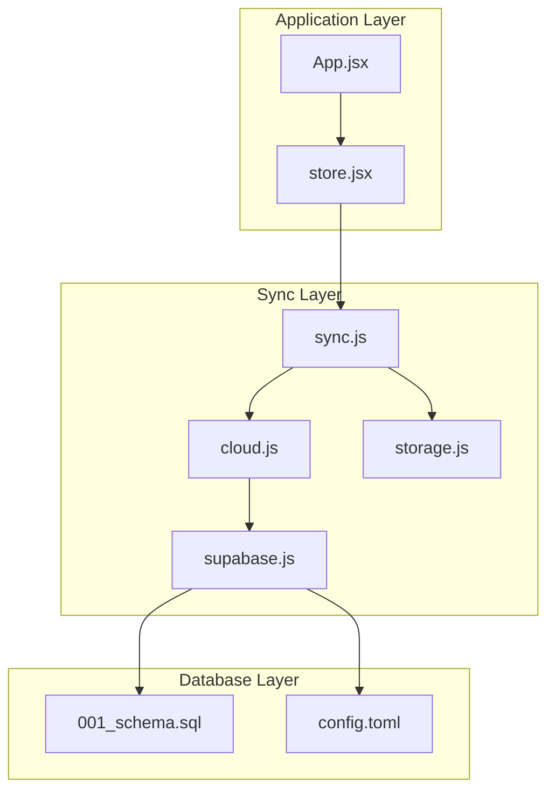
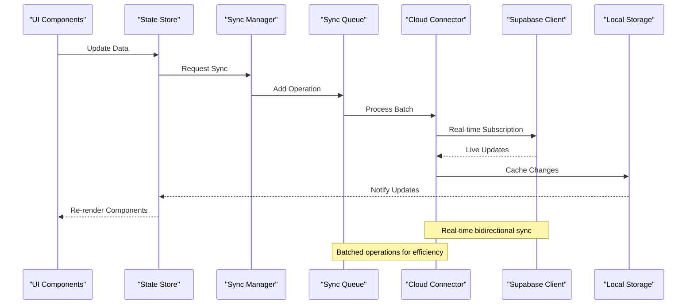
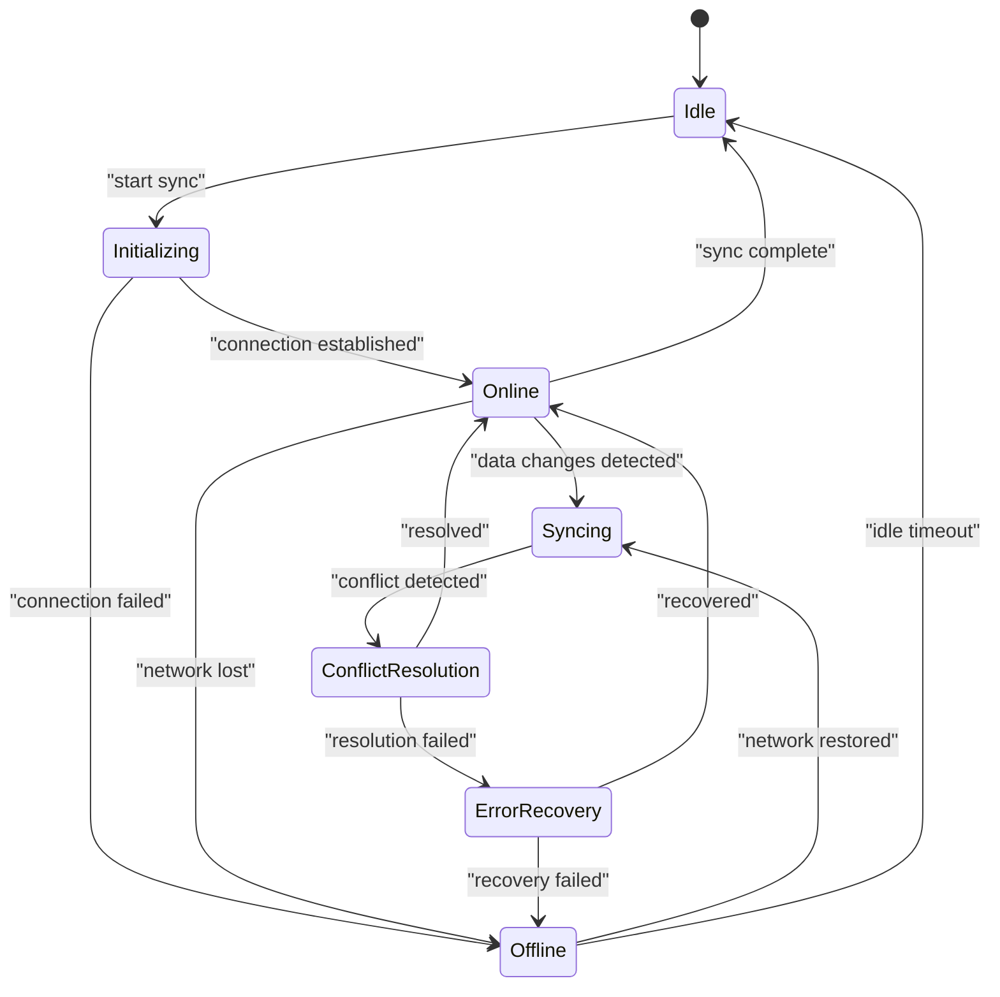
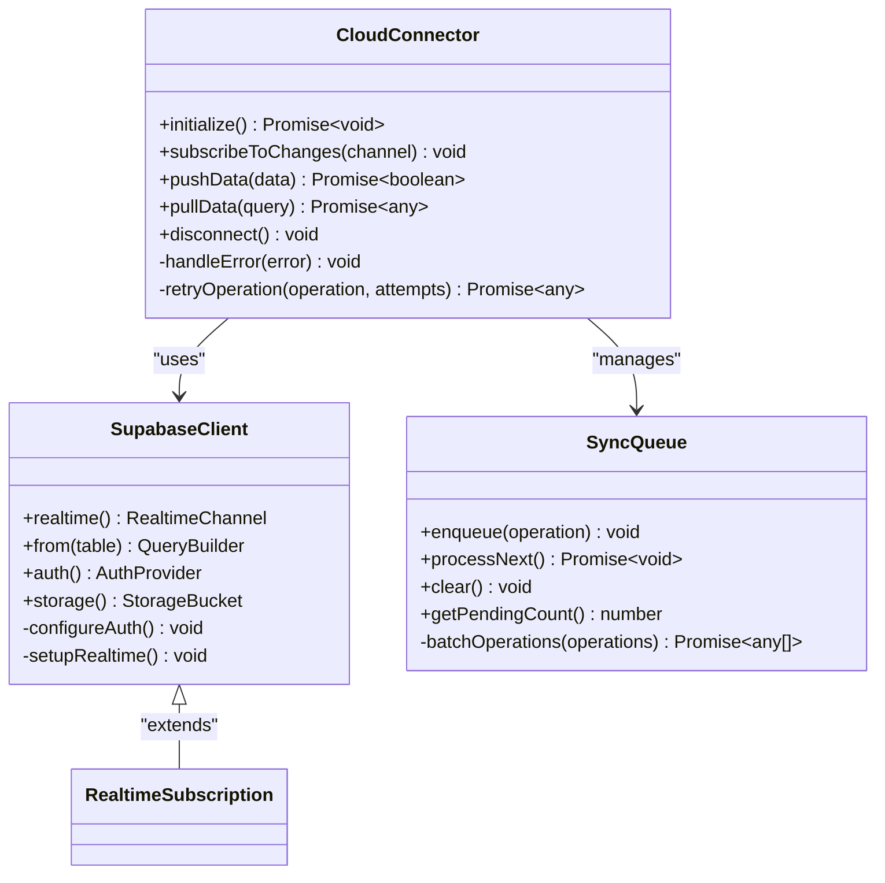
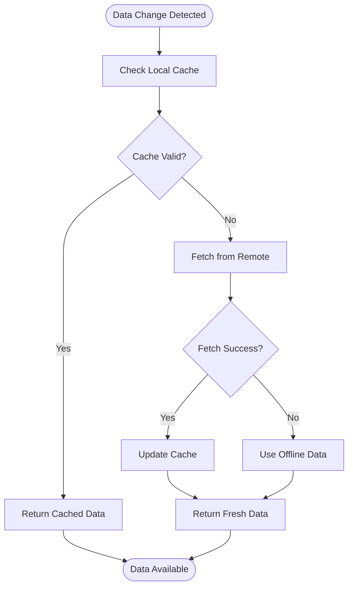
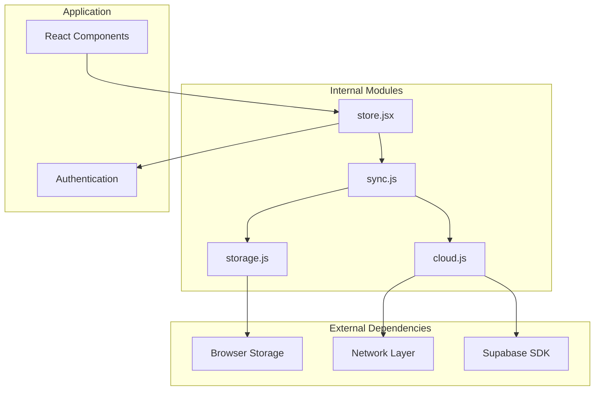

# Cloud Synchronization

<cite>
**Referenced Files in This Document**
- [sync.js](file://src/lib/sync.js)
- [cloud.js](file://src/lib/cloud.js)
- [supabase.js](file://src/lib/supabase.js)
- [storage.js](file://src/lib/storage.js)
- [store.jsx](file://src/store.jsx)
- [App.jsx](file://src/App.jsx)
- [config.toml](file://supabase/config.toml)
- [001_schema.sql](file://supabase/migrations/001_schema.sql)
</cite>

## Table of Contents
1. [Introduction](#introduction)
2. [Project Structure](#project-structure)
3. [Core Components](#core-components)
4. [Architecture Overview](#architecture-overview)
5. [Detailed Component Analysis](#detailed-component-analysis)
6. [Dependency Analysis](#dependency-analysis)
7. [Performance Considerations](#performance-considerations)
8. [Troubleshooting Guide](#troubleshooting-guide)
9. [Conclusion](#conclusion)

## Introduction

The ApplyGuard PH cloud synchronization system provides real-time data synchronization between local device storage and Supabase cloud infrastructure. This system ensures data consistency across multiple devices while maintaining offline functionality through intelligent caching and conflict resolution strategies.

The synchronization architecture leverages Supabase's real-time subscriptions for live updates, implements a robust sync queue for handling network operations, and provides comprehensive error recovery mechanisms to maintain data integrity in various network conditions.

## Project Structure

The cloud synchronization system is organized into several key components within the `src/lib` directory:

**Diagram sources**
- [sync.js:1-50](file://src/lib/sync.js#L1-L50)
- [cloud.js:1-50](file://src/lib/cloud.js#L1-L50)
- [supabase.js:1-50](file://src/lib/supabase.js#L1-L50)
- [storage.js:1-50](file://src/lib/storage.js#L1-L50)

**Section sources**
- [sync.js:1-100](file://src/lib/sync.js#L1-L100)
- [cloud.js:1-100](file://src/lib/cloud.js#L1-L100)
- [supabase.js:1-100](file://src/lib/supabase.js#L1-L100)
- [storage.js:1-100](file://src/lib/storage.js#L1-L100)

## Core Components

### Sync Manager
The central orchestrator responsible for coordinating all synchronization operations, managing the sync queue, and handling state transitions between online and offline modes.

### Cloud Connector
Handles communication with Supabase services, including real-time subscriptions, REST API calls, and authentication management.

### Storage Adapter
Provides abstraction over local storage mechanisms, implementing caching strategies and data persistence for offline scenarios.

### State Management
Maintains application state consistency across sync operations and provides reactive updates to UI components.

**Section sources**
- [sync.js:50-150](file://src/lib/sync.js#L50-L150)
- [cloud.js:50-150](file://src/lib/cloud.js#L50-L150)
- [storage.js:50-150](file://src/lib/storage.js#L50-L150)
- [store.jsx:1-100](file://src/store.jsx#L1-L100)

## Architecture Overview

The synchronization system follows a layered architecture pattern with clear separation of concerns:

**Diagram sources**
- [sync.js:100-200](file://src/lib/sync.js#L100-L200)
- [cloud.js:100-200](file://src/lib/cloud.js#L100-L200)
- [supabase.js:100-200](file://src/lib/supabase.js#L100-L200)

## Detailed Component Analysis

### Sync Manager Implementation

The sync manager implements a sophisticated state machine that handles various synchronization scenarios:

**Diagram sources**
- [sync.js:150-300](file://src/lib/sync.js#L150-L300)

#### Key Features:
- **Real-time Subscriptions**: Establishes persistent connections to Supabase for live data updates
- **Conflict Resolution**: Implements last-write-wins strategy with manual override capabilities
- **Batch Operations**: Groups multiple sync operations for improved performance
- **Offline Caching**: Maintains local data copies for offline access
- **Error Recovery**: Automatic retry mechanisms with exponential backoff

### Cloud Connector Architecture

The cloud connector manages all interactions with Supabase services:

**Diagram sources**
- [cloud.js:150-350](file://src/lib/cloud.js#L150-L350)
- [supabase.js:150-350](file://src/lib/supabase.js#L150-L350)

### Storage Layer Design

The storage layer provides a unified interface for data persistence:

**Diagram sources**
- [storage.js:150-350](file://src/lib/storage.js#L150-L350)

#### Storage Strategies:
- **In-memory Cache**: Fast access to frequently used data
- **Persistent Storage**: Long-term data retention across sessions
- **Version Control**: Tracks data versions for conflict resolution
- **Compression**: Optimizes storage space usage

**Section sources**
- [sync.js:200-400](file://src/lib/sync.js#L200-L400)
- [cloud.js:200-400](file://src/lib/cloud.js#L200-L400)
- [storage.js:200-400](file://src/lib/storage.js#L200-L400)

## Dependency Analysis

The synchronization system maintains clear dependency boundaries:

**Diagram sources**
- [package.json:1-50](file://package.json#L1-L50)
- [supabase.js:1-100](file://src/lib/supabase.js#L1-L100)

### Module Coupling Analysis:
- **Low Coupling**: Each module has well-defined interfaces
- **High Cohesion**: Related functionality grouped together
- **Dependency Injection**: External dependencies injected for testability
- **Event-driven Communication**: Loose coupling through event system

**Section sources**
- [package.json:1-100](file://package.json#L1-L100)
- [supabase.js:1-100](file://src/lib/supabase.js#L1-L100)

## Performance Considerations

### Optimization Strategies:

#### 1. Batch Processing
- Groups multiple database operations into single transactions
- Reduces network overhead and improves throughput
- Implements intelligent batching based on operation types

#### 2. Connection Pooling
- Maintains persistent connections to Supabase
- Reuses connections across requests
- Implements connection health monitoring

#### 3. Data Compression
- Compresses large payloads before transmission
- Uses efficient serialization formats
- Implements selective field updates

#### 4. Memory Management
- Implements LRU cache eviction policies
- Monitors memory usage and triggers cleanup
- Prevents memory leaks in long-running applications

### Monitoring Metrics:
- Sync latency measurements
- Queue depth tracking
- Error rate monitoring
- Resource utilization metrics

## Troubleshooting Guide

### Common Issues and Solutions:

#### Network Connectivity Problems
- **Symptoms**: Sync failures, timeout errors
- **Diagnosis**: Check network status, verify Supabase connectivity
- **Resolution**: Implement retry logic, fallback mechanisms

#### Data Conflicts
- **Symptoms**: Inconsistent data across devices
- **Diagnosis**: Review conflict resolution logs
- **Resolution**: Implement manual conflict resolution UI

#### Performance Degradation
- **Symptoms**: Slow sync operations, high memory usage
- **Diagnosis**: Monitor resource utilization, analyze query patterns
- **Resolution**: Optimize queries, implement pagination

### Debugging Techniques:

#### 1. Sync State Inspection
- Monitor sync queue depth and processing status
- Track individual operation states and timestamps
- Log detailed error information with context

#### 2. Network Traffic Analysis
- Capture and analyze Supabase API calls
- Monitor real-time subscription events
- Identify bottlenecks in data transfer

#### 3. Performance Profiling
- Measure sync operation durations
- Track memory allocation patterns
- Analyze CPU usage during sync operations

### Health Monitoring:

#### System Health Checks:
- Database connectivity status
- Authentication token validity
- Storage capacity availability
- Network connection quality

#### Alerting Mechanisms:
- Critical error notifications
- Performance threshold warnings
- Capacity planning alerts

**Section sources**
- [sync.js:300-500](file://src/lib/sync.js#L300-L500)
- [cloud.js:300-500](file://src/lib/cloud.js#L300-L500)

## Conclusion

The ApplyGuard PH cloud synchronization system provides a robust, scalable solution for real-time data synchronization across multiple devices. The architecture successfully balances performance requirements with reliability guarantees, ensuring consistent user experiences regardless of network conditions.

Key strengths include:
- **Real-time Capabilities**: Seamless live updates through Supabase subscriptions
- **Offline Resilience**: Comprehensive caching and conflict resolution
- **Performance Optimization**: Efficient batch processing and connection management
- **Operational Visibility**: Extensive monitoring and debugging capabilities

The system's modular design enables easy maintenance and future enhancements while maintaining backward compatibility. The comprehensive error handling and recovery mechanisms ensure reliable operation in production environments.

Future improvements could include:
- Enhanced conflict resolution strategies
- Advanced analytics and reporting
- Support for additional data synchronization patterns
- Improved mobile-specific optimizations