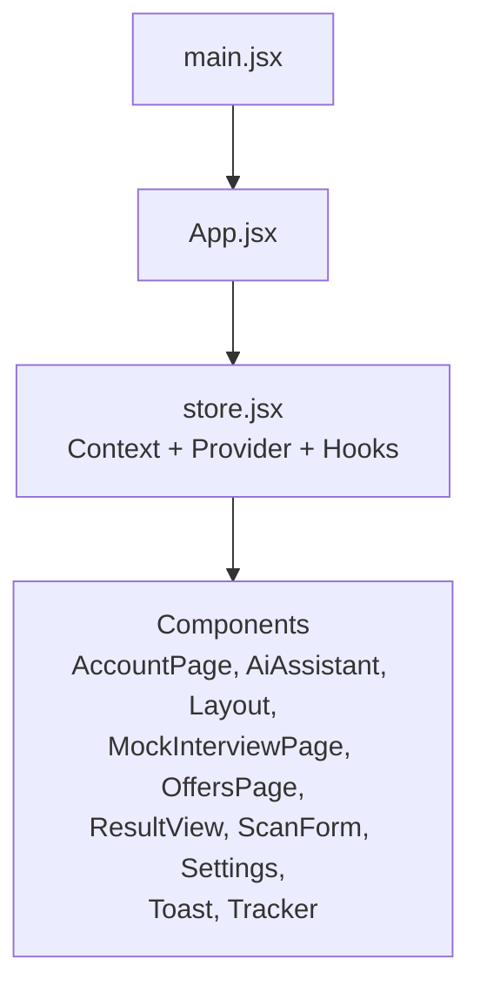
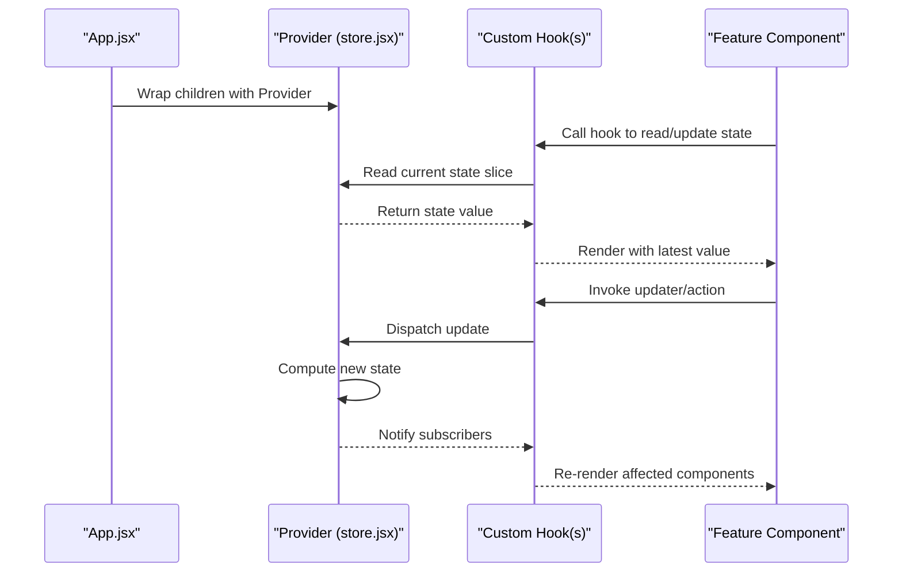
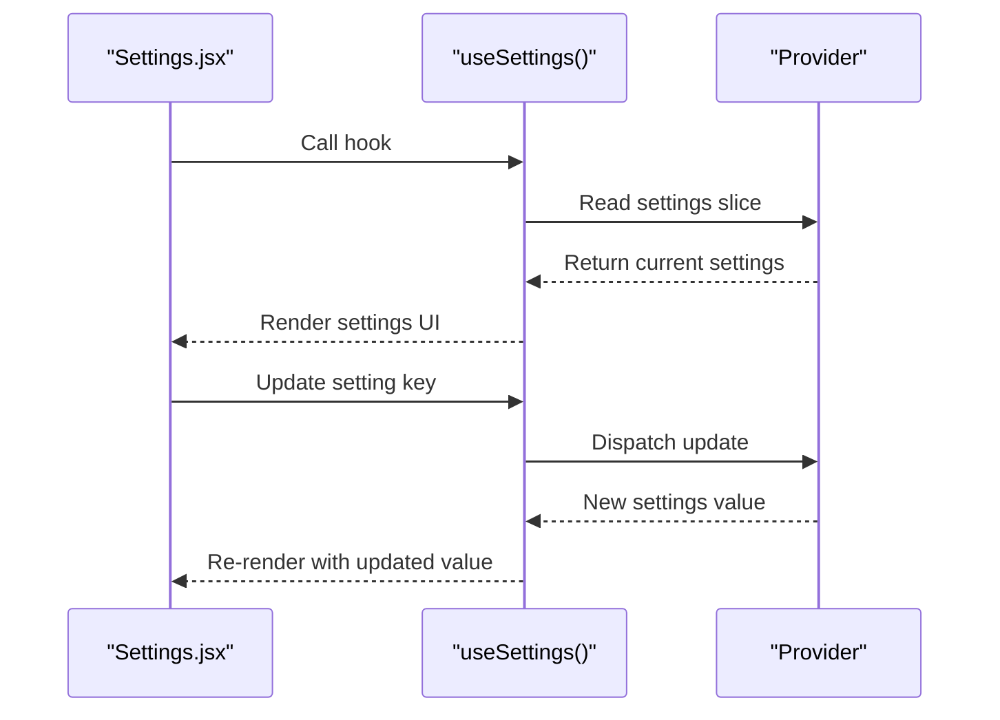
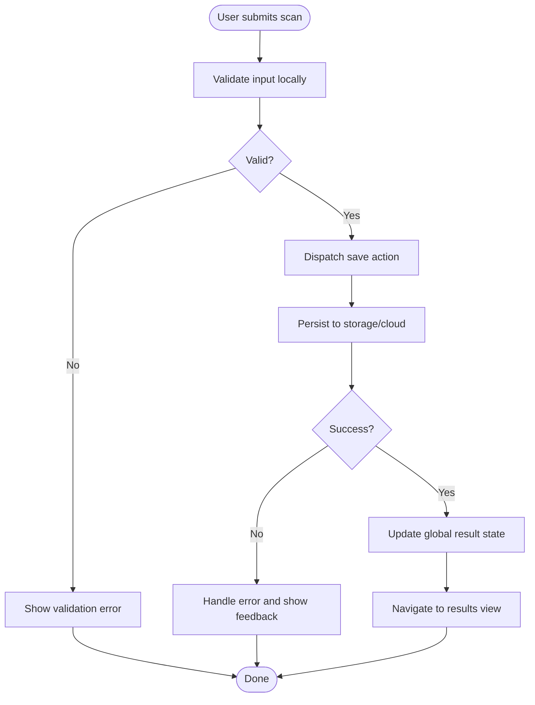
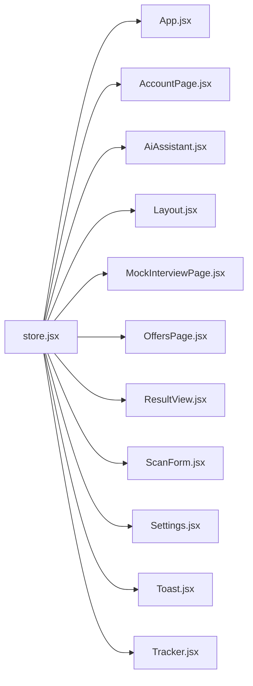

# Context Store Architecture

<cite>
**Referenced Files in This Document**
- [store.jsx](file://src/store.jsx)
- [App.jsx](file://src/App.jsx)
- [main.jsx](file://src/main.jsx)
- [AccountPage.jsx](file://src/components/AccountPage.jsx)
- [AiAssistant.jsx](file://src/components/AiAssistant.jsx)
- [Layout.jsx](file://src/components/Layout.jsx)
- [MockInterviewPage.jsx](file://src/components/MockInterviewPage.jsx)
- [OffersPage.jsx](file://src/components/OffersPage.jsx)
- [ResultView.jsx](file://src/components/ResultView.jsx)
- [ScanForm.jsx](file://src/components/ScanForm.jsx)
- [Settings.jsx](file://src/components/Settings.jsx)
- [Toast.jsx](file://src/components/Toast.jsx)
- [Tracker.jsx](file://src/components/Tracker.jsx)
</cite>

## Table of Contents
1. [Introduction](#introduction)
2. [Project Structure](#project-structure)
3. [Core Components](#core-components)
4. [Architecture Overview](#architecture-overview)
5. [Detailed Component Analysis](#detailed-component-analysis)
6. [Dependency Analysis](#dependency-analysis)
7. [Performance Considerations](#performance-considerations)
8. [Troubleshooting Guide](#troubleshooting-guide)
9. [Conclusion](#conclusion)

## Introduction
This document explains the context-based state management system used by ApplyGuard PH. It focuses on how a global store is structured, how the React Context provider is implemented and mounted, and how components access and update state through custom hooks. It also covers initialization flows, state shape organization, selective re-renders for performance, and patterns for maintaining consistency across the application.

## Project Structure
The state management implementation centers around a single store module that creates a React Context and exposes a Provider along with typed hooks for consuming state. The application root mounts the Provider so all descendant components can read and dispatch updates. Feature pages and shared UI components consume the store via hooks to render and interact with data.

**Diagram sources**
- [main.jsx](file://src/main.jsx)
- [App.jsx](file://src/App.jsx)
- [store.jsx](file://src/store.jsx)
- [AccountPage.jsx](file://src/components/AccountPage.jsx)
- [AiAssistant.jsx](file://src/components/AiAssistant.jsx)
- [Layout.jsx](file://src/components/Layout.jsx)
- [MockInterviewPage.jsx](file://src/components/MockInterviewPage.jsx)
- [OffersPage.jsx](file://src/components/OffersPage.jsx)
- [ResultView.jsx](file://src/components/ResultView.jsx)
- [ScanForm.jsx](file://src/components/ScanForm.jsx)
- [Settings.jsx](file://src/components/Settings.jsx)
- [Toast.jsx](file://src/components/Toast.jsx)
- [Tracker.jsx](file://src/components/Tracker.jsx)

**Section sources**
- [main.jsx](file://src/main.jsx)
- [App.jsx](file://src/App.jsx)
- [store.jsx](file://src/store.jsx)

## Core Components
- Global store module: Creates the React Context, defines the initial state shape, provides a reducer or updater functions, and exports a Provider component plus custom hooks for reading and updating state.
- Application root: Mounts the Provider at the top of the component tree so all features have access to the store.
- Feature components: Consume the store via hooks to read slices of state and dispatch actions or updater functions to mutate state.

Key responsibilities:
- Initialization: Build the initial state once and expose it through the Provider.
- Access: Provide hooks that return stable references to state slices and updaters.
- Updates: Centralize mutation logic to ensure consistency and avoid ad-hoc state changes.
- Performance: Use memoization and selector-like patterns to limit re-renders to only the components that depend on changed slices.

**Section sources**
- [store.jsx](file://src/store.jsx)
- [App.jsx](file://src/App.jsx)

## Architecture Overview
The architecture follows a unidirectional data flow pattern using React Context:
- The Provider holds the canonical state and exposes methods to update it.
- Components subscribe to specific parts of the state via custom hooks.
- Updates are dispatched through centralized functions, ensuring predictable transitions and consistent state across the app.

**Diagram sources**
- [App.jsx](file://src/App.jsx)
- [store.jsx](file://src/store.jsx)

## Detailed Component Analysis

### Store Module (Global State)
Responsibilities:
- Define the initial state shape and default values.
- Create a React Context instance.
- Implement a Provider that manages state lifecycle and exposes an API surface (readers and writers).
- Export custom hooks that encapsulate selectors and action dispatching.

State shape organization:
- Group related fields into logical namespaces (for example, user, settings, analytics, feature flags).
- Keep primitive values and derived computations separate; compute derived values where needed to avoid redundant calculations.

Update patterns:
- Prefer small, focused updater functions over large monolithic reducers.
- Normalize complex updates by composing multiple small updates.
- Ensure immutability when merging nested objects to prevent accidental reference sharing.

Selective re-renders:
- Expose hooks that return only the minimal required slice of state.
- Memoize expensive computations and stable function references.
- Avoid returning entire state objects from hooks; instead, return granular values or stable arrays/objects.

**Section sources**
- [store.jsx](file://src/store.jsx)

### Provider Implementation
Responsibilities:
- Initialize state once and persist it if necessary.
- Provide both state and dispatcher through context.
- Ensure that consumers receive stable references to avoid unnecessary re-renders.

Mounting strategy:
- Wrap the application root with the Provider so all components can access the store.
- Optionally wrap feature-specific sections with additional providers if domain scoping is desired.

**Section sources**
- [App.jsx](file://src/App.jsx)
- [store.jsx](file://src/store.jsx)

### Custom Hooks for State Access
Patterns:
- Selector hooks: Return a specific piece of state or a computed result based on state.
- Action hooks: Encapsulate side effects and state mutations behind simple APIs.
- Composition: Combine selector and action hooks to build higher-level interfaces for components.

Usage examples:
- Reading user profile information in account-related screens.
- Toggling feature flags or settings in configuration screens.
- Updating form inputs and submitting results in scanning workflows.

**Section sources**
- [store.jsx](file://src/store.jsx)
- [AccountPage.jsx](file://src/components/AccountPage.jsx)
- [Settings.jsx](file://src/components/Settings.jsx)
- [ScanForm.jsx](file://src/components/ScanForm.jsx)
- [ResultView.jsx](file://src/components/ResultView.jsx)
- [AiAssistant.jsx](file://src/components/AiAssistant.jsx)
- [Tracker.jsx](file://src/components/Tracker.jsx)
- [OffersPage.jsx](file://src/components/OffersPage.jsx)
- [MockInterviewPage.jsx](file://src/components/MockInterviewPage.jsx)
- [Layout.jsx](file://src/components/Layout.jsx)
- [Toast.jsx](file://src/components/Toast.jsx)

### Example Flows

#### Reading and Updating Settings

**Diagram sources**
- [Settings.jsx](file://src/components/Settings.jsx)
- [store.jsx](file://src/store.jsx)

#### Submitting a Scan Result

**Diagram sources**
- [ScanForm.jsx](file://src/components/ScanForm.jsx)
- [ResultView.jsx](file://src/components/ResultView.jsx)
- [store.jsx](file://src/store.jsx)

## Dependency Analysis
The store module is the central dependency for all components that need to read or write application state. The application root depends on the store to provide context, while feature components depend on the store’s hooks to access state.

**Diagram sources**
- [store.jsx](file://src/store.jsx)
- [App.jsx](file://src/App.jsx)
- [AccountPage.jsx](file://src/components/AccountPage.jsx)
- [AiAssistant.jsx](file://src/components/AiAssistant.jsx)
- [Layout.jsx](file://src/components/Layout.jsx)
- [MockInterviewPage.jsx](file://src/components/MockInterviewPage.jsx)
- [OffersPage.jsx](file://src/components/OffersPage.jsx)
- [ResultView.jsx](file://src/components/ResultView.jsx)
- [ScanForm.jsx](file://src/components/ScanForm.jsx)
- [Settings.jsx](file://src/components/Settings.jsx)
- [Toast.jsx](file://src/components/Toast.jsx)
- [Tracker.jsx](file://src/components/Tracker.jsx)

**Section sources**
- [store.jsx](file://src/store.jsx)
- [App.jsx](file://src/App.jsx)
- [AccountPage.jsx](file://src/components/AccountPage.jsx)
- [AiAssistant.jsx](file://src/components/AiAssistant.jsx)
- [Layout.jsx](file://src/components/Layout.jsx)
- [MockInterviewPage.jsx](file://src/components/MockInterviewPage.jsx)
- [OffersPage.jsx](file://src/components/OffersPage.jsx)
- [ResultView.jsx](file://src/components/ResultView.jsx)
- [ScanForm.jsx](file://src/components/ScanForm.jsx)
- [Settings.jsx](file://src/components/Settings.jsx)
- [Toast.jsx](file://src/components/Toast.jsx)
- [Tracker.jsx](file://src/components/Tracker.jsx)

## Performance Considerations
- Selective subscriptions: Use hooks that return only the exact pieces of state a component needs to minimize re-renders.
- Stable references: Memoize updater functions and derived values so components do not re-render due to identity changes.
- Batched updates: Group related state changes to reduce intermediate renders.
- Avoid deep object returns: Return flattened or normalized values when possible to keep comparison cheap.
- Lazy initialization: Defer heavy computations until they are actually needed.

[No sources needed since this section provides general guidance]

## Troubleshooting Guide
Common issues and resolutions:
- Missing Provider: If a component throws an error when accessing context, ensure the Provider wraps the component tree.
- Stale closures: When using updater functions inside effects or callbacks, verify dependencies are correct to avoid stale state.
- Unnecessary re-renders: Check if hooks are returning entire state objects; refactor to return smaller slices or memoized values.
- Inconsistent state: Centralize mutations in the store and avoid direct state writes outside the Provider.

**Section sources**
- [store.jsx](file://src/store.jsx)
- [App.jsx](file://src/App.jsx)

## Conclusion
ApplyGuard PH uses a straightforward yet powerful context-based state management approach. By centralizing state in a single store module, exposing a Provider at the application root, and providing fine-grained hooks for consumption, the system achieves clear separation of concerns, predictable updates, and good performance through selective re-renders. Following the patterns outlined here will help maintain consistency and scalability as the application grows.