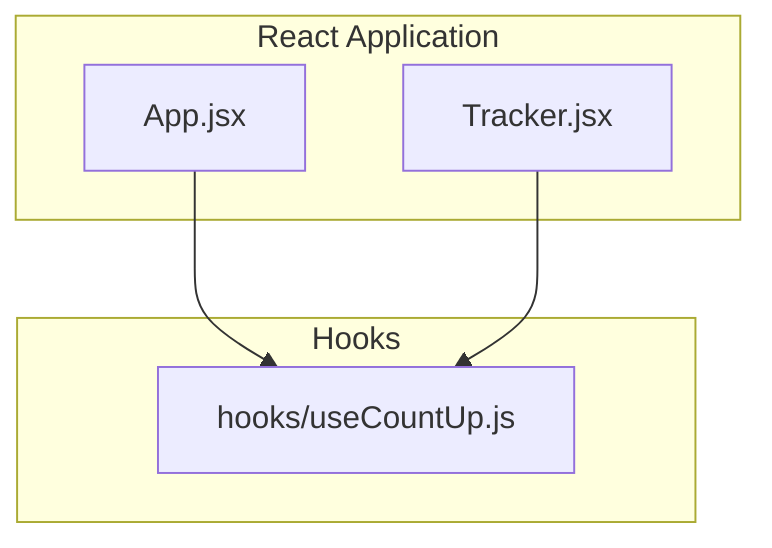
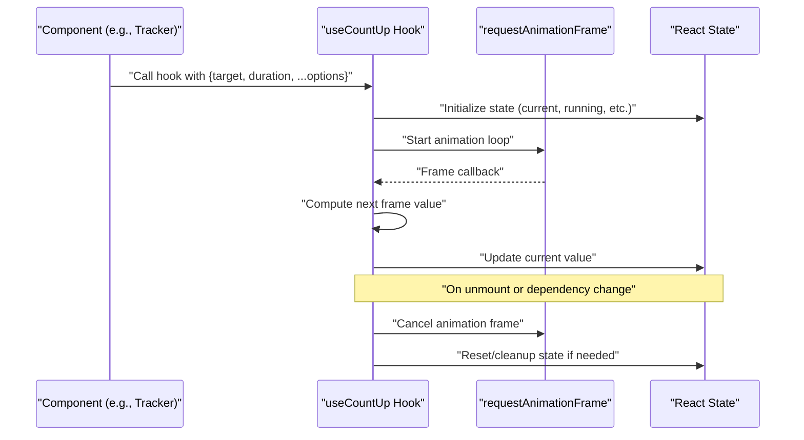
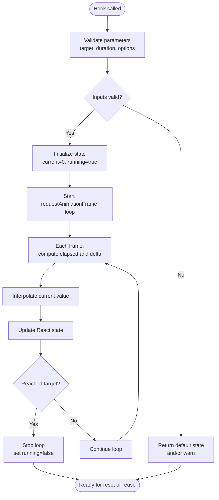
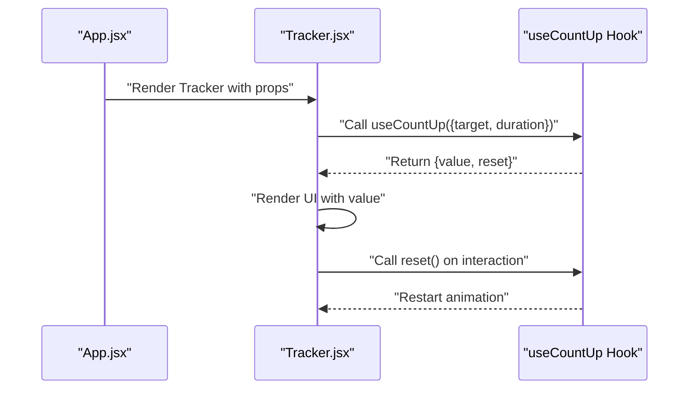
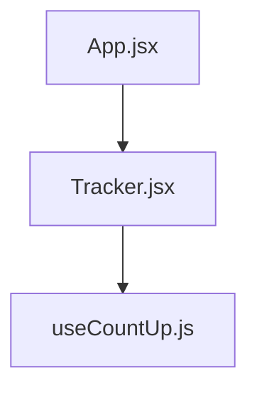

# Custom Hooks Library

<cite>
**Referenced Files in This Document**
- [useCountUp.js](file://src/hooks/useCountUp.js)
- [App.jsx](file://src/App.jsx)
- [Tracker.jsx](file://src/components/Tracker.jsx)
</cite>

## Table of Contents
1. [Introduction](#introduction)
2. [Project Structure](#project-structure)
3. [Core Components](#core-components)
4. [Architecture Overview](#architecture-overview)
5. [Detailed Component Analysis](#detailed-component-analysis)
6. [Dependency Analysis](#dependency-analysis)
7. [Performance Considerations](#performance-considerations)
8. [Troubleshooting Guide](#troubleshooting-guide)
9. [Conclusion](#conclusion)
10. [Appendices](#appendices)

## Introduction
This document provides comprehensive documentation for the custom hooks library in ApplyGuard PH, with a focus on the useCountUp hook implementation pattern. It explains how the hook manages animation state, handles cleanup, and integrates with React’s lifecycle. It also covers hook composition patterns, parameter validation, error handling strategies, guidelines for creating new custom hooks, testing patterns, and performance considerations for reusable state logic.

## Project Structure
The custom hooks are organized under src/hooks. The primary hook analyzed here is useCountUp.js. Example consumers include App.jsx and Tracker.jsx.

**Diagram sources**
- [App.jsx](file://src/App.jsx)
- [Tracker.jsx](file://src/components/Tracker.jsx)
- [useCountUp.js](file://src/hooks/useCountUp.js)

**Section sources**
- [useCountUp.js](file://src/hooks/useCountUp.js)
- [App.jsx](file://src/App.jsx)
- [Tracker.jsx](file://src/components/Tracker.jsx)

## Core Components
- useCountUp: A custom hook that animates a numeric value from a start to an end over a specified duration using requestAnimationFrame. It exposes the current animated value and a reset function, and it manages its own internal animation state and cleanup.

Key responsibilities:
- Animation loop management via requestAnimationFrame
- State synchronization with React
- Cleanup on unmount or dependency changes
- Parameter validation and safe defaults
- Error handling for invalid inputs

Typical usage patterns:
- Consumed by components to display animated counters
- Resettable behavior for re-triggering animations
- Configurable duration and easing (if implemented)

**Section sources**
- [useCountUp.js](file://src/hooks/useCountUp.js)

## Architecture Overview
The hook encapsulates animation logic and exposes a simple API to components. Consumers call the hook with parameters such as target value, duration, and optional configuration. Internally, the hook coordinates React state updates and browser animation APIs.

**Diagram sources**
- [useCountUp.js](file://src/hooks/useCountUp.js)
- [Tracker.jsx](file://src/components/Tracker.jsx)

## Detailed Component Analysis

### useCountUp Hook Implementation Pattern
The hook follows a standard custom hook pattern:
- Input parameters: target value, duration, and optional options (e.g., easing, step size).
- Internal state: current value, running flag, and possibly a reference to the animation frame ID.
- Lifecycle integration:
  - Start animation when dependencies change or component mounts.
  - Update React state each frame to reflect progress.
  - Cancel animation on cleanup to prevent memory leaks.
- Output: current animated value and a reset function to restart the animation.

Animation flow:
- On mount or dependency change, initialize state and start the animation loop.
- Each frame, compute the interpolated value based on elapsed time and duration.
- Update state until the target is reached, then stop the loop.
- On unmount or dependency change, cancel any pending frames and reset state.

Parameter validation:
- Ensure target and duration are numbers.
- Enforce non-negative duration.
- Provide sensible defaults for missing options.

Error handling:
- Guard against invalid inputs and log warnings.
- Avoid state updates after unmount by checking a mounted flag or relying on React’s safeguards.

Cleanup:
- Always cancel requestAnimationFrame on cleanup.
- Reset internal references to avoid dangling timers.

**Diagram sources**
- [useCountUp.js](file://src/hooks/useCountUp.js)

**Section sources**
- [useCountUp.js](file://src/hooks/useCountUp.js)

### Integration with React Lifecycle
- Mount: Initialize state and begin animation.
- Update: Re-run animation when relevant props change (e.g., target or duration).
- Unmount: Cancel animation frames and clean up references.

Best practices:
- Use refs for mutable values across frames to avoid stale closures.
- Debounce or throttle if necessary to reduce excessive re-renders.
- Expose a reset function to allow controlled re-animation.

**Section sources**
- [useCountUp.js](file://src/hooks/useCountUp.js)

### Consumer Examples
- App.jsx may orchestrate application-level state and pass parameters to components that consume useCountUp.
- Tracker.jsx likely renders UI elements that depend on the animated counter and may trigger resets or update targets.

**Diagram sources**
- [App.jsx](file://src/App.jsx)
- [Tracker.jsx](file://src/components/Tracker.jsx)
- [useCountUp.js](file://src/hooks/useCountUp.js)

**Section sources**
- [App.jsx](file://src/App.jsx)
- [Tracker.jsx](file://src/components/Tracker.jsx)
- [useCountUp.js](file://src/hooks/useCountUp.js)

## Dependency Analysis
The hook has minimal external dependencies, primarily relying on React primitives and browser APIs. Consumers import the hook directly.

**Diagram sources**
- [useCountUp.js](file://src/hooks/useCountUp.js)
- [Tracker.jsx](file://src/components/Tracker.jsx)
- [App.jsx](file://src/App.jsx)

**Section sources**
- [useCountUp.js](file://src/hooks/useCountUp.js)
- [Tracker.jsx](file://src/components/Tracker.jsx)
- [App.jsx](file://src/App.jsx)

## Performance Considerations
- Prefer refs for per-frame mutable data to avoid unnecessary re-renders.
- Batch state updates where possible; consider using functional setState to minimize work.
- Avoid heavy computations inside the animation loop; precompute constants outside the loop.
- Use requestAnimationFrame responsibly; ensure cancellation on cleanup.
- Consider debouncing rapid prop changes to prevent animation thrashing.
- Keep the hook pure regarding side effects; isolate DOM interactions and timers within the hook.

[No sources needed since this section provides general guidance]

## Troubleshooting Guide
Common issues and resolutions:
- Animation does not start:
  - Verify parameters are valid numbers and duration is positive.
  - Check that the hook is called at the top level of the component.
- Memory leak or stuck animation:
  - Ensure requestAnimationFrame is canceled on cleanup.
  - Confirm no lingering references to old frames.
- Stale values in callbacks:
  - Use refs for values accessed inside the animation loop.
- Excessive re-renders:
  - Memoize consumer components and stable props.
  - Reduce frequency of state updates if needed.

**Section sources**
- [useCountUp.js](file://src/hooks/useCountUp.js)

## Conclusion
The useCountUp hook demonstrates a robust pattern for encapsulating animation state and lifecycle management in React. By validating inputs, handling errors gracefully, and ensuring proper cleanup, it provides a reliable building block for reusable state logic. Following the guidelines and best practices outlined here will help create consistent, testable, and performant custom hooks.

[No sources needed since this section summarizes without analyzing specific files]

## Appendices

### Guidelines for Creating New Custom Hooks
- Define clear input contracts and validate parameters early.
- Isolate side effects and manage cleanup explicitly.
- Return only what consumers need; keep internal state private.
- Compose smaller hooks to build complex behaviors.
- Document expected behavior, edge cases, and performance characteristics.

### Testing Patterns
- Mock requestAnimationFrame and timers to control animation timing.
- Assert initial state, intermediate frames, and final state.
- Test cleanup by unmounting components and verifying no active frames remain.
- Validate error paths for invalid inputs.

### Composition Patterns
- Combine useCountUp with other hooks for richer behaviors (e.g., persistence, throttling).
- Create higher-order hooks that wrap useCountUp to add logging or metrics.

[No sources needed since this section provides general guidance]