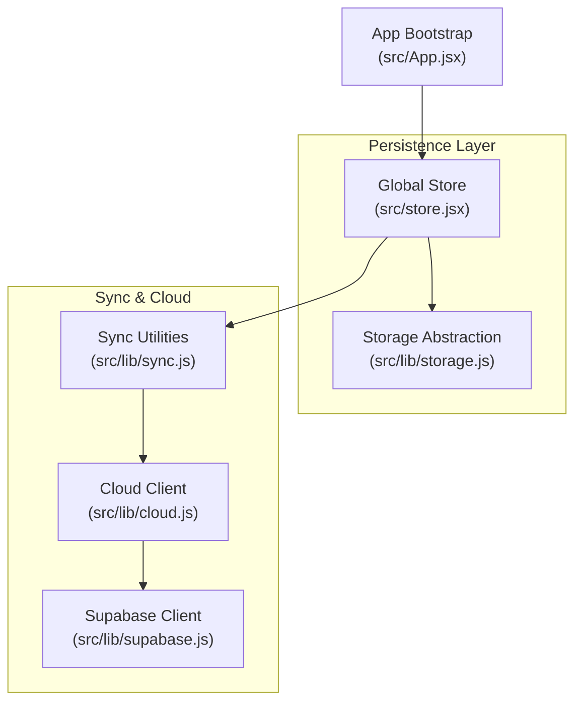
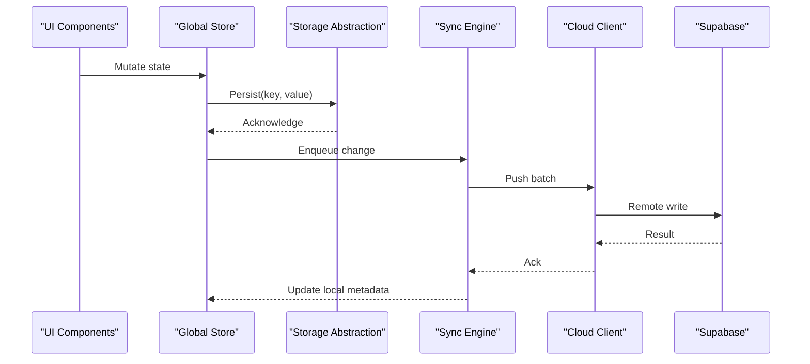
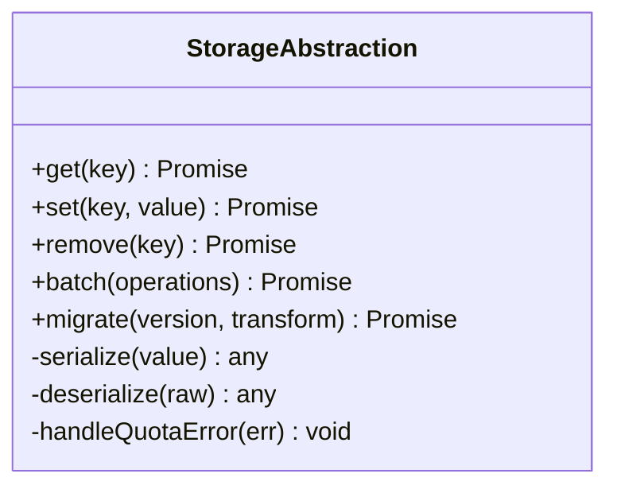
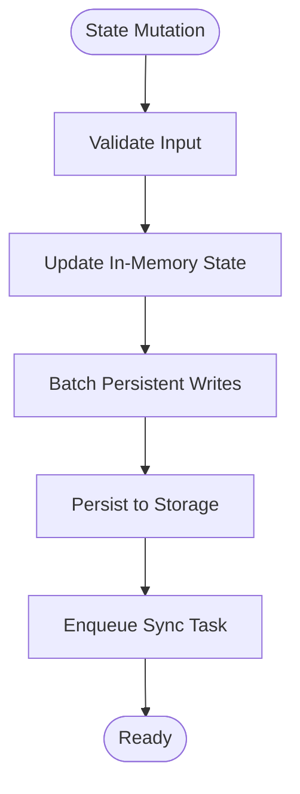
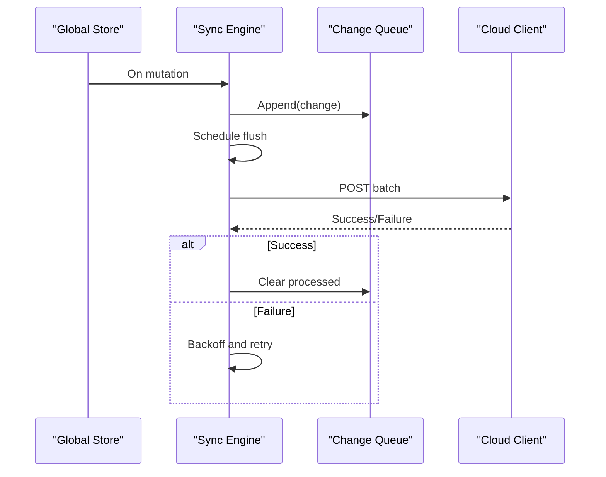
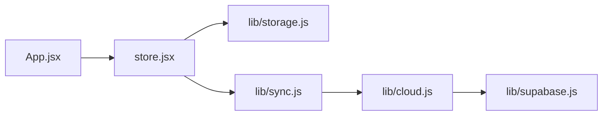

# Local Storage & Persistence

<cite>
**Referenced Files in This Document**
- [storage.js](file://src/lib/storage.js)
- [store.jsx](file://src/store.jsx)
- [sync.js](file://src/lib/sync.js)
- [cloud.js](file://src/lib/cloud.js)
- [supabase.js](file://src/lib/supabase.js)
- [App.jsx](file://src/App.jsx)
</cite>

## Table of Contents
1. [Introduction](#introduction)
2. [Project Structure](#project-structure)
3. [Core Components](#core-components)
4. [Architecture Overview](#architecture-overview)
5. [Detailed Component Analysis](#detailed-component-analysis)
6. [Dependency Analysis](#dependency-analysis)
7. [Performance Considerations](#performance-considerations)
8. [Troubleshooting Guide](#troubleshooting-guide)
9. [Conclusion](#conclusion)
10. [Appendices](#appendices)

## Introduction
This document explains the local storage persistence layer in ApplyGuard PH, focusing on how data is serialized, keyed, migrated, and synchronized with cloud services. It covers the storage abstraction, error handling for quota exceeded scenarios, offline-first patterns, versioned schemas, and performance optimizations for large datasets. The goal is to help developers understand where and how data persists locally, how it evolves over time, and how it integrates with online sync.

## Project Structure
The persistence-related code is primarily implemented in:
- A dedicated storage abstraction module that wraps browser storage APIs
- A global store that coordinates state and persistence
- Sync utilities that reconcile local changes with cloud data
- Cloud integration modules for remote operations
- App bootstrap logic that initializes storage and sync

**Diagram sources**
- [storage.js](file://src/lib/storage.js)
- [store.jsx](file://src/store.jsx)
- [sync.js](file://src/lib/sync.js)
- [cloud.js](file://src/lib/cloud.js)
- [supabase.js](file://src/lib/supabase.js)
- [App.jsx](file://src/App.jsx)

**Section sources**
- [storage.js](file://src/lib/storage.js)
- [store.jsx](file://src/store.jsx)
- [sync.js](file://src/lib/sync.js)
- [cloud.js](file://src/lib/cloud.js)
- [supabase.js](file://src/lib/supabase.js)
- [App.jsx](file://src/App.jsx)

## Core Components
- Storage Abstraction: Provides a consistent interface for reading/writing JSON-serializable values under well-defined keys. It centralizes serialization, key management, and error handling (including quota exceeded).
- Global Store: Holds application state, triggers persistence on mutations, and exposes reactive accessors for UI components.
- Sync Engine: Orchestrates conflict resolution and background synchronization between local storage and cloud endpoints.
- Cloud Client: Encapsulates HTTP calls to backend services and Supabase.
- App Bootstrap: Initializes storage, applies migrations if needed, and starts sync processes.

Key responsibilities:
- Serialization strategy: JSON-based with optional compression or batching for large payloads
- Key management: Versioned namespaces and feature-scoped prefixes
- Migration handling: Schema versioning and one-time transforms
- Error handling: Graceful fallbacks when storage is unavailable or full
- Offline-first: Read/write against local storage first; sync later

**Section sources**
- [storage.js](file://src/lib/storage.js)
- [store.jsx](file://src/store.jsx)
- [sync.js](file://src/lib/sync.js)
- [cloud.js](file://src/lib/cloud.js)
- [supabase.js](file://src/lib/supabase.js)
- [App.jsx](file://src/App.jsx)

## Architecture Overview
The system follows an offline-first pattern:
- All writes go to local storage immediately
- Changes are queued for sync
- Background tasks reconcile with cloud storage
- Conflicts are resolved using timestamps and operational semantics

**Diagram sources**
- [store.jsx](file://src/store.jsx)
- [storage.js](file://src/lib/storage.js)
- [sync.js](file://src/lib/sync.js)
- [cloud.js](file://src/lib/cloud.js)
- [supabase.js](file://src/lib/supabase.js)

## Detailed Component Analysis

### Storage Abstraction Layer
Responsibilities:
- Provide typed get/set methods for domain entities
- Manage storage keys with versioned namespaces
- Serialize/deserialize complex objects safely
- Handle quota exceeded errors and degrade gracefully
- Offer bulk operations for performance

Design considerations:
- Use a single namespace prefix per app to avoid collisions
- Include schema version in keys or metadata to support migrations
- Wrap native storage calls with try/catch and return structured results
- Implement retry/backoff for transient failures

**Diagram sources**
- [storage.js](file://src/lib/storage.js)

**Section sources**
- [storage.js](file://src/lib/storage.js)

### Global Store
Responsibilities:
- Maintain application state in memory
- Trigger persistence on mutations
- Expose reactive getters for components
- Coordinate with sync engine for background updates

Patterns:
- Immutable updates to prevent accidental mutations
- Batching multiple updates before persisting
- Debounced persistence to reduce I/O pressure

**Diagram sources**
- [store.jsx](file://src/store.jsx)

**Section sources**
- [store.jsx](file://src/store.jsx)

### Sync Engine
Responsibilities:
- Track pending changes and last synced timestamps
- Perform conflict resolution strategies (e.g., last-write-wins or merge)
- Retry failed uploads with exponential backoff
- Throttle network requests to avoid rate limits

**Diagram sources**
- [sync.js](file://src/lib/sync.js)
- [cloud.js](file://src/lib/cloud.js)

**Section sources**
- [sync.js](file://src/lib/sync.js)
- [cloud.js](file://src/lib/cloud.js)

### Cloud Integration
Responsibilities:
- Authenticate and authorize requests
- Map local entities to API payloads
- Handle server-side validation errors
- Normalize responses into local-friendly structures

Integration points:
- Uses Supabase client for database operations
- Implements retries and timeouts
- Logs telemetry for observability

**Section sources**
- [cloud.js](file://src/lib/cloud.js)
- [supabase.js](file://src/lib/supabase.js)

### App Bootstrap
Responsibilities:
- Initialize storage and apply migrations
- Start sync loop
- Recover from partial states after crashes

Initialization flow:
- Load schema version
- Run migration functions if needed
- Restore persisted state
- Start periodic sync

**Section sources**
- [App.jsx](file://src/App.jsx)
- [storage.js](file://src/lib/storage.js)
- [sync.js](file://src/lib/sync.js)

## Dependency Analysis
High-level dependencies among persistence components:

**Diagram sources**
- [App.jsx](file://src/App.jsx)
- [store.jsx](file://src/store.jsx)
- [storage.js](file://src/lib/storage.js)
- [sync.js](file://src/lib/sync.js)
- [cloud.js](file://src/lib/cloud.js)
- [supabase.js](file://src/lib/supabase.js)

**Section sources**
- [App.jsx](file://src/App.jsx)
- [store.jsx](file://src/store.jsx)
- [storage.js](file://src/lib/storage.js)
- [sync.js](file://src/lib/sync.js)
- [cloud.js](file://src/lib/cloud.js)
- [supabase.js](file://src/lib/supabase.js)

## Performance Considerations
Optimization techniques for large datasets:
- Batch writes: Group multiple mutations into a single storage operation
- Debounce persistence: Coalesce rapid updates to reduce I/O
- Lazy loading: Load only necessary slices of data on demand
- Compression: Compress large payloads before storing
- Partitioning: Split large collections across multiple keys to avoid hitting quotas
- Indexing: Maintain lightweight indexes for frequent queries
- Caching: Keep hot data in memory and persist asynchronously

Practical tips:
- Avoid serializing circular references
- Strip transient fields before persistence
- Use stable IDs and timestamps for efficient diffs during sync

[No sources needed since this section provides general guidance]

## Troubleshooting Guide
Common issues and resolutions:
- Quota exceeded:
  - Symptoms: Write failures, missing data after reload
  - Actions: Reduce payload size, enable compression, partition data, prompt user to clear cache
- Corrupted entries:
  - Symptoms: Parse errors on load
  - Actions: Detect invalid JSON, roll back to last known good snapshot, run recovery migration
- Stale data:
  - Symptoms: UI shows outdated information
  - Actions: Force refresh via sync, invalidate caches, rehydrate from cloud
- Sync conflicts:
  - Symptoms: Data diverges between devices
  - Actions: Review conflict resolution policy, log discrepancies, allow manual reconciliation

Operational checks:
- Verify storage availability and permissions
- Inspect queue length and retry counts
- Monitor network errors and timeouts
- Log schema versions and migration outcomes

**Section sources**
- [storage.js](file://src/lib/storage.js)
- [sync.js](file://src/lib/sync.js)

## Conclusion
ApplyGuard PH’s persistence layer combines a robust storage abstraction, a reactive global store, and a resilient sync engine to deliver an offline-first experience. By enforcing versioned schemas, careful key management, and strong error handling, the system remains reliable even under adverse conditions such as quota limits or network outages. Following the performance recommendations will ensure smooth scaling as datasets grow.

[No sources needed since this section summarizes without analyzing specific files]

## Appendices

### Examples and Patterns

- Storing complex objects:
  - Ensure all nested properties are serializable
  - Use stable identifiers and timestamps
  - Consider compressing large attachments or logs

- Implementing versioned data schemas:
  - Define a schema version number
  - Store current version alongside data
  - Provide migration functions that transform older formats to newer ones
  - Run migrations once at startup based on stored version

- Optimizing storage for large datasets:
  - Partition by entity type and date ranges
  - Use incremental updates instead of full rewrites
  - Employ lazy loading and virtualization in UI

[No sources needed since this section provides general guidance]