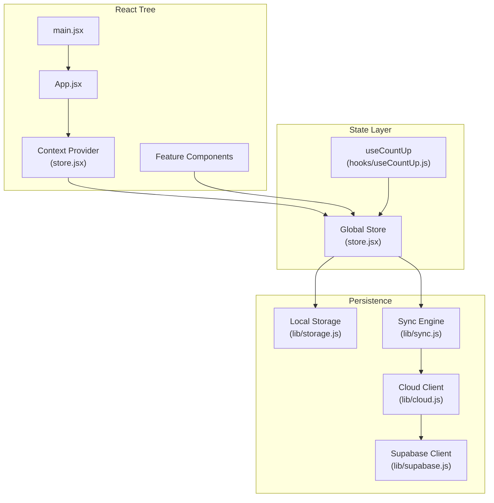
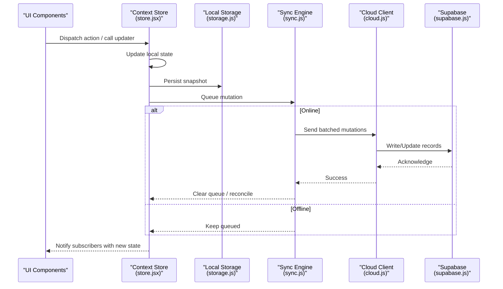
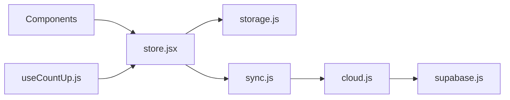

# State Management

<cite>
**Referenced Files in This Document**
- [store.jsx](file://src/store.jsx)
- [useCountUp.js](file://src/hooks/useCountUp.js)
- [storage.js](file://src/lib/storage.js)
- [cloud.js](file://src/lib/cloud.js)
- [sync.js](file://src/lib/sync.js)
- [supabase.js](file://src/lib/supabase.js)
- [App.jsx](file://src/App.jsx)
- [main.jsx](file://src/main.jsx)
</cite>

## Table of Contents
1. [Introduction](#introduction)
2. [Project Structure](#project-structure)
3. [Core Components](#core-components)
4. [Architecture Overview](#architecture-overview)
5. [Detailed Component Analysis](#detailed-component-analysis)
6. [Dependency Analysis](#dependency-analysis)
7. [Performance Considerations](#performance-considerations)
8. [Troubleshooting Guide](#troubleshooting-guide)
9. [Conclusion](#conclusion)

## Introduction
This document explains the state management architecture in ApplyGuard PH, focusing on a custom context-based approach implemented with store.jsx and reusable hooks like useCountUp. It covers how global state is structured and accessed, local storage persistence, synchronization between local and cloud storage, offline-first patterns, update strategies, performance considerations, and debugging techniques for complex state scenarios.

## Project Structure
The state management layer spans a small set of focused modules:
- Global state container and provider via a React Context
- Reusable hook pattern for encapsulating stateful logic
- Local storage abstraction for persistence
- Cloud integration and synchronization utilities
- App bootstrap wiring the provider into the component tree

**Diagram sources**
- [main.jsx](file://src/main.jsx)
- [App.jsx](file://src/App.jsx)
- [store.jsx](file://src/store.jsx)
- [useCountUp.js](file://src/hooks/useCountUp.js)
- [storage.js](file://src/lib/storage.js)
- [cloud.js](file://src/lib/cloud.js)
- [sync.js](file://src/lib/sync.js)
- [supabase.js](file://src/lib/supabase.js)

**Section sources**
- [main.jsx](file://src/main.jsx)
- [App.jsx](file://src/App.jsx)
- [store.jsx](file://src/store.jsx)
- [useCountUp.js](file://src/hooks/useCountUp.js)
- [storage.js](file://src/lib/storage.js)
- [cloud.js](file://src/lib/cloud.js)
- [sync.js](file://src/lib/sync.js)
- [supabase.js](file://src/lib/supabase.js)

## Core Components
- Context-based global store: A single source of truth for application-wide state, exposing both data and actions through React Context. Consumers subscribe to updates and dispatch mutations via provided methods.
- Reusable hook (useCountUp): Encapsulates incrementing counters and related logic, demonstrating how to extract and reuse stateful behavior across components without duplicating logic.
- Persistence layer: Local storage wrapper that serializes and persists state slices to ensure durability across sessions.
- Cloud client: Abstraction over remote APIs (e.g., Supabase) for reading/writing shared data.
- Sync engine: Orchestrates conflict resolution, batching, and reconciliation between local and cloud state, enabling offline-first operation.

Key responsibilities:
- Centralize state shape and lifecycle
- Provide consistent mutation patterns
- Persist changes locally by default
- Sync changes to the cloud when available
- Expose simple APIs to UI components

**Section sources**
- [store.jsx](file://src/store.jsx)
- [useCountUp.js](file://src/hooks/useCountUp.js)
- [storage.js](file://src/lib/storage.js)
- [cloud.js](file://src/lib/cloud.js)
- [sync.js](file://src/lib/sync.js)

## Architecture Overview
The system follows an offline-first, context-driven architecture:
- UI components consume state from the Context Provider
- Mutations are dispatched to the store, which updates local state immediately
- The sync engine batches and reconciles changes with the cloud
- On connectivity restoration or explicit triggers, pending operations are flushed

**Diagram sources**
- [store.jsx](file://src/store.jsx)
- [storage.js](file://src/lib/storage.js)
- [sync.js](file://src/lib/sync.js)
- [cloud.js](file://src/lib/cloud.js)
- [supabase.js](file://src/lib/supabase.js)

## Detailed Component Analysis

### Context-Based Global Store (store.jsx)
Responsibilities:
- Defines the global state shape and initial values
- Provides a Context Provider wrapping the app tree
- Exposes state and action functions to consumers
- Integrates with local storage for persistence
- Coordinates with the sync engine for cloud synchronization

Patterns:
- Single object state slice per feature domain
- Immutable updates via functional updaters
- Selectors or memoized values where needed to reduce re-renders
- Batching of multiple updates to minimize render cycles

Integration points:
- Local storage for immediate persistence
- Sync engine for background reconciliation
- Cloud client for remote read/write

**Section sources**
- [store.jsx](file://src/store.jsx)

### Reusable Hook Pattern: useCountUp (hooks/useCountUp.js)
Purpose:
- Encapsulates counter state and increment logic
- Demonstrates extracting reusable stateful behavior from components
- Can be composed with other hooks or store actions

Behavior:
- Returns current count and an increment function
- Optionally integrates with store actions for cross-component consistency
- Supports optional persistence or side effects

Usage pattern:
- Import and invoke within any component to get a self-contained counter
- Combine with store actions if the counter must be part of global state

**Section sources**
- [useCountUp.js](file://src/hooks/useCountUp.js)

### Local Storage Persistence (lib/storage.js)
Responsibilities:
- Serializes and deserializes state slices
- Handles versioning and migration of persisted schemas
- Provides safe access with fallbacks for missing keys
- Supports partial reads/writes to avoid full-state thrash

Strategies:
- Debounced writes to reduce I/O overhead
- Atomic snapshots to prevent partial corruption
- Error handling for quota exceeded or unavailable storage

**Section sources**
- [storage.js](file://src/lib/storage.js)

### Cloud Integration (lib/cloud.js)
Responsibilities:
- Wraps API calls to remote services (e.g., Supabase)
- Normalizes responses and errors
- Implements retry and backoff policies
- Manages authentication tokens and session state

Design:
- Promise-based interface for async operations
- Idempotent write operations where possible
- Caching of frequently read data to reduce network usage

**Section sources**
- [cloud.js](file://src/lib/cloud.js)
- [supabase.js](file://src/lib/supabase.js)

### Synchronization Engine (lib/sync.js)
Responsibilities:
- Queues local mutations when offline
- Batches operations to minimize network calls
- Resolves conflicts using timestamps or operational transforms
- Drives reconciliation when connectivity resumes

Offline-first flow:
- All writes succeed locally first
- Pending queue persists until successful upload
- Conflict detection ensures data integrity

**Section sources**
- [sync.js](file://src/lib/sync.js)

### App Bootstrap (main.jsx and App.jsx)
Responsibilities:
- main.jsx initializes the React app and wraps it with the Context Provider
- App.jsx configures routes, providers, and global initialization tasks
- Ensures store hydration from local storage before rendering critical UI

Initialization order:
- Hydrate store from local storage
- Start sync engine
- Render UI with guaranteed minimal state

**Section sources**
- [main.jsx](file://src/main.jsx)
- [App.jsx](file://src/App.jsx)

## Dependency Analysis
The state layer has clear boundaries and low coupling:
- Components depend only on the Context API and exposed actions
- Store depends on storage and sync abstractions
- Sync depends on cloud client and supabase client
- Hooks are independent but can optionally interact with store

**Diagram sources**
- [store.jsx](file://src/store.jsx)
- [storage.js](file://src/lib/storage.js)
- [sync.js](file://src/lib/sync.js)
- [cloud.js](file://src/lib/cloud.js)
- [supabase.js](file://src/lib/supabase.js)
- [useCountUp.js](file://src/hooks/useCountUp.js)

**Section sources**
- [store.jsx](file://src/store.jsx)
- [storage.js](file://src/lib/storage.js)
- [sync.js](file://src/lib/sync.js)
- [cloud.js](file://src/lib/cloud.js)
- [supabase.js](file://src/lib/supabase.js)
- [useCountUp.js](file://src/hooks/useCountUp.js)

## Performance Considerations
- Minimize re-renders: Use selectors or memoization to derive expensive values; split large state objects into smaller slices.
- Batch updates: Group multiple state changes into a single update cycle to avoid intermediate renders.
- Debounce persistence: Throttle local storage writes to reduce I/O contention.
- Lazy hydration: Defer heavy initialization until needed to speed up initial render.
- Network efficiency: Batch sync operations, cache reads, and implement retries/backoff.
- Memory hygiene: Avoid retaining large objects in memory longer than necessary; release references after sync completion.

[No sources needed since this section provides general guidance]

## Troubleshooting Guide
Common issues and remedies:
- Stale state in UI: Ensure actions trigger proper updates and that consumers subscribe to the correct state slice.
- Data loss after refresh: Verify local storage hydration runs before rendering; check serialization/deserialization correctness.
- Sync failures: Inspect queue status, network errors, and conflict resolution logs; retry failed operations with backoff.
- Performance regressions: Profile re-renders, identify unnecessary subscriptions, and optimize selectors.
- Offline mode anomalies: Confirm queuing behavior and deferred execution; validate conflict resolution rules.

Debugging techniques:
- Add logging around state mutations and sync events
- Snapshot state diffs during transitions
- Instrument network requests and storage operations
- Use time-travel style logs to replay sequences of actions

**Section sources**
- [store.jsx](file://src/store.jsx)
- [sync.js](file://src/lib/sync.js)
- [storage.js](file://src/lib/storage.js)
- [cloud.js](file://src/lib/cloud.js)

## Conclusion
ApplyGuard PH’s state management leverages a lightweight, context-based store with robust persistence and synchronization. The design emphasizes offline-first reliability, predictable update patterns, and reusable logic through hooks. By separating concerns among store, storage, sync, and cloud layers, the system remains maintainable and performant while supporting complex state scenarios.

[No sources needed since this section summarizes without analyzing specific files]