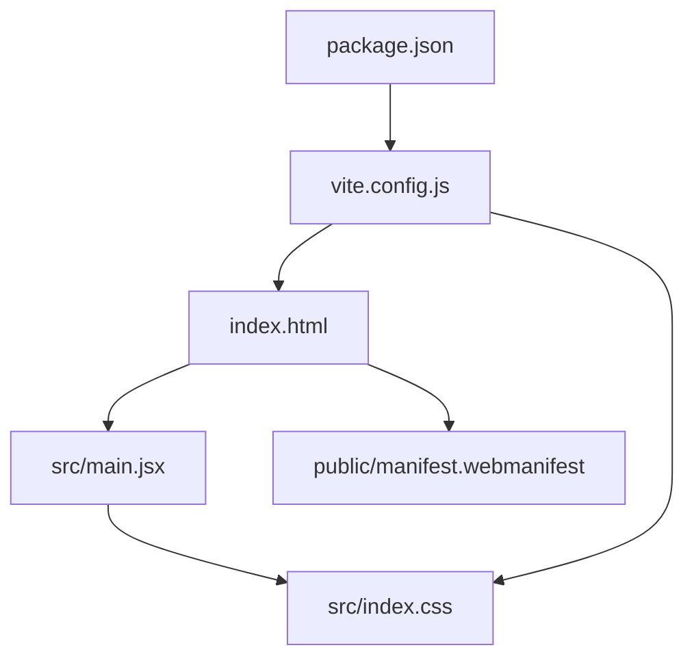
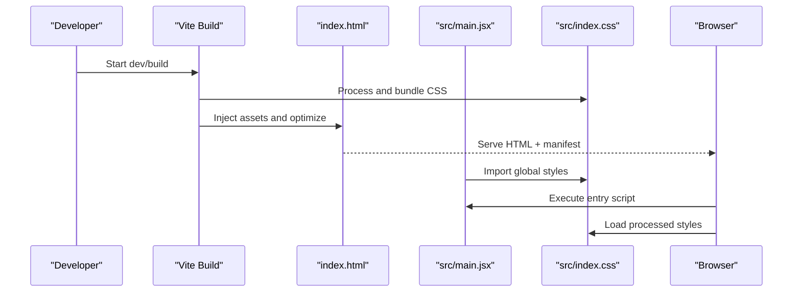
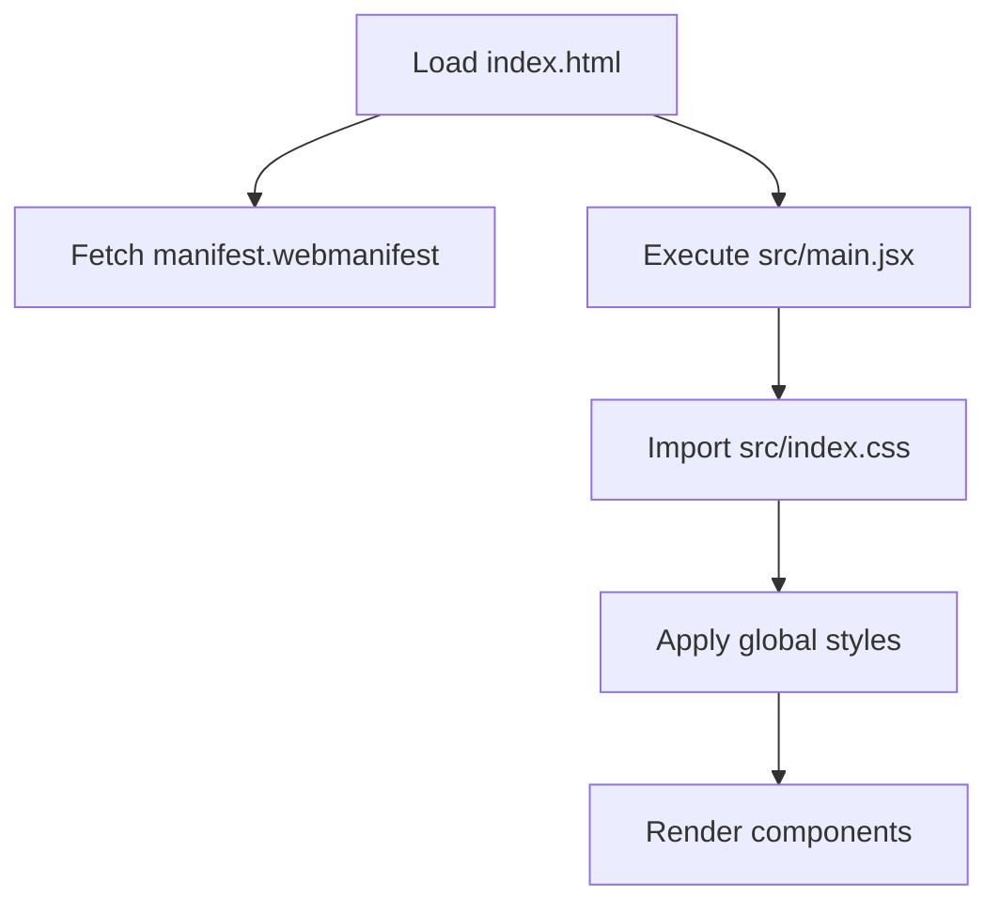
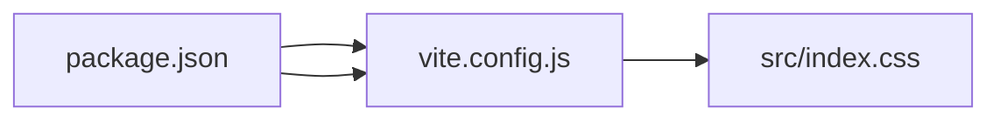

# Styling & Theming

<cite>
**Referenced Files in This Document**
- [index.html](file://index.html)
- [src/index.css](file://src/index.css)
- [src/main.jsx](file://src/main.jsx)
- [public/manifest.webmanifest](file://public/manifest.webmanifest)
- [vite.config.js](file://vite.config.js)
- [package.json](file://package.json)
</cite>

## Table of Contents
1. [Introduction](#introduction)
2. [Project Structure](#project-structure)
3. [Core Components](#core-components)
4. [Architecture Overview](#architecture-overview)
5. [Detailed Component Analysis](#detailed-component-analysis)
6. [Dependency Analysis](#dependency-analysis)
7. [Performance Considerations](#performance-considerations)
8. [Troubleshooting Guide](#troubleshooting-guide)
9. [Conclusion](#conclusion)
10. [Appendices](#appendices)

## Introduction
This document explains the styling and theming system for ApplyGuard PH, focusing on:
- Global CSS structure and organization
- Responsive design patterns and mobile-first approach
- PWA manifest configuration for app icons, splash screens, and browser behavior
- Vite build configuration for asset optimization and CSS processing
- Styling best practices, component-specific styles, and cross-browser compatibility considerations

The goal is to provide a clear, practical guide for developers to maintain consistent UI behavior across devices and browsers while leveraging modern tooling for performance.

## Project Structure
Styling-related assets are organized as follows:
- Global stylesheet entry point: src/index.css
- Application shell and HTML root: index.html
- Entry script that imports global styles: src/main.jsx
- PWA manifest: public/manifest.webmanifest
- Build configuration: vite.config.js
- Dependencies and scripts: package.json

**Diagram sources**
- [index.html](file://index.html)
- [src/main.jsx](file://src/main.jsx)
- [src/index.css](file://src/index.css)
- [public/manifest.webmanifest](file://public/manifest.webmanifest)
- [vite.config.js](file://vite.config.js)
- [package.json](file://package.json)

**Section sources**
- [index.html](file://index.html)
- [src/main.jsx](file://src/main.jsx)
- [src/index.css](file://src/index.css)
- [public/manifest.webmanifest](file://public/manifest.webmanifest)
- [vite.config.js](file://vite.config.js)
- [package.json](file://package.json)

## Core Components
- Global Styles (src/index.css): Central place for base styles, typography, color tokens, spacing, layout utilities, and responsive rules.
- App Shell (index.html): Defines the document root, meta tags, viewport settings, and links to the manifest and main bundle.
- Entry Script (src/main.jsx): Bootstraps the application and ensures global styles are loaded before rendering components.
- PWA Manifest (public/manifest.webmanifest): Declares app metadata, icons, theme colors, display mode, and related behaviors.
- Build Configuration (vite.config.js): Controls asset handling, CSS processing, minification, and production optimizations.
- Dependencies (package.json): Lists runtime and dev dependencies relevant to styling and builds.

Key responsibilities:
- Maintain a single source of truth for global styles.
- Enforce mobile-first responsive breakpoints.
- Configure PWA behavior via the manifest.
- Optimize CSS and assets during development and production.

**Section sources**
- [src/index.css](file://src/index.css)
- [index.html](file://index.html)
- [src/main.jsx](file://src/main.jsx)
- [public/manifest.webmanifest](file://public/manifest.webmanifest)
- [vite.config.js](file://vite.config.js)
- [package.json](file://package.json)

## Architecture Overview
The styling architecture centers around a global stylesheet imported at application startup, with PWA metadata provided by the web manifest. The build pipeline processes and optimizes CSS and assets through Vite.

**Diagram sources**
- [vite.config.js](file://vite.config.js)
- [index.html](file://index.html)
- [src/main.jsx](file://src/main.jsx)
- [src/index.css](file://src/index.css)

## Detailed Component Analysis

### Global CSS Structure (src/index.css)
- Base layer: Reset or normalize styles, default typography, box-sizing, and color variables.
- Layout utilities: Flexbox/Grid helpers, spacing scales, container widths, and safe-area padding for mobile.
- Theme tokens: Colors, fonts, radii, shadows, and z-index scale defined as CSS custom properties for easy theming.
- Responsive design: Mobile-first media queries using consistent breakpoints; prefer fluid units where appropriate.
- Component scaffolding: Shared class names for buttons, inputs, cards, and overlays to ensure consistency.

Best practices:
- Keep global styles minimal and scoped to base elements and shared utilities.
- Use CSS custom properties for theming and avoid hard-coded values.
- Organize rules by concern (base, layout, components, utilities) with clear comments.
- Prefer logical properties (margin-inline, padding-block) for internationalization-friendly layouts.

**Section sources**
- [src/index.css](file://src/index.css)

### Responsive Design Patterns and Mobile-First Approach
- Breakpoints: Define a small set of consistent breakpoints (e.g., phone, tablet, desktop) and apply them from smallest to largest.
- Fluid typography and spacing: Use clamp() or relative units to scale content smoothly across viewports.
- Touch targets: Ensure minimum tap target sizes for interactive elements on mobile.
- Safe areas: Account for notches and home indicators using env(safe-area-inset-*).
- Performance: Avoid heavy animations on low-power devices; use prefers-reduced-motion.

Implementation tips:
- Encapsulate responsive logic in utility classes to keep components clean.
- Test common orientations and device densities.
- Validate contrast and readability at all breakpoints.

[No sources needed since this section provides general guidance]

### PWA Manifest Configuration (public/manifest.webmanifest)
The manifest defines how the app appears when installed or launched from the home screen:
- Name and short name for user-facing labels.
- Icons array with multiple resolutions for various devices and densities.
- Theme color and background color for consistent branding.
- Display mode (standalone, fullscreen, minimal-ui) to control chrome visibility.
- Orientation preference for locked or preferred orientation.
- Scope and start_url to define navigation boundaries and launch URL.

Icons and splash behavior:
- Provide icons covering common sizes (e.g., 192x192, 512x512).
- Include purpose attributes (any, maskable) to support different launcher requirements.
- For splash screens, rely on platform defaults or add additional meta tags if needed.

Browser behavior customization:
- Set lang and dir for accessibility and text direction.
- Use categories and description fields for discoverability.
- Ensure HTTPS and proper caching strategies for offline reliability.

**Section sources**
- [public/manifest.webmanifest](file://public/manifest.webmanifest)

### Vite Build Configuration for Assets and CSS (vite.config.js)
Vite config controls how CSS and other assets are processed:
- Asset handling: File naming, hashing, and output directories for images, fonts, and other static resources.
- CSS processing: Minification, autoprefixer integration, and extraction strategy for production.
- Optimization flags: Enable CSS minify, chunk splitting, and tree-shaking for unused styles.
- Development server: HMR for fast feedback loops during styling changes.
- Production build: Bundle analysis, sourcemaps, and cache-busting for long-term caching.

Recommendations:
- Enable CSS minification and autoprefixer for broad compatibility.
- Use deterministic filenames for cache busting.
- Keep asset paths relative to the build output directory.
- Monitor bundle size and remove unused styles.

**Section sources**
- [vite.config.js](file://vite.config.js)

### Entry Points and Style Loading (index.html and src/main.jsx)
- index.html: Links to the manifest and sets up the root element for the app.
- src/main.jsx: Imports global styles to ensure they are available before any component renders.

Flow:
- The browser loads index.html and fetches the manifest.
- The entry script executes and imports the global stylesheet.
- Vite injects optimized assets into the page.

**Diagram sources**
- [index.html](file://index.html)
- [src/main.jsx](file://src/main.jsx)
- [src/index.css](file://src/index.css)
- [public/manifest.webmanifest](file://public/manifest.webmanifest)

**Section sources**
- [index.html](file://index.html)
- [src/main.jsx](file://src/main.jsx)
- [src/index.css](file://src/index.css)
- [public/manifest.webmanifest](file://public/manifest.webmanifest)

### Component-Specific Styles
- Prefer importing component-level styles only when necessary to reduce global footprint.
- Use CSS modules or scoped approaches to avoid collisions.
- Leverage shared tokens from the global stylesheet for consistency.
- Keep component styles close to their implementation for maintainability.

[No sources needed since this section provides general guidance]

### Cross-Browser Compatibility Considerations
- Autoprefixer: Ensure vendor prefixes are applied for older browsers.
- CSS features: Verify support for grid, flexbox, custom properties, and modern selectors.
- PWA support: Confirm manifest and service worker compatibility across target browsers.
- Testing: Validate on iOS Safari, Android Chrome, and desktop browsers.

[No sources needed since this section provides general guidance]

## Dependency Analysis
Styling and build dependencies influence how CSS is processed and optimized. Review package.json to confirm presence of tools such as autoprefixer, cssnano, or PostCSS plugins used by Vite.

**Diagram sources**
- [package.json](file://package.json)
- [vite.config.js](file://vite.config.js)
- [src/index.css](file://src/index.css)

**Section sources**
- [package.json](file://package.json)
- [vite.config.js](file://vite.config.js)

## Performance Considerations
- Minify CSS in production to reduce payload size.
- Use efficient selectors and avoid deep nesting.
- Prefer CSS custom properties over JavaScript-driven theming where possible.
- Lazy-load non-critical styles if needed.
- Cache assets aggressively with immutable filenames.
- Measure impact with Lighthouse and bundle analyzers.

[No sources needed since this section provides general guidance]

## Troubleshooting Guide
Common issues and resolutions:
- Styles not applying:
  - Verify global stylesheet import in the entry script.
  - Check for specificity conflicts and ensure no overriding rules.
- PWA icons not showing:
  - Confirm icon paths in the manifest and correct MIME types.
  - Clear caches and reinstall the app after updates.
- Build errors with CSS:
  - Inspect Vite config for incorrect asset paths or missing plugins.
  - Validate syntax and supported CSS features.
- Responsive issues:
  - Revisit breakpoint definitions and ensure mobile-first order.
  - Test on real devices and emulators.

**Section sources**
- [src/main.jsx](file://src/main.jsx)
- [src/index.css](file://src/index.css)
- [public/manifest.webmanifest](file://public/manifest.webmanifest)
- [vite.config.js](file://vite.config.js)

## Conclusion
ApplyGuard PH’s styling system relies on a centralized global stylesheet, a mobile-first responsive strategy, and a well-configured Vite build pipeline. The PWA manifest centralizes app appearance and behavior. By following the recommended best practices—using tokens, keeping styles modular, optimizing assets, and testing across devices—you can maintain a consistent, performant, and accessible user experience.

[No sources needed since this section summarizes without analyzing specific files]

## Appendices

### Quick Reference: Key Files and Roles
- index.html: App shell and manifest link
- src/main.jsx: Entry script and global style import
- src/index.css: Global styles, tokens, and utilities
- public/manifest.webmanifest: PWA metadata and icons
- vite.config.js: Build and asset optimization settings
- package.json: Dependencies and scripts

**Section sources**
- [index.html](file://index.html)
- [src/main.jsx](file://src/main.jsx)
- [src/index.css](file://src/index.css)
- [public/manifest.webmanifest](file://public/manifest.webmanifest)
- [vite.config.js](file://vite.config.js)
- [package.json](file://package.json)