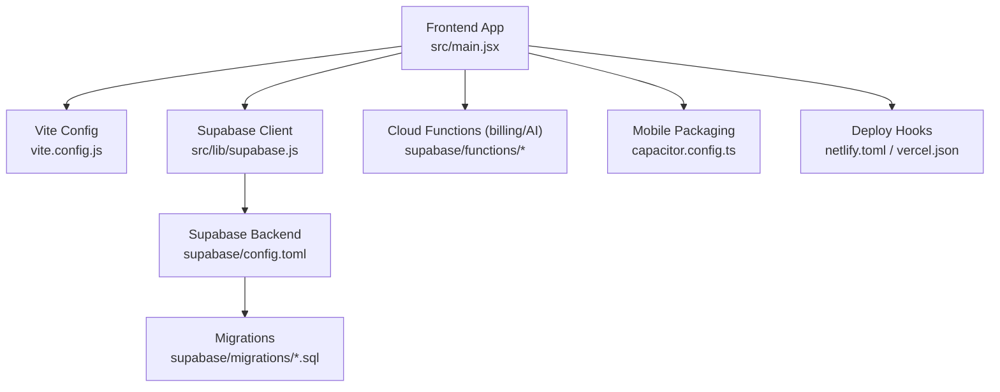
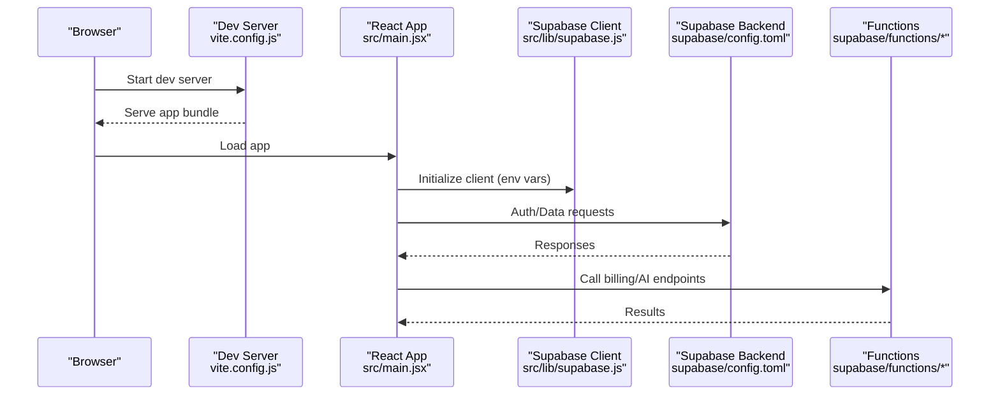
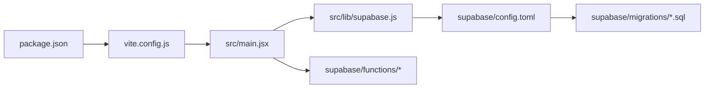

# Getting Started

<cite>
**Referenced Files in This Document**
- [README.md](file://README.md)
- [package.json](file://package.json)
- [vite.config.js](file://vite.config.js)
- [netlify.toml](file://netlify.toml)
- [vercel.json](file://vercel.json)
- [capacitor.config.ts](file://capacitor.config.ts)
- [src/main.jsx](file://src/main.jsx)
- [src/lib/supabase.js](file://src/lib/supabase.js)
- [supabase/config.toml](file://supabase/config.toml)
- [supabase/migrations/001_schema.sql](file://supabase/migrations/001_schema.sql)
- [supabase/functions/_shared/http.ts](file://supabase/functions/_shared/http.ts)
</cite>

## Table of Contents
1. Introduction
2. Project Structure
3. Core Components
4. Architecture Overview
5. Detailed Component Analysis
6. Dependency Analysis
7. Performance Considerations
8. Troubleshooting Guide
9. Conclusion
10. Appendices

## Introduction
This guide helps you set up and run ApplyGuard PH locally, configure Supabase integration, and prepare for development and deployment. It covers prerequisites, installation, environment configuration, first-time workflow, running the dev server, building, and deploying locally. The goal is to get you productive quickly with clear commands and expected outputs.

## Project Structure
ApplyGuard PH is a Vite-based React application with Supabase as the backend. Key areas:
- Frontend app entry and build configuration
- Supabase client initialization and migrations
- Cloud functions for billing and AI proxy
- Mobile packaging via Capacitor

**Diagram sources**
- [src/main.jsx](file://src/main.jsx)
- [vite.config.js](file://vite.config.js)
- [src/lib/supabase.js](file://src/lib/supabase.js)
- [supabase/config.toml](file://supabase/config.toml)
- [supabase/migrations/001_schema.sql](file://supabase/migrations/001_schema.sql)
- [capacitor.config.ts](file://capacitor.config.ts)
- [netlify.toml](file://netlify.toml)
- [vercel.json](file://vercel.json)

**Section sources**
- [README.md](file://README.md)
- [package.json](file://package.json)
- [vite.config.js](file://vite.config.js)
- [src/main.jsx](file://src/main.jsx)
- [src/lib/supabase.js](file://src/lib/supabase.js)
- [capacitor.config.ts](file://capacitor.config.ts)
- [netlify.toml](file://netlify.toml)
- [vercel.json](file://vercel.json)

## Core Components
- Build system: Vite with React
- Runtime entry: src/main.jsx bootstraps the app
- Data layer: Supabase client configured in src/lib/supabase.js
- Backend schema: SQL migrations under supabase/migrations
- Serverless functions: Billing and AI proxy endpoints under supabase/functions
- Mobile packaging: Capacitor config at capacitor.config.ts
- Deployment hooks: netlify.toml and vercel.json

What this means for you:
- Use npm/yarn scripts defined in package.json to install dependencies, start the dev server, and build.
- Configure Supabase by setting environment variables and applying migrations.
- Optionally integrate mobile builds using Capacitor.

**Section sources**
- [package.json](file://package.json)
- [vite.config.js](file://vite.config.js)
- [src/main.jsx](file://src/main.jsx)
- [src/lib/supabase.js](file://src/lib/supabase.js)
- [supabase/migrations/001_schema.sql](file://supabase/migrations/001_schema.sql)
- [supabase/functions/_shared/http.ts](file://supabase/functions/_shared/http.ts)
- [capacitor.config.ts](file://capacitor.config.ts)
- [netlify.toml](file://netlify.toml)
- [vercel.json](file://vercel.json)

## Architecture Overview
High-level flow from browser to Supabase:

**Diagram sources**
- [vite.config.js](file://vite.config.js)
- [src/main.jsx](file://src/main.jsx)
- [src/lib/supabase.js](file://src/lib/supabase.js)
- [supabase/config.toml](file://supabase/config.toml)
- [supabase/functions/_shared/http.ts](file://supabase/functions/_shared/http.ts)

## Detailed Component Analysis

### Prerequisites
- Node.js: Use a recent LTS version compatible with your project’s engine settings. Check the engines field in package.json for the required range.
- Package manager: npm or yarn (yarn v1). Ensure it matches the lockfile used by the project.
- Git: For cloning the repository.
- Optional: Supabase CLI for local development and migration management.

Verification steps:
- Confirm Node.js version meets the requirement specified in package.json.
- Verify npm/yarn can resolve packages without errors.

**Section sources**
- [package.json](file://package.json)

### Installation
1. Clone the repository and open the project root.
2. Install dependencies:
   - Using npm: run the install script defined in package.json.
   - Using yarn: run the equivalent command if preferred.
3. Confirm installation completes without errors.

Expected output:
- A node_modules directory created and no error messages.

**Section sources**
- [package.json](file://package.json)

### Environment Setup
Create a .env file in the project root and add the following variables:
- SUPABASE_URL: Your Supabase project URL.
- SUPABASE_ANON_KEY: Your Supabase anon/public key.
- Any additional keys referenced by the app or functions (e.g., AI provider keys, payment gateway keys).

Notes:
- The Supabase client reads these values at runtime.
- Keep secrets out of version control; use .env only locally.

How to verify:
- Start the dev server and ensure no “missing env” warnings appear in the console.
- If the app attempts to connect to Supabase, confirm that basic operations succeed.

**Section sources**
- [src/lib/supabase.js](file://src/lib/supabase.js)

### First-Time Development Workflow
1. Start the development server:
   - Use the script defined in package.json to launch the Vite dev server.
2. Open the local URL printed by the dev server in your browser.
3. Confirm the app loads and any Supabase-dependent features work.

Expected output:
- Dev server logs indicating the local address.
- Browser shows the app UI without errors.

**Section sources**
- [package.json](file://package.json)
- [vite.config.js](file://vite.config.js)
- [src/main.jsx](file://src/main.jsx)

### Running the Development Server
- Command: Use the dev script from package.json.
- Behavior: Vite serves hot-reloaded assets and proxies API calls as configured.

Tips:
- If you need custom port or proxy behavior, adjust vite.config.js accordingly.

**Section sources**
- [package.json](file://package.json)
- [vite.config.js](file://vite.config.js)

### Building the Application
- Command: Use the build script from package.json.
- Output: A production-ready static bundle suitable for hosting.

Verification:
- Inspect the dist folder created by the build process.
- Serve the dist folder locally to validate the production build.

**Section sources**
- [package.json](file://package.json)

### Deploying Locally
Static hosting options:
- Netlify: netlify.toml provides deploy hooks and build settings.
- Vercel: vercel.json defines framework detection and redirects.

Local preview:
- After building, serve the dist folder with a simple static server to simulate production.

**Section sources**
- [netlify.toml](file://netlify.toml)
- [vercel.json](file://vercel.json)
- [package.json](file://package.json)

### Supabase Integration
Initial setup steps:
1. Create a Supabase project and obtain:
   - Project URL
   - Anon key
2. Add them to your .env file as described above.
3. Apply database migrations:
   - Run the migrations defined under supabase/migrations.
   - Alternatively, push changes via the Supabase dashboard or CLI.
4. Test connectivity:
   - Ensure the app can read/write data as per your RLS policies.

Optional:
- Configure Supabase functions for billing and AI proxy endpoints.
- Set function-specific secrets in the Supabase dashboard.

**Section sources**
- [src/lib/supabase.js](file://src/lib/supabase.js)
- [supabase/config.toml](file://supabase/config.toml)
- [supabase/migrations/001_schema.sql](file://supabase/migrations/001_schema.sql)
- [supabase/functions/_shared/http.ts](file://supabase/functions/_shared/http.ts)

### API Keys and Secrets
Common categories:
- Supabase credentials (URL and anon key)
- AI provider keys (if used directly from frontend or via functions)
- Payment gateway keys (PayPal/Paymongo) used by Supabase functions

Where to store:
- Frontend-only keys: .env (never commit)
- Function secrets: Supabase dashboard environment variables

Security note:
- Prefer calling functions for sensitive operations instead of exposing keys in the browser.

**Section sources**
- [src/lib/supabase.js](file://src/lib/supabase.js)
- [supabase/functions/_shared/http.ts](file://supabase/functions/_shared/http.ts)

### Mobile Packaging (Optional)
Capacitor is configured for mobile builds. Use the provided config to generate native projects and run on devices/emulators.

Steps:
- Review capacitor.config.ts for platform targets and app metadata.
- Follow Capacitor docs to sync and run on iOS/Android.

**Section sources**
- [capacitor.config.ts](file://capacitor.config.ts)

## Dependency Analysis
Key relationships:
- package.json defines scripts and dependencies for Vite, React, and tooling.
- vite.config.js controls dev/build behavior.
- src/main.jsx initializes the React app.
- src/lib/supabase.js connects to Supabase using environment variables.
- supabase/migrations define the initial schema.
- supabase/functions implement server-side logic for billing and AI proxy.

**Diagram sources**
- [package.json](file://package.json)
- [vite.config.js](file://vite.config.js)
- [src/main.jsx](file://src/main.jsx)
- [src/lib/supabase.js](file://src/lib/supabase.js)
- [supabase/config.toml](file://supabase/config.toml)
- [supabase/migrations/001_schema.sql](file://supabase/migrations/001_schema.sql)
- [supabase/functions/_shared/http.ts](file://supabase/functions/_shared/http.ts)

**Section sources**
- [package.json](file://package.json)
- [vite.config.js](file://vite.config.js)
- [src/main.jsx](file://src/main.jsx)
- [src/lib/supabase.js](file://src/lib/supabase.js)
- [supabase/config.toml](file://supabase/config.toml)
- [supabase/migrations/001_schema.sql](file://supabase/migrations/001_schema.sql)
- [supabase/functions/_shared/http.ts](file://supabase/functions/_shared/http.ts)

## Performance Considerations
- Use the dev server for fast iteration; switch to the production build for performance testing.
- Avoid heavy synchronous operations in the main thread; offload to Web Workers or serverless functions where appropriate.
- Minimize unnecessary re-renders in React components.
- Cache responses when possible and leverage Supabase real-time features judiciously.

[No sources needed since this section provides general guidance]

## Troubleshooting Guide
Common issues and resolutions:
- Missing environment variables:
  - Ensure .env contains SUPABASE_URL and SUPABASE_ANON_KEY.
  - Restart the dev server after editing .env.
- Network/CORS errors:
  - Verify Supabase project CORS settings allow your local domain.
  - Check function URLs and headers if calling serverless endpoints.
- Migration failures:
  - Re-run migrations against the correct project.
  - Validate SQL syntax and constraints.
- Build errors:
  - Clear node_modules and reinstall dependencies.
  - Ensure Node.js version matches the engines requirement.
- Local preview not working:
  - Serve the dist folder with a static server and test again.

Verification checklist:
- Dev server starts and prints a local URL.
- App loads in the browser without console errors.
- Basic Supabase operations succeed (auth/data).
- Production build completes and dist folder exists.

**Section sources**
- [src/lib/supabase.js](file://src/lib/supabase.js)
- [package.json](file://package.json)
- [vite.config.js](file://vite.config.js)

## Conclusion
You now have the essentials to install, configure, and run ApplyGuard PH locally, integrate Supabase, and prepare for deployment. Use the troubleshooting tips to resolve common setup issues, and refer to the architecture overview to understand how components interact.

[No sources needed since this section summarizes without analyzing specific files]

## Appendices

### Quick Commands Reference
- Install dependencies: use the install script from package.json
- Start dev server: use the dev script from package.json
- Build production: use the build script from package.json
- Preview production build: serve the dist folder with a static server

**Section sources**
- [package.json](file://package.json)