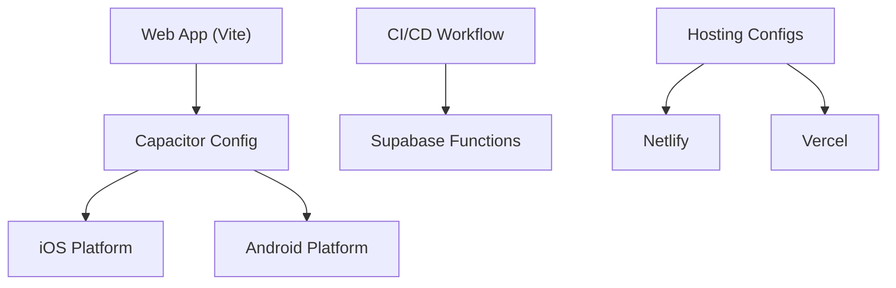
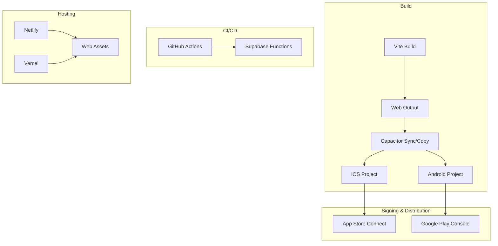
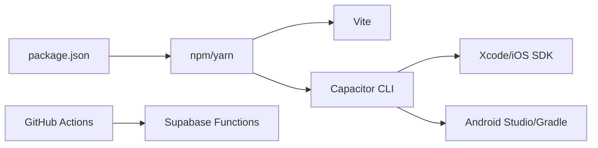

# App Build & Deployment

<cite>
**Referenced Files in This Document**
- [README.md](file://README.md)
- [package.json](file://package.json)
- [vite.config.js](file://vite.config.js)
- [capacitor.config.ts](file://capacitor.config.ts)
- [mobile/README.md](file://mobile/README.md)
- [.github/workflows/supabase.yml](file://.github/workflows/supabase.yml)
- [netlify.toml](file://netlify.toml)
- [vercel.json](file://vercel.json)
</cite>

## Table of Contents
1. [Introduction](#introduction)
2. [Project Structure](#project-structure)
3. [Core Components](#core-components)
4. [Architecture Overview](#architecture-overview)
5. [Detailed Component Analysis](#detailed-component-analysis)
6. [Dependency Analysis](#dependency-analysis)
7. [Performance Considerations](#performance-considerations)
8. [Troubleshooting Guide](#troubleshooting-guide)
9. [Conclusion](#conclusion)
10. [Appendices](#appendices)

## Introduction
This document provides comprehensive build and deployment guidance for the ApplyGuard PH mobile applications. It covers end-to-end processes for building, signing, and distributing iOS and Android apps using Capacitor, along with CI/CD integration and store preparation steps. The guide is designed to be accessible to both developers and release managers, with clear references to repository files where applicable.

## Project Structure
The project is a web application built with Vite and packaged as a native app via Capacitor. Key configuration points:
- Web build tooling and environment are defined in the root configuration files.
- Capacitor config centralizes app identity and platform settings.
- Mobile-specific documentation exists under the mobile directory.
- CI/CD workflows are present for Supabase-related automation.
- Hosting configurations exist for Netlify and Vercel.

[No sources needed since this diagram shows conceptual workflow, not actual code structure]

**Section sources**
- [README.md](file://README.md)
- [package.json](file://package.json)
- [vite.config.js](file://vite.config.js)
- [capacitor.config.ts](file://capacitor.config.ts)
- [mobile/README.md](file://mobile/README.md)
- [.github/workflows/supabase.yml](file://.github/workflows/supabase.yml)
- [netlify.toml](file://netlify.toml)
- [vercel.json](file://vercel.json)

## Core Components
- Web build pipeline: Vite-based build scripts and configuration define how assets are compiled and optimized for production.
- Capacitor bridge: Centralized configuration maps web artifacts into native iOS and Android projects, including app metadata and permissions.
- Mobile documentation: The mobile README contains platform-specific setup and build instructions.
- CI/CD: GitHub Actions workflow for Supabase functions and related backend tasks.
- Hosting: Configuration files for Netlify and Vercel deployments.

Key responsibilities:
- package.json: Scripts for development, building, and Capacitor operations.
- vite.config.js: Build targets, output paths, and environment handling.
- capacitor.config.ts: App ID, name, webDir, and platform options.
- mobile/README.md: Step-by-step guides for iOS and Android builds.
- .github/workflows/supabase.yml: Automated tasks for Supabase functions.
- netlify.toml and vercel.json: Hosting rules and redirects.

**Section sources**
- [package.json](file://package.json)
- [vite.config.js](file://vite.config.js)
- [capacitor.config.ts](file://capacitor.config.ts)
- [mobile/README.md](file://mobile/README.md)
- [.github/workflows/supabase.yml](file://.github/workflows/supabase.yml)
- [netlify.toml](file://netlify.toml)
- [vercel.json](file://vercel.json)

## Architecture Overview
The build and distribution architecture integrates web build outputs with native packaging through Capacitor. CI/CD automates backend tasks while hosting platforms serve web assets. Native app stores require platform-specific signing and provisioning.

[No sources needed since this diagram shows conceptual workflow, not actual code structure]

## Detailed Component Analysis

### Web Build Pipeline (Vite)
- Purpose: Compile and optimize frontend assets for production.
- Inputs: Source files and environment variables.
- Outputs: Static assets consumed by Capacitor.
- Integration: Capacitor copies these assets into native projects.

Operational notes:
- Ensure environment variables are set before building.
- Confirm output directory matches Capacitor’s webDir setting.

**Section sources**
- [vite.config.js](file://vite.config.js)
- [package.json](file://package.json)

### Capacitor Configuration and Packaging
- Purpose: Bridge web artifacts into native iOS and Android projects.
- Key settings: App identifier, display name, webDir path, and platform options.
- Operations: Sync/copy web assets, add/update platforms, open IDEs for native builds.

Best practices:
- Keep app ID consistent across platforms.
- Align webDir with Vite’s output directory.
- Use Capacitor CLI commands to manage platforms and sync changes.

**Section sources**
- [capacitor.config.ts](file://capacitor.config.ts)
- [package.json](file://package.json)

### Mobile Documentation and Platform-Specific Steps
- Location: mobile/README.md
- Content: Platform-specific setup, build, and troubleshooting steps for iOS and Android.
- Usage: Follow the documented steps for adding platforms, configuring native settings, and generating signed builds.

**Section sources**
- [mobile/README.md](file://mobile/README.md)

### CI/CD Integration (GitHub Actions)
- Purpose: Automate Supabase functions and related backend tasks.
- Scope: Backend-focused; does not directly build or sign mobile apps.
- Extensibility: Add jobs to build and upload mobile artifacts if desired.

Notes:
- Secrets and tokens should be managed via repository secrets.
- Separate workflows can be created for mobile builds and store uploads.

**Section sources**
- [.github/workflows/supabase.yml](file://.github/workflows/supabase.yml)

### Hosting Configuration (Netlify and Vercel)
- Purpose: Serve web assets with routing and redirects.
- Files: netlify.toml and vercel.json define hosting behavior.
- Relevance: Useful for web distribution and preview environments; not used for native app store releases.

**Section sources**
- [netlify.toml](file://netlify.toml)
- [vercel.json](file://vercel.json)

## Dependency Analysis
The build system depends on:
- Node.js and npm/yarn for running scripts.
- Vite for asset compilation.
- Capacitor CLI for bridging web outputs to native projects.
- Platform SDKs (Xcode/iOS SDK, Android Studio/Gradle) for native builds and signing.
- CI/CD runner for automated tasks.

[No sources needed since this diagram shows conceptual dependencies, not actual code structure]

**Section sources**
- [package.json](file://package.json)
- [.github/workflows/supabase.yml](file://.github/workflows/supabase.yml)

## Performance Considerations
- Optimize web assets: Enable minification, tree-shaking, and image optimization in Vite.
- Reduce bundle size: Remove unused dependencies and lazy-load heavy modules.
- Cache strategies: Configure caching headers for hosted assets.
- Native builds: Use incremental builds and parallel Gradle/Xcode tasks where possible.

[No sources needed since this section provides general guidance]

## Troubleshooting Guide
Common issues and resolutions:
- Environment variables missing: Ensure all required variables are set before building.
- Capacitor sync errors: Verify webDir matches Vite’s output path and that web assets are generated successfully.
- Code signing failures (iOS): Check certificate validity, provisioning profile matching, and team settings in Xcode.
- Build errors (Android): Validate Gradle version compatibility and keystore configuration.
- CI/CD secrets: Confirm repository secrets are correctly configured and scoped.

For detailed platform-specific steps, consult the mobile documentation.

**Section sources**
- [mobile/README.md](file://mobile/README.md)

## Conclusion
This guide outlines the complete build and deployment process for ApplyGuard PH mobile applications using Vite and Capacitor. By aligning web build outputs with native packaging, managing platform-specific signing, and leveraging CI/CD for backend automation, teams can streamline releases to App Store Connect and Google Play Console. Refer to the mobile documentation for step-by-step platform instructions and ensure environment and secrets are properly configured for reliable builds.

[No sources needed since this section summarizes without analyzing specific files]

## Appendices

### App Store Connect Preparation (iOS)
- Create an app record in App Store Connect.
- Generate and install the required signing certificates and provisioning profiles.
- Configure Xcode project settings to match your app ID and signing identities.
- Archive and distribute via Xcode or command-line tools.

[No sources needed since this section provides general guidance]

### Google Play Console Preparation (Android)
- Create a new app entry in Google Play Console.
- Generate a keystore and configure Gradle signing.
- Upload the signed APK/AAB and fill out store listing details.
- Manage internal testing tracks and rollout phases.

[No sources needed since this section provides general guidance]

### Metadata Configuration
- Update app name, description, icons, and screenshots in each platform’s store console.
- Ensure privacy policy URLs and contact information are accurate.
- Align version codes and names across platforms for consistency.

[No sources needed since this section provides general guidance]

### Release Management
- Establish semantic versioning and changelog practices.
- Use feature flags to control gradual rollouts.
- Monitor crash reports and analytics post-release.
- Plan hotfixes and rollback procedures.

[No sources needed since this section provides general guidance]