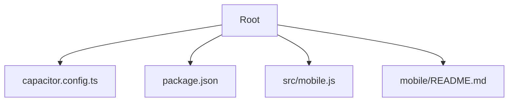
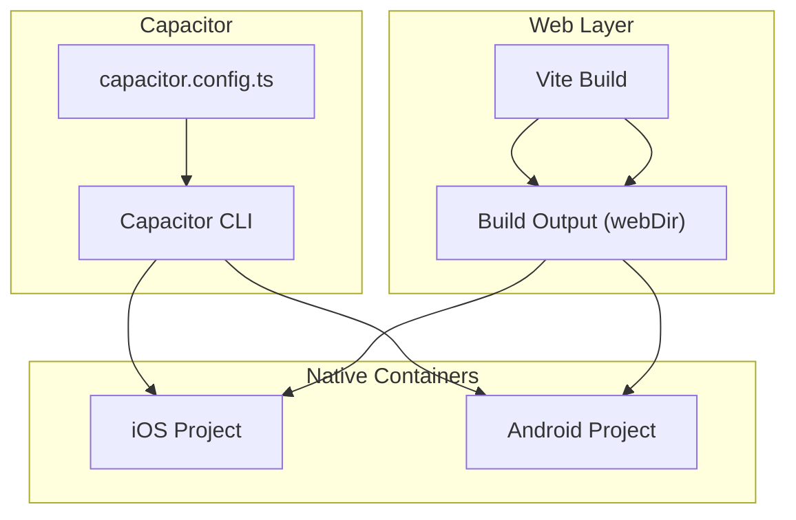
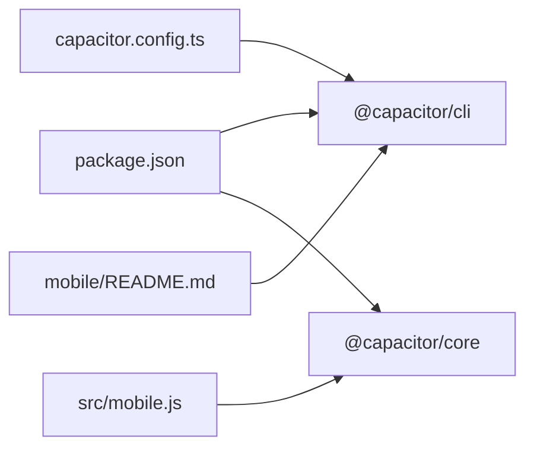

# Capacitor Setup & Configuration

<cite>
**Referenced Files in This Document**
- [capacitor.config.ts](file://capacitor.config.ts)
- [package.json](file://package.json)
- [src/mobile.js](file://src/mobile.js)
- [mobile/README.md](file://mobile/README.md)
</cite>

## Table of Contents
1. [Introduction](#introduction)
2. [Project Structure](#project-structure)
3. [Core Components](#core-components)
4. [Architecture Overview](#architecture-overview)
5. [Detailed Component Analysis](#detailed-component-analysis)
6. [Dependency Analysis](#dependency-analysis)
7. [Performance Considerations](#performance-considerations)
8. [Troubleshooting Guide](#troubleshooting-guide)
9. [Conclusion](#conclusion)
10. [Appendices](#appendices)

## Introduction
This document explains how Capacitor is set up and configured in ApplyGuard PH, focusing on the configuration file structure, platform-specific settings, build behavior, plugin management, and native capabilities. It also provides step-by-step instructions for initializing iOS and Android projects, installing dependencies, scaffolding, environment variables, and debugging workflows for both platforms.

## Project Structure
Capacitor-related files are located at the project root and within the mobile workspace:
- capacitor.config.ts: Central Capacitor configuration (app metadata, web assets, plugins, and platform targets).
- package.json: Declares Capacitor CLI and runtime packages used by the app.
- src/mobile.js: Mobile entry point that initializes Capacitor and conditionally loads mobile-only logic.
- mobile/README.md: Notes about the mobile workspace and any platform-specific guidance.

**Diagram sources**
- [capacitor.config.ts](file://capacitor.config.ts)
- [package.json](file://package.json)
- [src/mobile.js](file://src/mobile.js)
- [mobile/README.md](file://mobile/README.md)

**Section sources**
- [capacitor.config.ts](file://capacitor.config.ts)
- [package.json](file://package.json)
- [src/mobile.js](file://src/mobile.js)
- [mobile/README.md](file://mobile/README.md)

## Core Components
- Capacitor configuration file: Defines app identity, web asset directory, plugin options, and platform targets.
- Package manifest: Lists Capacitor CLI and runtime dependencies required to build and run native projects.
- Mobile entrypoint: Initializes Capacitor and bridges web code with native features when running on devices.
- Mobile workspace notes: Any additional platform-specific setup or conventions.

Key responsibilities:
- App identity and routing: Bundle identifier, app name, web server base path, and output directory.
- Plugin configuration: Enable/disable plugins and pass options consumed by native modules.
- Platform targets: Specify supported iOS and Android versions and related flags.
- Build integration: Ensure Vite build output aligns with Capacitor’s webDir expectation.

**Section sources**
- [capacitor.config.ts](file://capacitor.config.ts)
- [package.json](file://package.json)
- [src/mobile.js](file://src/mobile.js)
- [mobile/README.md](file://mobile/README.md)

## Architecture Overview
The application uses a hybrid architecture:
- Web layer built by Vite outputs static assets into a directory referenced by Capacitor.
- Capacitor CLI wraps the web assets into native containers for iOS and Android.
- The mobile entrypoint initializes Capacitor and conditionally enables mobile-only features.

[No sources needed since this diagram shows conceptual workflow, not actual code structure]

## Detailed Component Analysis

### Capacitor Configuration File (capacitor.config.ts)
Purpose:
- Centralizes app metadata, web asset location, plugin options, and platform targets.
- Ensures consistent behavior across development and production builds.

Typical sections and their roles:
- App identity: bundle identifier, app name, and versioning.
- Web server and assets: base URL, webDir pointing to the Vite build output.
- Plugins: per-plugin options and feature toggles.
- Platforms: minimum supported versions and platform-specific flags.

Common pitfalls:
- Mismatch between webDir and the actual build output folder.
- Incorrect bundle identifiers or missing permissions for requested native features.
- Incompatible plugin versions with target OS versions.

Best practices:
- Keep webDir aligned with your bundler configuration.
- Pin plugin versions compatible with your target OS versions.
- Use environment-aware values where necessary (e.g., different bundle IDs per flavor).

**Section sources**
- [capacitor.config.ts](file://capacitor.config.ts)

### Package Manifest (package.json)
Purpose:
- Declares Capacitor CLI and runtime packages.
- Provides scripts to sync, add, open, and run native projects.

What to verify:
- Presence of @capacitor/cli and @capacitor/core (and any platform-specific packages if added).
- Scripts for common tasks such as adding platforms, syncing changes, and launching emulators/devices.

Operational tips:
- Run dependency installation before adding platforms.
- Use the CLI to scaffold and update native projects after changing config or plugins.

**Section sources**
- [package.json](file://package.json)

### Mobile Entrypoint (src/mobile.js)
Purpose:
- Initializes Capacitor at runtime.
- Conditionally enables mobile-only behaviors based on the execution context.

Guidance:
- Ensure initialization occurs early in the app lifecycle.
- Guard mobile-only imports behind runtime checks to avoid errors in web-only environments.
- Keep platform detection minimal and reliable.

**Section sources**
- [src/mobile.js](file://src/mobile.js)

### Mobile Workspace Notes (mobile/README.md)
Purpose:
- Documents any mobile-specific conventions, toolchain requirements, or local setup steps.

Usage:
- Follow any prerequisites listed here before building native projects.
- Refer to it when troubleshooting platform-specific issues.

**Section sources**
- [mobile/README.md](file://mobile/README.md)

## Dependency Analysis
High-level relationships:
- capacitor.config.ts drives the Capacitor CLI behavior during sync/build.
- package.json supplies the CLI and runtime packages used by the app and tooling.
- src/mobile.js depends on Capacitor runtime to bridge web code to native APIs.
- mobile/README.md may reference platform SDKs or IDEs used for building.

**Diagram sources**
- [package.json](file://package.json)
- [capacitor.config.ts](file://capacitor.config.ts)
- [src/mobile.js](file://src/mobile.js)
- [mobile/README.md](file://mobile/README.md)

**Section sources**
- [package.json](file://package.json)
- [capacitor.config.ts](file://capacitor.config.ts)
- [src/mobile.js](file://src/mobile.js)
- [mobile/README.md](file://mobile/README.md)

## Performance Considerations
- Align webDir with your bundler’s output to avoid unnecessary copies or rebuilds.
- Keep plugin surface area minimal; only enable features you need.
- Avoid heavy synchronous calls from JavaScript to native; prefer async patterns.
- Preload only essential plugins at startup; lazy-load others when needed.

[No sources needed since this section provides general guidance]

## Troubleshooting Guide
Common issues and resolutions:
- Build output mismatch: If the app cannot find assets on device, ensure webDir matches the bundler’s output folder.
- Missing plugins: After adding or updating plugins, re-run the CLI to regenerate native projects.
- Platform version conflicts: Verify minimum OS versions in configuration match installed SDKs.
- Environment variables: If using env-based configuration, confirm they are available at build time and accessible at runtime where expected.
- Debugging:
  - iOS: Use Safari Developer Tools to inspect WebView content.
  - Android: Use Chrome DevTools via chrome://inspect to debug the WebView.

**Section sources**
- [capacitor.config.ts](file://capacitor.config.ts)
- [package.json](file://package.json)
- [src/mobile.js](file://src/mobile.js)
- [mobile/README.md](file://mobile/README.md)

## Conclusion
Capacitor in ApplyGuard PH is configured through a central configuration file, integrated with the build pipeline, and initialized at runtime via a dedicated mobile entrypoint. By keeping webDir aligned with the bundler, pinning compatible plugin versions, and following the provided setup and debugging steps, you can reliably develop and ship hybrid apps for iOS and Android.

[No sources needed since this section summarizes without analyzing specific files]

## Appendices

### Step-by-Step Setup Instructions
Prerequisites:
- Node.js and npm/yarn/pnpm installed.
- Xcode and iOS Simulator (for iOS).
- Android Studio and Android Emulator (for Android).

Steps:
1. Install dependencies:
   - Run the package manager install command to pull all dependencies declared in package.json.
2. Initialize Capacitor (if not already done):
   - Use the CLI to initialize Capacitor with your app metadata.
3. Add platforms:
   - Add iOS and Android projects using the CLI.
4. Sync configuration and plugins:
   - Run the CLI sync command to generate/update native projects based on capacitor.config.ts.
5. Open native projects:
   - Use the CLI to open each platform in its respective IDE for further customization.
6. Build and run:
   - Build the web assets (as configured by your bundler), then use the CLI to run on device/emulator.

Notes:
- Ensure the bundler’s output directory matches the webDir setting in capacitor.config.ts.
- After modifying plugins or configuration, always re-sync before rebuilding native projects.

**Section sources**
- [capacitor.config.ts](file://capacitor.config.ts)
- [package.json](file://package.json)
- [mobile/README.md](file://mobile/README.md)

### Environment Variables and Debugging
Environment variables:
- Define build-time variables in your bundler configuration and access them in the app where appropriate.
- For runtime variables, consider loading them from a secure source or configuration endpoint.

Debugging:
- iOS: Enable Safari Web Inspector and connect the simulator/device to inspect WebView.
- Android: Use Chrome DevTools via chrome://inspect to attach to the WebView.

**Section sources**
- [capacitor.config.ts](file://capacitor.config.ts)
- [src/mobile.js](file://src/mobile.js)
- [mobile/README.md](file://mobile/README.md)