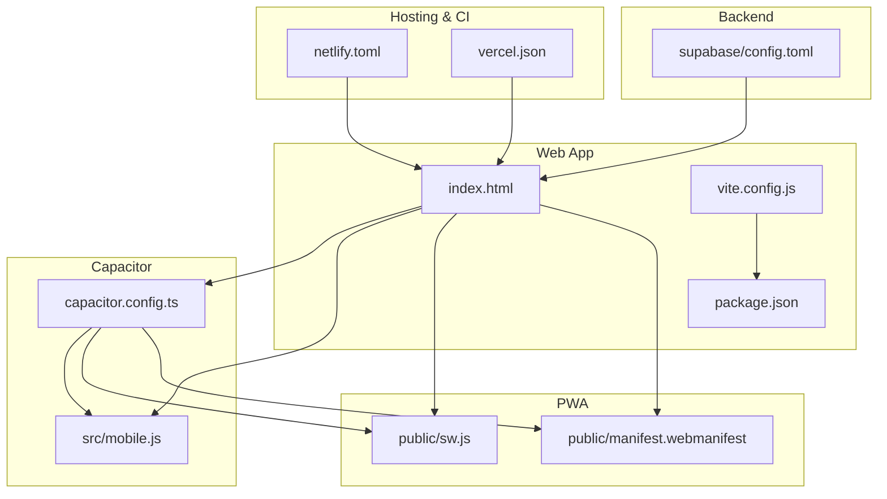
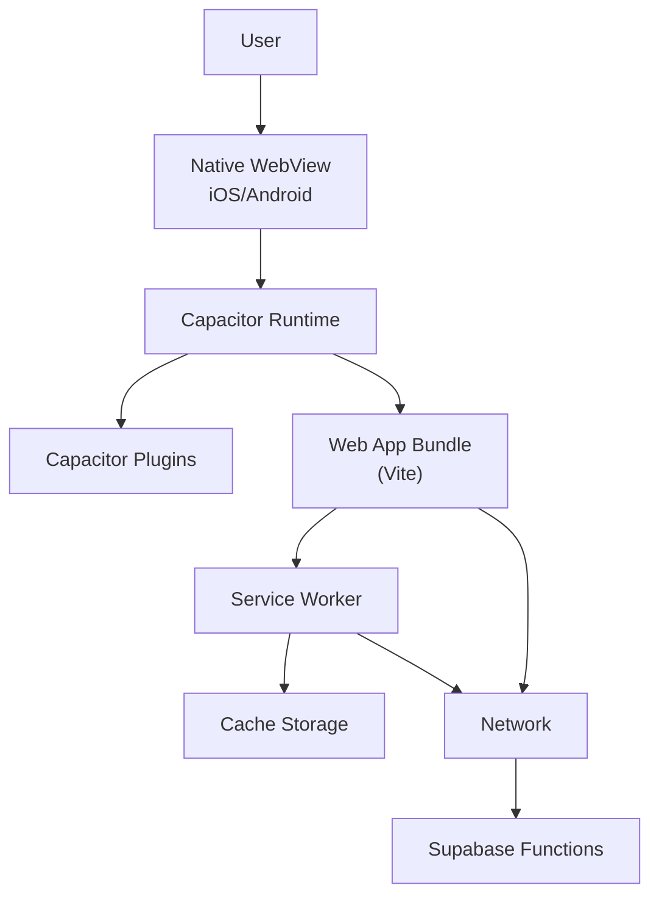
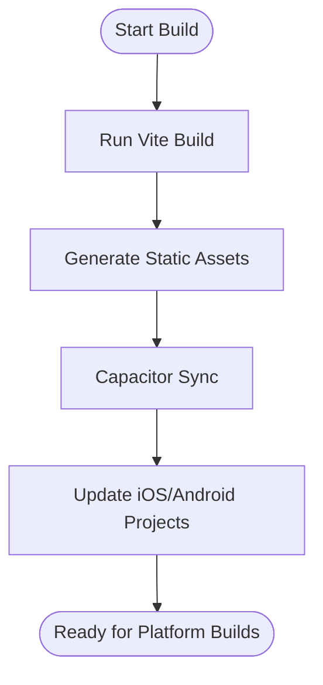
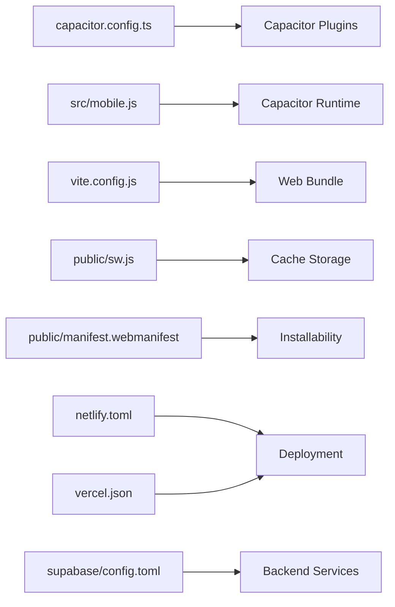

# Mobile Application

<cite>
**Referenced Files in This Document**
- [capacitor.config.ts](file://capacitor.config.ts)
- [mobile.js](file://src/mobile.js)
- [index.html](file://index.html)
- [public/sw.js](file://public/sw.js)
- [public/manifest.webmanifest](file://public/manifest.webmanifest)
- [package.json](file://package.json)
- [vite.config.js](file://vite.config.js)
- [netlify.toml](file://netlify.toml)
- [vercel.json](file://vercel.json)
- [supabase/config.toml](file://supabase/config.toml)
- [mobile/README.md](file://mobile/README.md)
</cite>

## Table of Contents
1. [Introduction](#introduction)
2. [Project Structure](#project-structure)
3. [Core Components](#core-components)
4. [Architecture Overview](#architecture-overview)
5. [Detailed Component Analysis](#detailed-component-analysis)
6. [Dependency Analysis](#dependency-analysis)
7. [Performance Considerations](#performance-considerations)
8. [Troubleshooting Guide](#troubleshooting-guide)
9. [Conclusion](#conclusion)
10. [Appendices](#appendices)

## Introduction
This document provides comprehensive mobile application documentation for ApplyGuard PH’s Capacitor-based app. It covers cross-platform setup, native feature access, mobile-specific optimizations, service worker implementation for offline functionality and background tasks, UI adaptations for touch interactions, device capability detection, build processes for iOS and Android, signing requirements, app store deployment procedures, debugging strategies, testing approaches, and performance considerations.

## Project Structure
The project is a web-first application packaged as a native app using Capacitor. The key mobile-related assets include:
- Capacitor configuration file at the repository root
- A mobile entrypoint module that initializes Capacitor features
- Service worker and web manifest for PWA capabilities
- Build and hosting configurations for Vite and CI
- Supabase configuration for backend integration

**Diagram sources**
- [capacitor.config.ts](file://capacitor.config.ts)
- [mobile.js](file://src/mobile.js)
- [index.html](file://index.html)
- [public/sw.js](file://public/sw.js)
- [public/manifest.webmanifest](file://public/manifest.webmanifest)
- [vite.config.js](file://vite.config.js)
- [package.json](file://package.json)
- [netlify.toml](file://netlify.toml)
- [vercel.json](file://vercel.json)
- [supabase/config.toml](file://supabase/config.toml)

**Section sources**
- [capacitor.config.ts](file://capacitor.config.ts)
- [mobile.js](file://src/mobile.js)
- [index.html](file://index.html)
- [public/sw.js](file://public/sw.js)
- [public/manifest.webmanifest](file://public/manifest.webmanifest)
- [vite.config.js](file://vite.config.js)
- [package.json](file://package.json)
- [netlify.toml](file://netlify.toml)
- [vercel.json](file://vercel.json)
- [supabase/config.toml](file://supabase/config.toml)

## Core Components
- Capacitor Configuration: Centralizes app identity, web asset path, and plugin settings to bridge web code with native platforms.
- Mobile Entrypoint: Initializes Capacitor runtime and any platform-specific bootstrapping logic before the main app loads.
- Service Worker: Provides caching strategies, offline support, and optional background processing hooks.
- Web Manifest: Defines installability, icons, theme colors, and launch behavior for PWA and native packaging.
- Build and Hosting Configurations: Configure Vite bundling and deployment targets (Netlify/Vercel).
- Supabase Configuration: Backend environment and function definitions used by the app.

Key responsibilities:
- Cross-platform compatibility via Capacitor plugins and web APIs
- Offline-first data handling through the service worker
- Device capability detection and graceful fallbacks
- Touch-friendly UI patterns and responsive layouts
- Secure builds and signing for app stores

**Section sources**
- [capacitor.config.ts](file://capacitor.config.ts)
- [mobile.js](file://src/mobile.js)
- [public/sw.js](file://public/sw.js)
- [public/manifest.webmanifest](file://public/manifest.webmanifest)
- [vite.config.js](file://vite.config.js)
- [package.json](file://package.json)
- [netlify.toml](file://netlify.toml)
- [vercel.json](file://vercel.json)
- [supabase/config.toml](file://supabase/config.toml)

## Architecture Overview
The mobile architecture layers the web application over Capacitor, which exposes native capabilities to JavaScript. The service worker handles caching and offline scenarios, while the web manifest ensures proper installation and presentation on devices.

**Diagram sources**
- [capacitor.config.ts](file://capacitor.config.ts)
- [mobile.js](file://src/mobile.js)
- [public/sw.js](file://public/sw.js)
- [public/manifest.webmanifest](file://public/manifest.webmanifest)
- [vite.config.js](file://vite.config.js)
- [package.json](file://package.json)

## Detailed Component Analysis

### Capacitor Setup and Cross-Platform Compatibility
- App Identity and Bundles: The configuration defines the app identifier, bundle names, and web asset directory so Capacitor can generate native projects.
- Plugin Integration: Capacitor plugins are referenced here to enable native features such as storage, camera, or push notifications.
- Web Path Mapping: Ensures the built web assets are correctly served from the native container.

Operational notes:
- After updating the configuration, regenerate native projects and rebuild each platform.
- Keep plugin versions aligned across iOS and Android to avoid inconsistencies.

**Section sources**
- [capacitor.config.ts](file://capacitor.config.ts)

### Mobile Entrypoint Initialization
- Bootstraps Capacitor before the main application renders.
- Optionally configures global listeners for lifecycle events (e.g., resume/pause) and error boundaries.
- Prepares device capability checks and feature flags for UI adaptation.

Best practices:
- Defer heavy initialization until after Capacitor is ready.
- Use try/catch around native calls to handle unsupported environments gracefully.

**Section sources**
- [mobile.js](file://src/mobile.js)

### Service Worker Implementation for Offline Functionality
Responsibilities:
- Caching static assets and API responses to support offline usage.
- Implementing cache-first or network-first strategies per resource type.
- Handling background sync where supported.
- Providing update notifications when new content is available.

Considerations:
- Ensure precache includes critical shell assets for fast cold starts.
- Validate cache keys to prevent stale data issues.
- Test both online and offline flows thoroughly.

**Section sources**
- [public/sw.js](file://public/sw.js)

### Web Manifest and Installability
Defines:
- App name, short name, description, and theme colors.
- Icons for various densities and splash screens.
- Display mode and orientation preferences.

Impact:
- Enables add-to-home-screen prompts on supported browsers.
- Influences how the app appears when launched from the home screen.

**Section sources**
- [public/manifest.webmanifest](file://public/manifest.webmanifest)

### Build Processes and Hosting Configuration
- Vite Configuration: Controls output format, asset handling, and environment variables.
- Package Scripts: Includes commands for building web assets and syncing with Capacitor.
- Hosting: Netlify and Vercel configs define redirects, headers, and SPA routing.

Build flow overview:

**Diagram sources**
- [vite.config.js](file://vite.config.js)
- [package.json](file://package.json)
- [capacitor.config.ts](file://capacitor.config.ts)

**Section sources**
- [vite.config.js](file://vite.config.js)
- [package.json](file://package.json)
- [netlify.toml](file://netlify.toml)
- [vercel.json](file://vercel.json)

### Push Notifications and Background Processing
Capabilities:
- Register for push permissions on iOS and Android.
- Handle token registration and message delivery.
- Process background tasks via platform-specific mechanisms.

Implementation guidance:
- Integrate Capacitor push notification plugins.
- Manage tokens securely and refresh them on changes.
- Provide user-visible feedback for permission prompts.

**Section sources**
- [capacitor.config.ts](file://capacitor.config.ts)
- [mobile.js](file://src/mobile.js)

### Mobile UI Adaptations and Touch Interactions
Recommendations:
- Use large tap targets and spacing suitable for fingers.
- Avoid hover-dependent interactions; rely on click/tap semantics.
- Implement swipe gestures for navigation where appropriate.
- Respect safe areas and dynamic island notches on modern devices.

Device capability detection:
- Detect touch availability, viewport size, and OS/browser features.
- Gracefully degrade features unavailable on certain devices.

**Section sources**
- [mobile.js](file://src/mobile.js)
- [index.html](file://index.html)

### Device Capability Detection and Feature Flags
Approach:
- Probe navigator and window APIs for presence of features.
- Maintain a feature flag map to conditionally render UI or disable non-functional actions.
- Provide clear messaging when features are unavailable.

**Section sources**
- [mobile.js](file://src/mobile.js)

### Signing Requirements and App Store Deployment
General steps:
- Generate platform-specific keystore/signing keys.
- Configure signing in Gradle (Android) and Xcode (iOS).
- Create release builds and run integrity checks.
- Submit binaries to Google Play and Apple App Store following their guidelines.

Notes:
- Keep secrets out of version control; use secure secret managers.
- Automate signing in CI pipelines for consistency.

**Section sources**
- [capacitor.config.ts](file://capacitor.config.ts)
- [package.json](file://package.json)

### Debugging and Testing Strategies
Debugging:
- Use browser DevTools for web-layer debugging.
- Inspect native logs via Android Studio and Xcode.
- Enable verbose logging during development builds.

Testing:
- Unit tests for business logic and utilities.
- E2E tests for critical user flows.
- Manual testing on real devices for native features and performance.

**Section sources**
- [package.json](file://package.json)
- [mobile.js](file://src/mobile.js)

## Dependency Analysis
High-level dependencies:
- Capacitor core and plugins provide native bridges.
- Vite orchestrates bundling and asset optimization.
- Hosting configurations ensure correct routing and caching headers.
- Supabase configuration drives backend endpoints and functions.

**Diagram sources**
- [capacitor.config.ts](file://capacitor.config.ts)
- [mobile.js](file://src/mobile.js)
- [vite.config.js](file://vite.config.js)
- [public/sw.js](file://public/sw.js)
- [public/manifest.webmanifest](file://public/manifest.webmanifest)
- [netlify.toml](file://netlify.toml)
- [vercel.json](file://vercel.json)
- [supabase/config.toml](file://supabase/config.toml)

**Section sources**
- [capacitor.config.ts](file://capacitor.config.ts)
- [mobile.js](file://src/mobile.js)
- [vite.config.js](file://vite.config.js)
- [public/sw.js](file://public/sw.js)
- [public/manifest.webmanifest](file://public/manifest.webmanifest)
- [netlify.toml](file://netlify.toml)
- [vercel.json](file://vercel.json)
- [supabase/config.toml](file://supabase/config.toml)

## Performance Considerations
- Minimize initial payload: leverage Vite’s code splitting and tree-shaking.
- Precache only essential assets; implement dynamic caching for API responses.
- Debounce and throttle frequent native calls (camera, sensors).
- Use efficient image formats and sizes; lazy-load media.
- Monitor memory usage on low-end devices; avoid long-running JS tasks on the main thread.
- Profile with device-specific tools (Chrome DevTools, Android Profiler, Instruments).

[No sources needed since this section provides general guidance]

## Troubleshooting Guide
Common issues and resolutions:
- Capacitor sync failures: Re-run sync and verify web asset paths.
- Push notification permission denied: Re-prompt users with clear explanations.
- Offline errors: Validate cache keys and fallback strategies in the service worker.
- Build signing errors: Confirm keystore validity and password correctness.
- Routing issues on SPA hosting: Verify redirect rules in hosting configs.

**Section sources**
- [capacitor.config.ts](file://capacitor.config.ts)
- [public/sw.js](file://public/sw.js)
- [netlify.toml](file://netlify.toml)
- [vercel.json](file://vercel.json)

## Conclusion
ApplyGuard PH’s mobile app leverages Capacitor to deliver a consistent cross-platform experience while retaining the flexibility of web technologies. With a robust service worker, thoughtful UI adaptations, and disciplined build and deployment practices, the app achieves strong offline support, native feature access, and reliable performance across iOS and Android. Following the guidance in this document will help maintain quality, security, and scalability as the app evolves.

[No sources needed since this section summarizes without analyzing specific files]

## Appendices

### Quick Start Checklist
- Update Capacitor configuration for app identity and plugins.
- Initialize mobile entrypoint and device capability checks.
- Configure service worker caching strategies and update notifications.
- Define web manifest for installability and appearance.
- Set up Vite build scripts and hosting configurations.
- Prepare signing credentials and automate releases.

**Section sources**
- [capacitor.config.ts](file://capacitor.config.ts)
- [mobile.js](file://src/mobile.js)
- [public/sw.js](file://public/sw.js)
- [public/manifest.webmanifest](file://public/manifest.webmanifest)
- [vite.config.js](file://vite.config.js)
- [package.json](file://package.json)
- [netlify.toml](file://netlify.toml)
- [vercel.json](file://vercel.json)

### Additional Resources
- Mobile README for platform-specific notes and instructions.

**Section sources**
- [mobile/README.md](file://mobile/README.md)