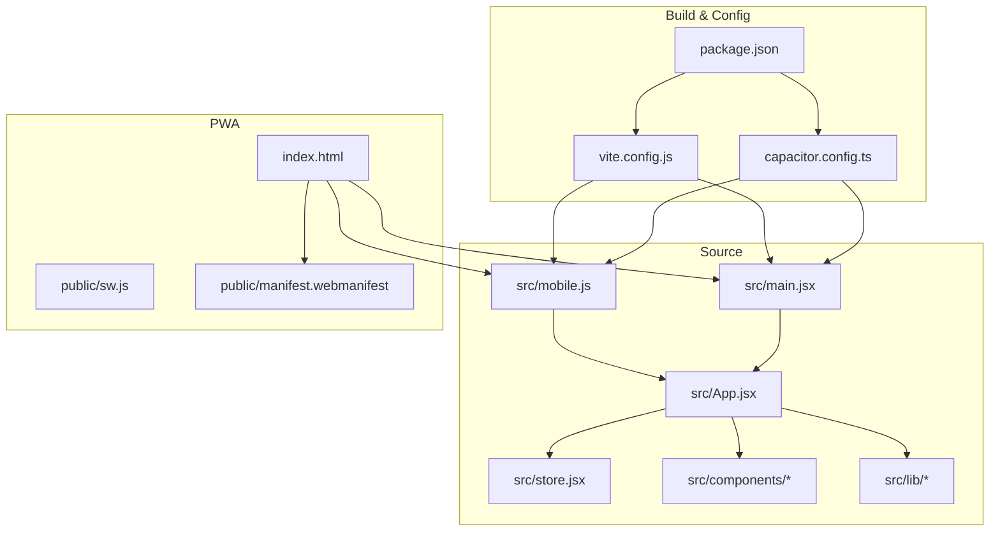
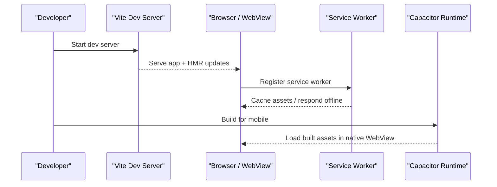
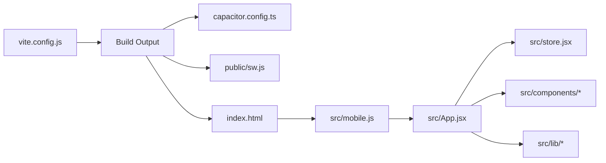

# Mobile Development Workflow

<cite>
**Referenced Files in This Document**
- [src/mobile.js](file://src/mobile.js)
- [public/sw.js](file://public/sw.js)
- [capacitor.config.ts](file://capacitor.config.ts)
- [mobile/README.md](file://mobile/README.md)
- [vite.config.js](file://vite.config.js)
- [package.json](file://package.json)
- [index.html](file://index.html)
- [manifest.webmanifest](file://public/manifest.webmanifest)
</cite>

## Table of Contents
1. [Introduction](#introduction)
2. [Project Structure](#project-structure)
3. [Core Components](#core-components)
4. [Architecture Overview](#architecture-overview)
5. [Detailed Component Analysis](#detailed-component-analysis)
6. [Dependency Analysis](#dependency-analysis)
7. [Performance Considerations](#performance-considerations)
8. [Troubleshooting Guide](#troubleshooting-guide)
9. [Conclusion](#conclusion)
10. [Appendices](#appendices)

## Introduction
This document describes the mobile development workflow for ApplyGuard PH. It focuses on the mobile-specific entry point, service worker implementation for offline functionality, build process adaptations, hot reloading, debugging techniques, testing strategies, responsive design guidelines, touch interactions, device capability detection, performance optimization, memory management, and battery usage considerations. The goal is to help developers build, run, debug, and optimize the app across web and native mobile targets.

## Project Structure
The project is a modern web application configured for both browser and mobile distribution:
- Web runtime entry points are under src/.
- A mobile-specific entry point exists at src/mobile.js.
- A PWA service worker is located at public/sw.js.
- Capacitor configuration is defined in capacitor.config.ts.
- Build tooling uses Vite via vite.config.js.
- The PWA manifest is at public/manifest.webmanifest.
- The HTML shell is index.html.
- The mobile folder contains mobile-specific guidance (mobile/README.md).

**Diagram sources**
- [src/mobile.js](file://src/mobile.js)
- [src/main.jsx](file://src/main.jsx)
- [src/App.jsx](file://src/App.jsx)
- [src/store.jsx](file://src/store.jsx)
- [public/sw.js](file://public/sw.js)
- [public/manifest.webmanifest](file://public/manifest.webmanifest)
- [index.html](file://index.html)
- [vite.config.js](file://vite.config.js)
- [capacitor.config.ts](file://capacitor.config.ts)
- [package.json](file://package.json)

**Section sources**
- [src/mobile.js](file://src/mobile.js)
- [public/sw.js](file://public/sw.js)
- [capacitor.config.ts](file://capacitor.config.ts)
- [mobile/README.md](file://mobile/README.md)
- [vite.config.js](file://vite.config.js)
- [package.json](file://package.json)
- [index.html](file://index.html)
- [manifest.webmanifest](file://public/manifest.webmanifest)

## Core Components
- Mobile entry point: src/mobile.js initializes the app for mobile contexts and may set up mobile-specific behaviors or feature flags.
- Service worker: public/sw.js provides caching and offline support for PWA features.
- Capacitor config: capacitor.config.ts defines how the web build is wrapped into a native container.
- Build config: vite.config.js controls bundling, asset handling, and environment variables used by both web and mobile builds.
- Manifest: public/manifest.webmanifest declares PWA metadata such as name, icons, theme color, and display mode.

Key responsibilities:
- Mobile entry point: ensure correct initialization path, detect mobile context if needed, and configure any mobile-only behavior.
- Service worker: cache critical assets, handle network-first vs cache-first strategies, and manage background sync where applicable.
- Capacitor: map web assets to native bundle, define permissions, and configure platform-specific options.
- Build: enable production optimizations, code splitting, and asset fingerprinting; expose environment variables for mobile builds.

**Section sources**
- [src/mobile.js](file://src/mobile.js)
- [public/sw.js](file://public/sw.js)
- [capacitor.config.ts](file://capacitor.config.ts)
- [vite.config.js](file://vite.config.js)
- [public/manifest.webmanifest](file://public/manifest.webmanifest)

## Architecture Overview
The mobile architecture layers include:
- UI layer: React components and hooks under src/components and src/hooks.
- State and data: store and lib modules for local state, Supabase integration, and utilities.
- Runtime entry: src/mobile.js for mobile and src/main.jsx for general web.
- PWA layer: service worker and manifest for offline and installability.
- Native wrapper: Capacitor bridges web assets to iOS/Android.

**Diagram sources**
- [vite.config.js](file://vite.config.js)
- [src/mobile.js](file://src/mobile.js)
- [public/sw.js](file://public/sw.js)
- [capacitor.config.ts](file://capacitor.config.ts)

## Detailed Component Analysis

### Mobile Entry Point (src/mobile.js)
Purpose:
- Initialize the application when running in mobile contexts.
- Optionally apply mobile-specific feature flags, routing, or UI adjustments.
- Ensure compatibility with Capacitor’s WebView environment.

Typical responsibilities:
- Detect mobile environment if necessary.
- Configure global settings or polyfills required only on mobile.
- Mount the root component or bootstrap logic tailored for mobile.

Best practices:
- Keep mobile-specific logic isolated to avoid impacting web builds.
- Use environment checks rather than hardcoding platform assumptions.
- Avoid heavy work during startup; defer non-critical tasks.

**Section sources**
- [src/mobile.js](file://src/mobile.js)

### Service Worker Implementation (public/sw.js)
Purpose:
- Provide offline access to core app resources.
- Improve perceived performance through caching strategies.
- Enable installation and background capabilities per PWA standards.

Common patterns:
- Precache essential assets during install.
- Network-first for dynamic content; cache-first for static assets.
- Handle fetch events to serve cached responses when offline.
- Manage cache versions and cleanup outdated entries.

Operational notes:
- Ensure the service worker is registered from the HTML shell.
- Validate that the manifest references the service worker scope correctly.
- Test offline scenarios thoroughly across devices.

**Section sources**
- [public/sw.js](file://public/sw.js)
- [index.html](file://index.html)
- [public/manifest.webmanifest](file://public/manifest.webmanifest)

### Build Process Adaptations (vite.config.js)
Purpose:
- Configure bundling for both web and mobile distributions.
- Optimize assets, code splitting, and environment variable injection.
- Integrate with Capacitor’s expected output structure.

Considerations:
- Set appropriate base paths for Capacitor’s www directory.
- Enable production optimizations (minification, tree-shaking).
- Expose environment variables for mobile-specific toggles.
- Ensure assets are properly hashed for cache busting.

**Section sources**
- [vite.config.js](file://vite.config.js)
- [package.json](file://package.json)

### Capacitor Configuration (capacitor.config.ts)
Purpose:
- Define how the web build is packaged into native apps.
- Configure app metadata, permissions, and platform-specific options.
- Map web assets to the native container’s www folder.

Guidelines:
- Align app ID, version, and name with store requirements.
- Configure plugins and permissions as needed (e.g., storage, camera).
- Verify that the web build output matches Capacitor’s expectations.

**Section sources**
- [capacitor.config.ts](file://capacitor.config.ts)

### Mobile README Guidance (mobile/README.md)
Purpose:
- Provide team-specific instructions for building, running, and debugging mobile builds.
- Outline platform setup steps and common pitfalls.

Usage:
- Follow platform prerequisites and CLI commands documented here.
- Refer to troubleshooting tips for known issues.

**Section sources**
- [mobile/README.md](file://mobile/README.md)

## Dependency Analysis
High-level dependencies:
- src/mobile.js depends on the app’s root component and shared libraries.
- public/sw.js is independent but interacts with the browser runtime and cache APIs.
- vite.config.js influences all source files by controlling build outputs.
- capacitor.config.ts consumes the build output produced by Vite.

**Diagram sources**
- [vite.config.js](file://vite.config.js)
- [capacitor.config.ts](file://capacitor.config.ts)
- [public/sw.js](file://public/sw.js)
- [index.html](file://index.html)
- [src/mobile.js](file://src/mobile.js)
- [src/App.jsx](file://src/App.jsx)
- [src/store.jsx](file://src/store.jsx)

**Section sources**
- [vite.config.js](file://vite.config.js)
- [capacitor.config.ts](file://capacitor.config.ts)
- [public/sw.js](file://public/sw.js)
- [index.html](file://index.html)
- [src/mobile.js](file://src/mobile.js)
- [src/App.jsx](file://src/App.jsx)
- [src/store.jsx](file://src/store.jsx)

## Performance Considerations
General guidance:
- Prefer lazy loading for heavy routes and components to reduce initial payload.
- Use efficient image formats and sizes; leverage responsive images where possible.
- Minimize synchronous work on the main thread; offload long-running tasks to workers if needed.
- Leverage caching strategies in the service worker to reduce network requests.
- Profile memory usage regularly; avoid retaining large objects unnecessarily.
- Monitor battery impact by reducing frequent polling and heavy animations.

Mobile-specific tips:
- Avoid blocking the UI thread during app start-up; defer non-critical initialization.
- Use hardware acceleration judiciously; excessive compositing can increase power usage.
- Respect system preferences like reduced motion and dark mode.

[No sources needed since this section provides general guidance]

## Troubleshooting Guide
Common areas to inspect:
- Service worker registration and lifecycle: verify registration from the HTML shell and check cache states.
- Capacitor build output: ensure the www directory structure matches expectations.
- Environment variables: confirm they are injected correctly for mobile builds.
- Device permissions: validate that required permissions are declared and requested appropriately.

Debugging techniques:
- Use browser DevTools for web previews and PWA inspection.
- Use platform-native debuggers (Xcode for iOS, Android Studio for Android) when running inside Capacitor.
- Inspect logs from the native WebView and plugin calls.

Testing strategies:
- Test on real devices to validate touch interactions, orientation changes, and performance.
- Simulate offline conditions to verify service worker behavior.
- Run automated tests for critical flows and unit tests for utility modules.

**Section sources**
- [public/sw.js](file://public/sw.js)
- [index.html](file://index.html)
- [capacitor.config.ts](file://capacitor.config.ts)
- [mobile/README.md](file://mobile/README.md)

## Conclusion
By isolating mobile-specific logic in the mobile entry point, implementing a robust service worker, and aligning build and packaging configurations, ApplyGuard PH can deliver a performant, offline-capable experience across web and native mobile platforms. Following the outlined debugging, testing, and optimization practices will help maintain quality and responsiveness on diverse devices.

[No sources needed since this section summarizes without analyzing specific files]

## Appendices

### Responsive Design Guidelines
- Use fluid layouts and relative units to adapt to various screen sizes.
- Implement breakpoints for small, medium, and large screens.
- Ensure text remains readable and interactive elements meet minimum touch target sizes.

### Touch Interactions
- Support tap, swipe, and pinch gestures where appropriate.
- Provide visual feedback for touch actions.
- Avoid hover-dependent interactions; rely on focus and active states.

### Device Capability Detection
- Feature-detect APIs before use rather than relying solely on user agent strings.
- Gracefully degrade functionality when advanced features are unavailable.
- Use progressive enhancement to improve experiences on capable devices.

[No sources needed since this section provides general guidance]