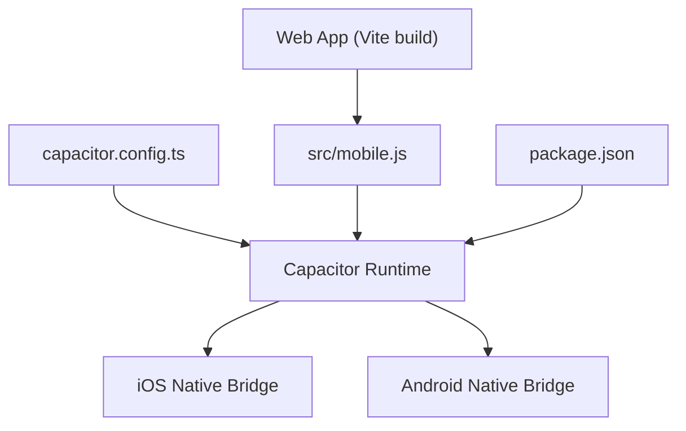
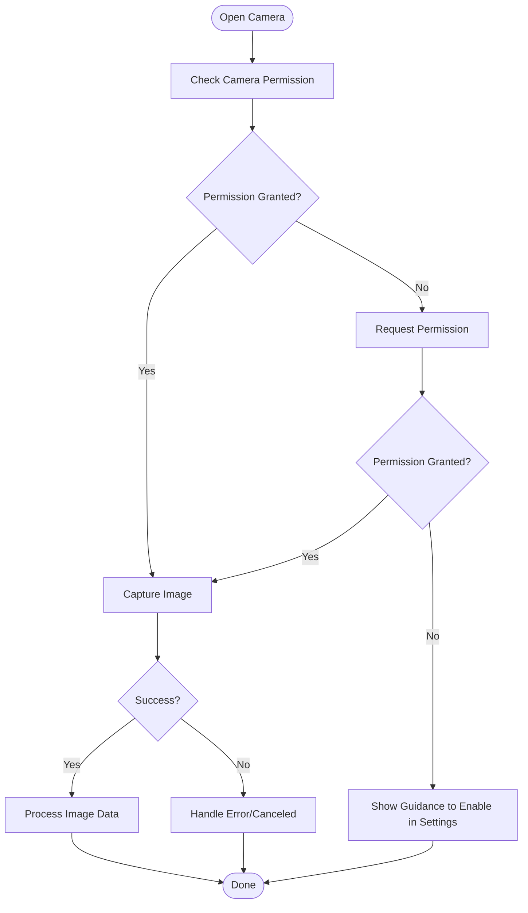
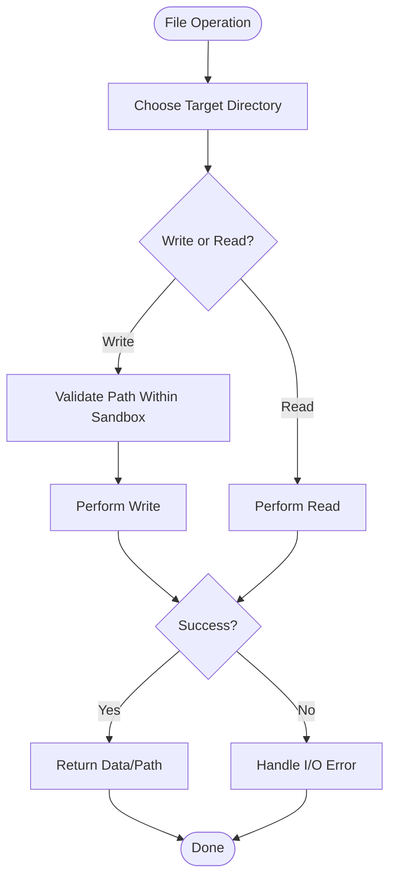
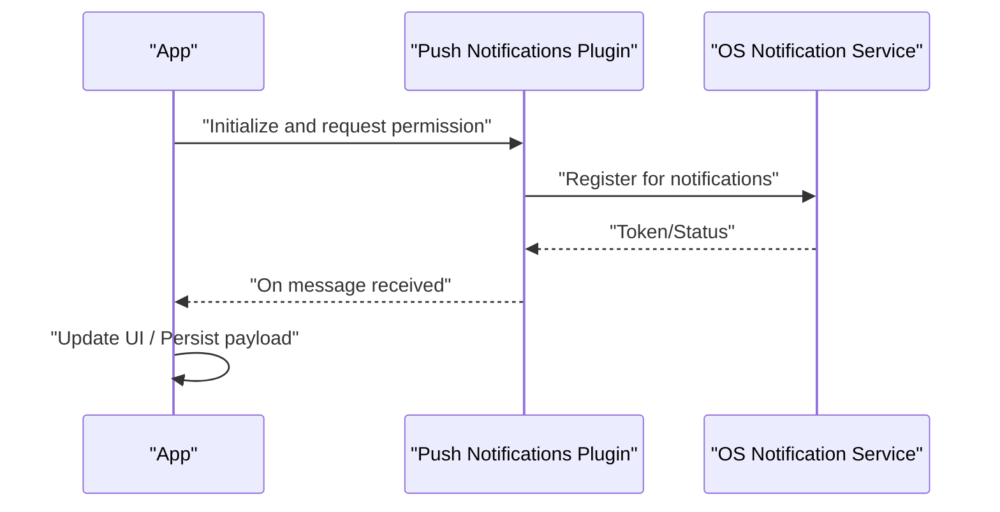
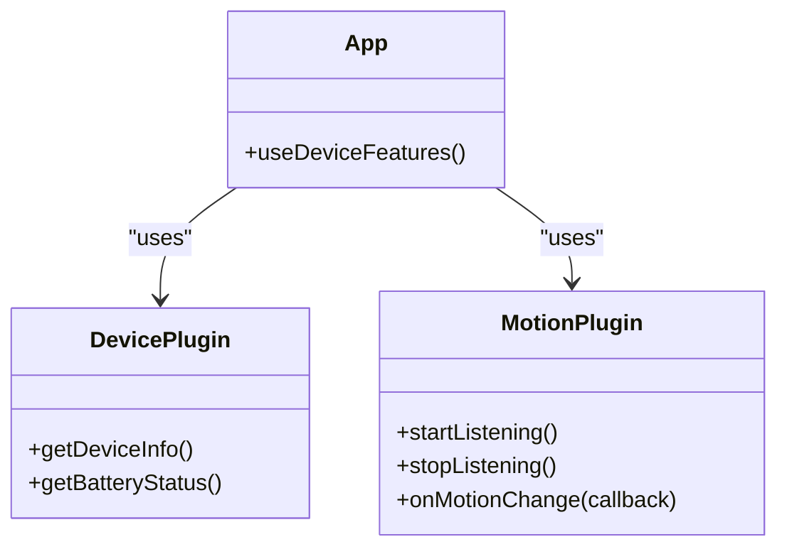
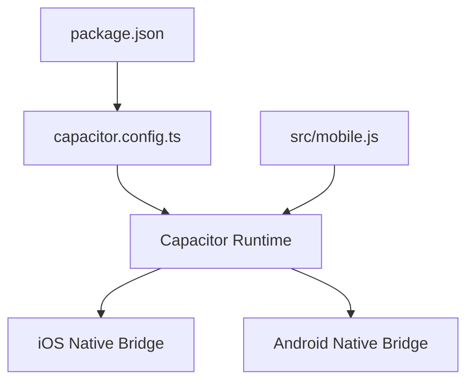

# Native Platform Integrations

<cite>
**Referenced Files in This Document**
- [capacitor.config.ts](file://capacitor.config.ts)
- [mobile.js](file://src/mobile.js)
- [package.json](file://package.json)
- [README.md](file://README.md)
</cite>

## Table of Contents
1. [Introduction](#introduction)
2. [Project Structure](#project-structure)
3. [Core Components](#core-components)
4. [Architecture Overview](#architecture-overview)
5. [Detailed Component Analysis](#detailed-component-analysis)
6. [Dependency Analysis](#dependency-analysis)
7. [Performance Considerations](#performance-considerations)
8. [Troubleshooting Guide](#troubleshooting-guide)
9. [Conclusion](#conclusion)
10. [Appendices](#appendices)

## Introduction
This document explains how ApplyGuard PH integrates with native platform capabilities on iOS and Android using Capacitor. It covers available Capacitor plugins, patterns for accessing native APIs, permission handling, and guidance for camera access, file system operations, push notifications, and device sensors. It also includes error handling strategies, fallback mechanisms for unsupported features, platform-specific considerations, security implications, and user privacy requirements.

## Project Structure
The mobile integration is configured at the project root and wired into the application via a dedicated module. The key files are:
- capacitor.config.ts: Capacitor configuration (app ID, name, webDir, plugins, etc.)
- src/mobile.js: Mobile entrypoint that initializes Capacitor and conditionally loads native-capable modules
- package.json: Declares dependencies including Capacitor runtime and any native plugins used by the app
- README.md: General project overview and setup notes



**Diagram sources**
- [capacitor.config.ts](file://capacitor.config.ts)
- [mobile.js](file://src/mobile.js)
- [package.json](file://package.json)

**Section sources**
- [capacitor.config.ts](file://capacitor.config.ts)
- [mobile.js](file://src/mobile.js)
- [package.json](file://package.json)
- [README.md](file://README.md)

## Core Components
- Capacitor Configuration
  - Defines app metadata, web directory, and plugin settings to ensure correct bridging between web code and native platforms.
  - Typical keys include app identifier, app name, web asset directory, and per-plugin options.

- Mobile Entrypoint
  - Initializes Capacitor at app startup and conditionally enables native features only when running inside a native container.
  - Provides a safe place to register listeners or initialize services that require native context.

- Dependency Management
  - Declares Capacitor core and any additional plugins required for camera, storage, notifications, and sensors.
  - Ensures consistent versions across web and native builds.

**Section sources**
- [capacitor.config.ts](file://capacitor.config.ts)
- [mobile.js](file://src/mobile.js)
- [package.json](file://package.json)

## Architecture Overview
At runtime, the web application runs inside a WebView provided by Capacitor. JavaScript calls into Capacitor’s bridge, which forwards requests to native implementations on iOS and Android. Responses flow back through the bridge to the web layer.

```mermaid
sequenceDiagram
participant Web as "Web App"
participant JS as "Capacitor JS Bridge"
participant IOS as "iOS Native Bridge"
participant AND as "Android Native Bridge"
Web->>JS : "Call native API"
JS->>IOS : "Forward to iOS implementation"
JS->>AND : "Forward to Android implementation"
IOS-->>JS : "Result/Error"
AND-->>JS : "Result/Error"
JS-->>Web : "Promise resolved/rejected"
```

[No sources needed since this diagram shows conceptual workflow, not actual code structure]

## Detailed Component Analysis

### Capacitor Plugins and Available Features
- Camera Access
  - Use the official Capacitor Camera plugin to capture photos or select images from the gallery.
  - Request permissions before invoking camera actions.
  - Handle errors such as denied permissions, canceled operations, or missing hardware.

- File System Operations
  - Prefer Capacitor Storage for small key-value data and app-scoped preferences.
  - For larger files or cross-app sharing, use Capacitor Filesystem to read/write within the app’s sandboxed directories.
  - Respect platform-specific paths and avoid writing outside allowed locations.

- Push Notifications
  - Integrate with Capacitor Push Notifications to register devices, handle token updates, and process incoming messages.
  - On iOS, configure APNs certificates and entitlements; on Android, configure Firebase and manifest entries.
  - Gracefully degrade if push is unavailable or disabled by the user.

- Device Sensors
  - Use Capacitor Device plugin for basic device info and battery status.
  - For motion and orientation, use Capacitor Motion or Accelerometer where appropriate.
  - Always check availability and handle lack of sensor hardware or disabled sensors.

- Clipboard
  - Read/write clipboard content using Capacitor Clipboard for copy/paste flows.
  - Avoid reading sensitive data without explicit user action.

- Share
  - Use Capacitor Share to open native share sheets for text, URLs, or files.

- In-App Browser
  - Open external links securely using Capacitor InAppBrowser with appropriate options.

- Geolocation
  - Use Capacitor Geolocation to obtain location with proper permission prompts and background restrictions.

- Network Status
  - Use Capacitor Network to detect connectivity changes and adapt behavior accordingly.

- App Lifecycle
  - Use Capacitor App to listen to lifecycle events like resume/suspend and act on them (e.g., pause/resume media).

- Splash Screen
  - Configure splash screen behavior via Capacitor config and hide programmatically after initialization.

- Toast/Alerts
  - Use Capacitor Toast or Alert for lightweight feedback and confirmations.

- Secure Storage
  - For secrets, prefer platform secure storage solutions exposed via Capacitor plugins or native modules.

Permission Handling Patterns
- Check and request permissions before sensitive operations (camera, microphone, location, notifications).
- Provide clear UI explaining why permissions are needed.
- Handle denial gracefully with fallbacks or guided steps to enable permissions in system settings.

Error Handling Strategies
- Wrap all native calls in try/catch or promise rejection handlers.
- Normalize errors into user-friendly messages.
- Log detailed diagnostics in development mode while avoiding sensitive data in logs.

Fallback Mechanisms
- Detect feature availability and provide web-based alternatives when native features are absent.
- Disable premium/native-only features when permissions are denied or hardware is missing.
- Cache results locally to improve resilience during network outages.

Platform-Specific Considerations
- iOS
  - Ensure Info.plist contains usage descriptions for camera, photo library, location, microphone, and notifications.
  - Configure APNs for push notifications and handle background modes if required.
  - Be mindful of ATS and HTTPS requirements for network calls.

- Android
  - Add required permissions in AndroidManifest.xml (camera, storage, internet, notification, location).
  - Configure Firebase for push notifications and test on real devices for accurate behavior.
  - Use scoped storage and SAF for file operations on newer Android versions.

Security Implications
- Never store tokens or secrets in plain text; use secure storage.
- Validate and sanitize inputs passed to native layers.
- Limit exposure of sensitive data in logs and analytics.
- Enforce HTTPS and certificate pinning where applicable.

User Privacy Requirements
- Provide clear privacy notices and consent flows.
- Honor user choices to disable tracking or location.
- Minimize data collection and retain only what is necessary.

**Section sources**
- [capacitor.config.ts](file://capacitor.config.ts)
- [mobile.js](file://src/mobile.js)
- [package.json](file://package.json)

### Camera Access Flow


[No sources needed since this diagram shows conceptual workflow, not actual code structure]

### File System Operations Flow


[No sources needed since this diagram shows conceptual workflow, not actual code structure]

### Push Notifications Flow


[No sources needed since this diagram shows conceptual workflow, not actual code structure]

### Device Sensors Integration


[No sources needed since this diagram shows conceptual workflow, not actual code structure]

## Dependency Analysis
The following diagram maps the primary integration points between configuration, runtime, and native bridges.



**Diagram sources**
- [package.json](file://package.json)
- [capacitor.config.ts](file://capacitor.config.ts)
- [mobile.js](file://src/mobile.js)

**Section sources**
- [package.json](file://package.json)
- [capacitor.config.ts](file://capacitor.config.ts)
- [mobile.js](file://src/mobile.js)

## Performance Considerations
- Batch native calls where possible to reduce bridge overhead.
- Debounce frequent sensor updates and throttle UI re-renders.
- Cache frequently accessed data locally to minimize repeated native/file reads.
- Avoid heavy image processing on the main thread; offload to workers or native code when feasible.
- Monitor memory usage for large file operations and release resources promptly.

[No sources needed since this section provides general guidance]

## Troubleshooting Guide
Common issues and resolutions:
- Permission Denied
  - Verify Info.plist and AndroidManifest.xml contain required usage descriptions and permissions.
  - Implement permission checks and guide users to system settings when denied.

- Push Not Working
  - Confirm APNs/Firebase configurations and provisioning profiles.
  - Test on physical devices; simulators may have limited support.

- File I/O Failures
  - Ensure target directories exist and are writable within the app sandbox.
  - Handle scoped storage constraints on Android.

- Camera Errors
  - Check for hardware availability and permission state.
  - Handle canceled captures and invalid image formats.

- Network Issues
  - Use Network plugin to detect offline states and queue operations for later sync.

- Build/Run Problems
  - Rebuild native projects after adding new plugins.
  - Sync Capacitor with latest versions and regenerate platforms.

**Section sources**
- [capacitor.config.ts](file://capacitor.config.ts)
- [mobile.js](file://src/mobile.js)
- [package.json](file://package.json)

## Conclusion
ApplyGuard PH leverages Capacitor to integrate native capabilities seamlessly across iOS and Android. By configuring the app correctly, initializing the bridge early, and adopting robust permission and error-handling patterns, the app can deliver rich native experiences while maintaining strong security and privacy standards. When native features are unavailable, graceful fallbacks ensure a consistent user experience.

[No sources needed since this section summarizes without analyzing specific files]

## Appendices

### Quick Reference: Common Capacitor Plugins
- Camera: Capture and select images
- Filesystem: Read/write within app sandbox
- Storage: Key-value preferences
- Push Notifications: Register and receive notifications
- Device: Basic device info and battery status
- Motion/Accelerometer: Sensor data streams
- Clipboard: Copy/paste operations
- Share: Native share sheet
- InAppBrowser: Secure external link handling
- Geolocation: Location access with permissions
- Network: Connectivity monitoring
- App: Lifecycle events
- Splash Screen: Boot splash control
- Toast/Alert: Lightweight feedback

[No sources needed since this section provides general guidance]