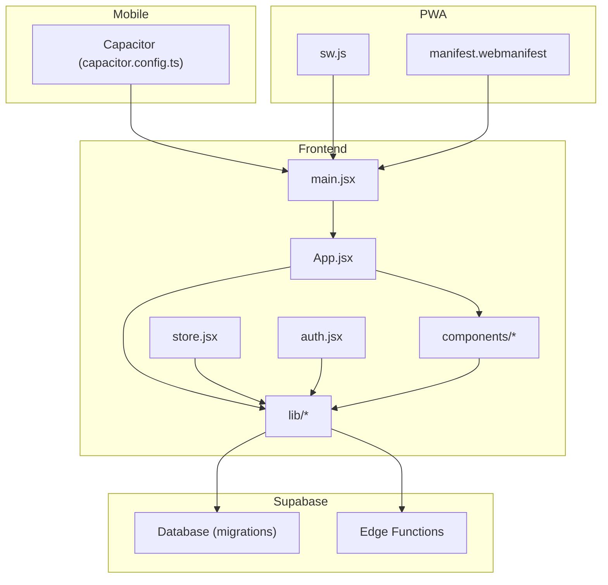
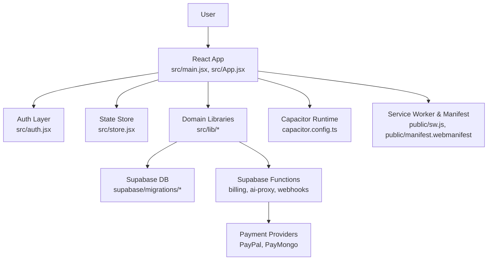
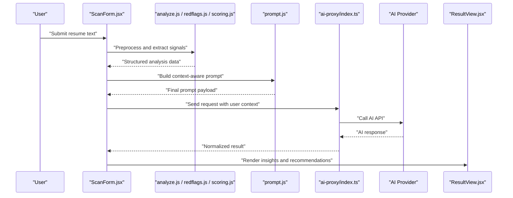
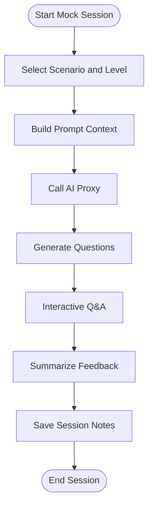
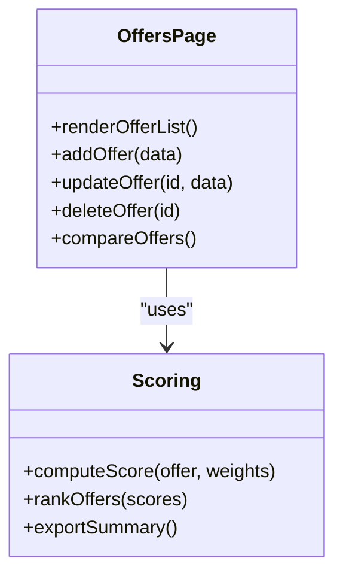
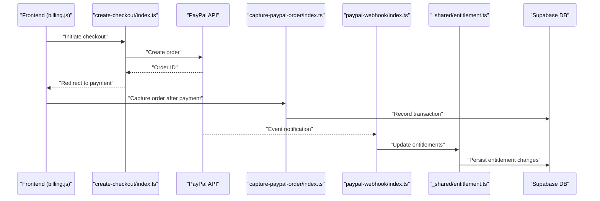
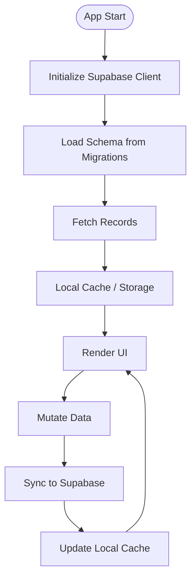
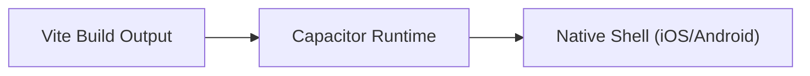
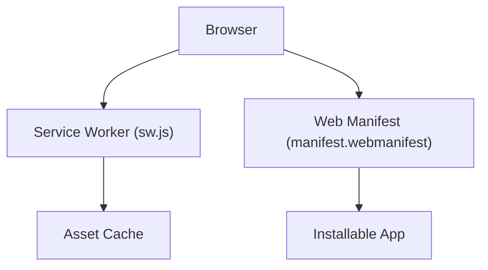
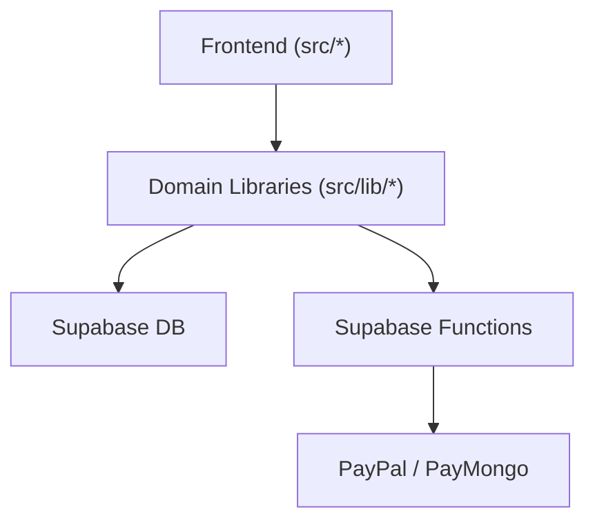

# Project Overview

<cite>
**Referenced Files in This Document**
- [README.md](file://README.md)
- [package.json](file://package.json)
- [src/main.jsx](file://src/main.jsx)
- [src/App.jsx](file://src/App.jsx)
- [src/auth.jsx](file://src/auth.jsx)
- [src/store.jsx](file://src/store.jsx)
- [src/mobile.js](file://src/mobile.js)
- [capacitor.config.ts](file://capacitor.config.ts)
- [supabase/config.toml](file://supabase/config.toml)
- [supabase/migrations/001_schema.sql](file://supabase/migrations/001_schema.sql)
- [supabase/migrations/002_paypal_fulfillment.sql](file://supabase/migrations/002_paypal_fulfillment.sql)
- [supabase/functions/_shared/http.ts](file://supabase/functions/_shared/http.ts)
- [supabase/functions/_shared/paypal.ts](file://supabase/functions/_shared/paypal.ts)
- [supabase/functions/_shared/paypal-runtime.ts](file://supabase/functions/_shared/paypal-runtime.ts)
- [supabase/functions/_shared/entitlement.ts](file://supabase/functions/_shared/entitlement.ts)
- [supabase/functions/create-checkout/index.ts](file://supabase/functions/create-checkout/index.ts)
- [supabase/functions/capture-paypal-order/index.ts](file://supabase/functions/capture-paypal-order/index.ts)
- [supabase/functions/create-paypal-order/index.ts](file://supabase/functions/create-paypal-order/index.ts)
- [supabase/functions/paymongo-webhook/index.ts](file://supabase/functions/paymongo-webhook/index.ts)
- [supabase/functions/paypal-webhook/index.ts](file://supabase/functions/paypal-webhook/index.ts)
- [supabase/functions/ai-proxy/index.ts](file://supabase/functions/ai-proxy/index.ts)
- [src/lib/supabase.js](file://src/lib/supabase.js)
- [src/lib/billing.js](file://src/lib/billing.js)
- [src/lib/entitlement.js](file://src/lib/entitlement.js)
- [src/components/AiAssistant.jsx](file://src/components/AiAssistant.jsx)
- [src/components/MockInterviewPage.jsx](file://src/components/MockInterviewPage.jsx)
- [src/components/OffersPage.jsx](file://src/components/OffersPage.jsx)
- [src/components/ScanForm.jsx](file://src/components/ScanForm.jsx)
- [src/components/Tracker.jsx](file://src/components/Tracker.jsx)
- [src/components/ResultView.jsx](file://src/components/ResultView.jsx)
- [src/components/AccountPage.jsx](file://src/components/AccountPage.jsx)
- [src/components/Layout.jsx](file://src/components/Layout.jsx)
- [src/components/Settings.jsx](file://src/components/Settings.jsx)
- [src/lib/analyze.js](file://src/lib/analyze.js)
- [src/lib/scoring.js](file://src/lib/scoring.js)
- [src/lib/redflags.js](file://src/lib/redflags.js)
- [src/lib/stats.js](file://src/lib/stats.js)
- [src/lib/followups.js](file://src/lib/followups.js)
- [src/lib/prompt.js](file://src/lib/prompt.js)
- [src/lib/ai.js](file://src/lib/ai.js)
- [src/lib/pricing.js](file://src/lib/pricing.js)
- [src/lib/cloud.js](file://src/lib/cloud.js)
- [src/lib/sync.js](file://src/lib/sync.js)
- [src/lib/storage.js](file://src/lib/storage.js)
- [public/sw.js](file://public/sw.js)
- [public/manifest.webmanifest](file://public/manifest.webmanifest)
</cite>

## Table of Contents
1. Introduction
2. Project Structure
3. Core Components
4. Architecture Overview
5. Detailed Component Analysis
6. Dependency Analysis
7. Performance Considerations
8. Troubleshooting Guide
9. Conclusion

## Introduction
ApplyGuard PH is a job application tracking and analysis platform designed to help job seekers organize their applications, prepare for interviews, evaluate offers, and leverage AI-powered insights to improve outcomes. The platform combines a modern web experience with mobile support and secure cloud storage, enabling users to track progress across devices and receive actionable feedback on resumes and interview performance.

Key value propositions:
- Centralized application tracker with analytics and follow-up reminders
- AI-assisted resume scanning and interview preparation
- Offer comparison and decision support
- Subscription-based billing with multiple payment providers
- Cross-platform access via web and mobile (Capacitor)

Target audience:
- Job seekers at all levels who want structured tracking and coaching
- Career coaches and mentors who need visibility into client pipelines
- Students and recent graduates preparing for first roles

Primary use cases:
- Track applications from submission to offer or rejection
- Prepare for interviews using AI-driven mock sessions and feedback
- Compare offers side-by-side with weighted criteria
- Manage subscriptions and unlock premium features

[No sources needed since this section provides general guidance]

## Project Structure
The project follows a feature-oriented frontend layout with Supabase as the backend and serverless functions for payments and AI proxying. Mobile packaging is handled by Capacitor.

Highlights:
- Frontend: React + Vite app under src/, organized by components and domain-specific libraries
- Backend: Supabase database and Edge Functions for billing and AI proxy
- Mobile: Capacitor configuration for building native apps from the same codebase
- PWA: Service worker and manifest for offline-friendly experiences

**Diagram sources**
- [src/main.jsx:1-50](file://src/main.jsx#L1-L50)
- [src/App.jsx:1-120](file://src/App.jsx#L1-L120)
- [src/store.jsx:1-80](file://src/store.jsx#L1-L80)
- [src/auth.jsx:1-60](file://src/auth.jsx#L1-L60)
- [capacitor.config.ts:1-40](file://capacitor.config.ts#L1-L40)
- [public/sw.js:1-40](file://public/sw.js#L1-L40)
- [public/manifest.webmanifest:1-40](file://public/manifest.webmanifest#L1-L40)
- [supabase/migrations/001_schema.sql:1-60](file://supabase/migrations/001_schema.sql#L1-L60)
- [supabase/config.toml:1-40](file://supabase/config.toml#L1-L40)

**Section sources**
- [README.md:1-60](file://README.md#L1-L60)
- [package.json:1-60](file://package.json#L1-L60)
- [src/main.jsx:1-50](file://src/main.jsx#L1-L50)
- [src/App.jsx:1-120](file://src/App.jsx#L1-L120)
- [capacitor.config.ts:1-40](file://capacitor.config.ts#L1-L40)
- [public/sw.js:1-40](file://public/sw.js#L1-L40)
- [public/manifest.webmanifest:1-40](file://public/manifest.webmanifest#L1-L40)
- [supabase/config.toml:1-40](file://supabase/config.toml#L1-L40)

## Core Components
This section outlines the main user-facing features and how they are implemented in the frontend and backend.

- Application Tracker
  - Purpose: Track jobs, statuses, notes, and next actions
  - Key files: Tracker component, stats and follow-ups utilities
  - Data flow: Local state and Supabase sync; analytics computed from stored records

- Resume Scanner and AI Assistant
  - Purpose: Analyze resumes and provide improvement suggestions
  - Key files: Scan form, result view, AI assistant, prompt builder, AI proxy function
  - Data flow: User input -> local analysis helpers -> AI proxy -> results display

- Mock Interview Preparation
  - Purpose: Practice interviews with AI-driven questions and feedback
  - Key files: Mock interview page, AI assistant integration
  - Data flow: Scenario selection -> AI prompts -> interactive Q&A -> summary

- Offers Management
  - Purpose: Compare and manage job offers with scoring and notes
  - Key files: Offers page, scoring utilities
  - Data flow: Offer entries -> scoring model -> comparative views

- Billing and Subscriptions
  - Purpose: Manage plans, entitlements, and payments
  - Key files: Billing library, entitlement checks, checkout and webhook functions
  - Data flow: Checkout initiation -> payment provider -> webhook -> entitlement update

- Account and Settings
  - Purpose: User profile, preferences, and subscription management
  - Key files: Account page, settings component, auth integration

**Section sources**
- [src/components/Tracker.jsx:1-120](file://src/components/Tracker.jsx#L1-L120)
- [src/lib/stats.js:1-80](file://src/lib/stats.js#L1-L80)
- [src/lib/followups.js:1-80](file://src/lib/followups.js#L1-L80)
- [src/components/ScanForm.jsx:1-120](file://src/components/ScanForm.jsx#L1-L120)
- [src/components/ResultView.jsx:1-120](file://src/components/ResultView.jsx#L1-L120)
- [src/components/AiAssistant.jsx:1-120](file://src/components/AiAssistant.jsx#L1-L120)
- [src/lib/prompt.js:1-80](file://src/lib/prompt.js#L1-L80)
- [src/lib/ai.js:1-80](file://src/lib/ai.js#L1-L80)
- [supabase/functions/ai-proxy/index.ts:1-80](file://supabase/functions/ai-proxy/index.ts#L1-L80)
- [src/components/MockInterviewPage.jsx:1-120](file://src/components/MockInterviewPage.jsx#L1-L120)
- [src/components/OffersPage.jsx:1-120](file://src/components/OffersPage.jsx#L1-L120)
- [src/lib/scoring.js:1-80](file://src/lib/scoring.js#L1-L80)
- [src/lib/billing.js:1-120](file://src/lib/billing.js#L1-L120)
- [src/lib/entitlement.js:1-80](file://src/lib/entitlement.js#L1-L80)
- [src/components/AccountPage.jsx:1-120](file://src/components/AccountPage.jsx#L1-L120)
- [src/components/Settings.jsx:1-120](file://src/components/Settings.jsx#L1-L120)
- [src/auth.jsx:1-60](file://src/auth.jsx#L1-L60)

## Architecture Overview
High-level architecture showing how the frontend interacts with Supabase, serverless functions, and optional mobile packaging.

**Diagram sources**
- [src/main.jsx:1-50](file://src/main.jsx#L1-L50)
- [src/App.jsx:1-120](file://src/App.jsx#L1-L120)
- [src/auth.jsx:1-60](file://src/auth.jsx#L1-L60)
- [src/store.jsx:1-80](file://src/store.jsx#L1-L80)
- [src/lib/supabase.js:1-80](file://src/lib/supabase.js#L1-L80)
- [supabase/migrations/001_schema.sql:1-60](file://supabase/migrations/001_schema.sql#L1-L60)
- [supabase/migrations/002_paypal_fulfillment.sql:1-60](file://supabase/migrations/002_paypal_fulfillment.sql#L1-L60)
- [supabase/functions/_shared/http.ts:1-80](file://supabase/functions/_shared/http.ts#L1-L80)
- [supabase/functions/_shared/paypal.ts:1-80](file://supabase/functions/_shared/paypal.ts#L1-L80)
- [supabase/functions/_shared/paypal-runtime.ts:1-80](file://supabase/functions/_shared/paypal-runtime.ts#L1-L80)
- [supabase/functions/_shared/entitlement.ts:1-80](file://supabase/functions/_shared/entitlement.ts#L1-L80)
- [supabase/functions/create-checkout/index.ts:1-80](file://supabase/functions/create-checkout/index.ts#L1-L80)
- [supabase/functions/capture-paypal-order/index.ts:1-80](file://supabase/functions/capture-paypal-order/index.ts#L1-L80)
- [supabase/functions/create-paypal-order/index.ts:1-80](file://supabase/functions/create-paypal-order/index.ts#L1-L80)
- [supabase/functions/paymongo-webhook/index.ts:1-80](file://supabase/functions/paymongo-webhook/index.ts#L1-L80)
- [supabase/functions/paypal-webhook/index.ts:1-80](file://supabase/functions/paypal-webhook/index.ts#L1-L80)
- [capacitor.config.ts:1-40](file://capacitor.config.ts#L1-L40)
- [public/sw.js:1-40](file://public/sw.js#L1-L40)
- [public/manifest.webmanifest:1-40](file://public/manifest.webmanifest#L1-L40)

## Detailed Component Analysis

### Resume Scanning and AI Assistance
This feature allows users to submit resume content for analysis and receive AI-generated feedback. It integrates with an AI proxy function to securely call external models while enforcing rate limits and logging.

**Diagram sources**
- [src/components/ScanForm.jsx:1-120](file://src/components/ScanForm.jsx#L1-L120)
- [src/lib/analyze.js:1-80](file://src/lib/analyze.js#L1-L80)
- [src/lib/redflags.js:1-80](file://src/lib/redflags.js#L1-L80)
- [src/lib/scoring.js:1-80](file://src/lib/scoring.js#L1-L80)
- [src/lib/prompt.js:1-80](file://src/lib/prompt.js#L1-L80)
- [supabase/functions/ai-proxy/index.ts:1-80](file://supabase/functions/ai-proxy/index.ts#L1-L80)
- [src/components/ResultView.jsx:1-120](file://src/components/ResultView.jsx#L1-L120)

**Section sources**
- [src/components/ScanForm.jsx:1-120](file://src/components/ScanForm.jsx#L1-L120)
- [src/lib/analyze.js:1-80](file://src/lib/analyze.js#L1-L80)
- [src/lib/redflags.js:1-80](file://src/lib/redflags.js#L1-L80)
- [src/lib/scoring.js:1-80](file://src/lib/scoring.js#L1-L80)
- [src/lib/prompt.js:1-80](file://src/lib/prompt.js#L1-L80)
- [supabase/functions/ai-proxy/index.ts:1-80](file://supabase/functions/ai-proxy/index.ts#L1-L80)
- [src/components/ResultView.jsx:1-120](file://src/components/ResultView.jsx#L1-L120)

### Mock Interview Preparation
Users can practice interviews through guided scenarios and receive AI feedback. The flow includes scenario selection, question generation, and post-session summaries.

**Diagram sources**
- [src/components/MockInterviewPage.jsx:1-120](file://src/components/MockInterviewPage.jsx#L1-L120)
- [src/components/AiAssistant.jsx:1-120](file://src/components/AiAssistant.jsx#L1-L120)
- [src/lib/prompt.js:1-80](file://src/lib/prompt.js#L1-L80)
- [supabase/functions/ai-proxy/index.ts:1-80](file://supabase/functions/ai-proxy/index.ts#L1-L80)

**Section sources**
- [src/components/MockInterviewPage.jsx:1-120](file://src/components/MockInterviewPage.jsx#L1-L120)
- [src/components/AiAssistant.jsx:1-120](file://src/components/AiAssistant.jsx#L1-L120)
- [src/lib/prompt.js:1-80](file://src/lib/prompt.js#L1-L80)
- [supabase/functions/ai-proxy/index.ts:1-80](file://supabase/functions/ai-proxy/index.ts#L1-L80)

### Offers Management and Scoring
The offers module helps compare multiple offers using configurable criteria and scoring logic. Users can adjust weights and see ranked comparisons.

**Diagram sources**
- [src/components/OffersPage.jsx:1-120](file://src/components/OffersPage.jsx#L1-L120)
- [src/lib/scoring.js:1-80](file://src/lib/scoring.js#L1-L80)

**Section sources**
- [src/components/OffersPage.jsx:1-120](file://src/components/OffersPage.jsx#L1-L120)
- [src/lib/scoring.js:1-80](file://src/lib/scoring.js#L1-L80)

### Subscription Billing and Entitlements
Billing flows integrate with PayPal and PayMongo via Supabase Edge Functions. Webhooks update entitlements and grant access to premium features.

**Diagram sources**
- [src/lib/billing.js:1-120](file://src/lib/billing.js#L1-L120)
- [supabase/functions/create-checkout/index.ts:1-80](file://supabase/functions/create-checkout/index.ts#L1-L80)
- [supabase/functions/capture-paypal-order/index.ts:1-80](file://supabase/functions/capture-paypal-order/index.ts#L1-L80)
- [supabase/functions/paypal-webhook/index.ts:1-80](file://supabase/functions/paypal-webhook/index.ts#L1-L80)
- [supabase/functions/_shared/entitlement.ts:1-80](file://supabase/functions/_shared/entitlement.ts#L1-L80)
- [supabase/migrations/002_paypal_fulfillment.sql:1-60](file://supabase/migrations/002_paypal_fulfillment.sql#L1-L60)

Additional integrations:
- PayMongo webhook handler for alternative payment processing
- Shared HTTP utilities and PayPal runtime helpers

**Section sources**
- [src/lib/billing.js:1-120](file://src/lib/billing.js#L1-L120)
- [src/lib/entitlement.js:1-80](file://src/lib/entitlement.js#L1-L80)
- [supabase/functions/_shared/http.ts:1-80](file://supabase/functions/_shared/http.ts#L1-L80)
- [supabase/functions/_shared/paypal.ts:1-80](file://supabase/functions/_shared/paypal.ts#L1-L80)
- [supabase/functions/_shared/paypal-runtime.ts:1-80](file://supabase/functions/_shared/paypal-runtime.ts#L1-L80)
- [supabase/functions/paymongo-webhook/index.ts:1-80](file://supabase/functions/paymongo-webhook/index.ts#L1-L80)
- [supabase/migrations/002_paypal_fulfillment.sql:1-60](file://supabase/migrations/002_paypal_fulfillment.sql#L1-L60)

### Data Storage and Sync
Data persistence uses Supabase tables defined in migrations. The frontend leverages a shared Supabase client and sync utilities to keep local and remote states consistent.

**Diagram sources**
- [src/lib/supabase.js:1-80](file://src/lib/supabase.js#L1-L80)
- [supabase/migrations/001_schema.sql:1-60](file://supabase/migrations/001_schema.sql#L1-L60)
- [src/lib/sync.js:1-80](file://src/lib/sync.js#L1-L80)
- [src/lib/storage.js:1-80](file://src/lib/storage.js#L1-L80)

**Section sources**
- [src/lib/supabase.js:1-80](file://src/lib/supabase.js#L1-L80)
- [supabase/migrations/001_schema.sql:1-60](file://supabase/migrations/001_schema.sql#L1-L60)
- [src/lib/sync.js:1-80](file://src/lib/sync.js#L1-L80)
- [src/lib/storage.js:1-80](file://src/lib/storage.js#L1-L80)

### Mobile Support with Capacitor
Capacitor wraps the same React build to produce native iOS/Android apps. Configuration defines app metadata and plugin bridges.

**Diagram sources**
- [capacitor.config.ts:1-40](file://capacitor.config.ts#L1-L40)

**Section sources**
- [capacitor.config.ts:1-40](file://capacitor.config.ts#L1-L40)

### PWA Features
A service worker and web manifest enable caching, offline access, and installability.

**Diagram sources**
- [public/sw.js:1-40](file://public/sw.js#L1-L40)
- [public/manifest.webmanifest:1-40](file://public/manifest.webmanifest#L1-L40)

**Section sources**
- [public/sw.js:1-40](file://public/sw.js#L1-L40)
- [public/manifest.webmanifest:1-40](file://public/manifest.webmanifest#L1-L40)

## Dependency Analysis
The frontend depends on domain libraries for analysis, scoring, billing, and AI interactions. Serverless functions encapsulate sensitive operations like payment creation and webhook handling.

**Diagram sources**
- [src/App.jsx:1-120](file://src/App.jsx#L1-L120)
- [src/lib/billing.js:1-120](file://src/lib/billing.js#L1-L120)
- [src/lib/entitlement.js:1-80](file://src/lib/entitlement.js#L1-L80)
- [src/lib/ai.js:1-80](file://src/lib/ai.js#L1-L80)
- [supabase/functions/_shared/entitlement.ts:1-80](file://supabase/functions/_shared/entitlement.ts#L1-L80)
- [supabase/functions/_shared/paypal.ts:1-80](file://supabase/functions/_shared/paypal.ts#L1-L80)

**Section sources**
- [src/App.jsx:1-120](file://src/App.jsx#L1-L120)
- [src/lib/billing.js:1-120](file://src/lib/billing.js#L1-L120)
- [src/lib/entitlement.js:1-80](file://src/lib/entitlement.js#L1-L80)
- [src/lib/ai.js:1-80](file://src/lib/ai.js#L1-L80)
- [supabase/functions/_shared/entitlement.ts:1-80](file://supabase/functions/_shared/entitlement.ts#L1-L80)
- [supabase/functions/_shared/paypal.ts:1-80](file://supabase/functions/_shared/paypal.ts#L1-L80)

## Performance Considerations
- Prefer lightweight local analysis where possible to reduce AI calls
- Cache AI responses and common prompts to minimize latency
- Use pagination and selective field fetching for large datasets
- Debounce heavy computations (scoring, stats) during rapid updates
- Leverage PWA caching for static assets and frequent reads

[No sources needed since this section provides general guidance]

## Troubleshooting Guide
Common areas to check:
- Authentication and session issues: verify auth layer initialization and token refresh
- Billing failures: inspect checkout creation logs, capture order steps, and webhook payloads
- AI proxy errors: review error propagation and retry strategies in the proxy function
- Sync conflicts: ensure optimistic updates reconcile with server state
- Mobile build problems: validate Capacitor config and native plugin compatibility

**Section sources**
- [src/auth.jsx:1-60](file://src/auth.jsx#L1-L60)
- [src/lib/billing.js:1-120](file://src/lib/billing.js#L1-L120)
- [supabase/functions/_shared/http.ts:1-80](file://supabase/functions/_shared/http.ts#L1-L80)
- [supabase/functions/ai-proxy/index.ts:1-80](file://supabase/functions/ai-proxy/index.ts#L1-L80)
- [src/lib/sync.js:1-80](file://src/lib/sync.js#L1-L80)
- [capacitor.config.ts:1-40](file://capacitor.config.ts#L1-L40)

## Conclusion
ApplyGuard PH delivers a cohesive job search experience by combining robust tracking, AI-powered insights, and flexible billing. Its modular architecture separates concerns between UI, domain logic, and backend services, making it maintainable and extensible. With mobile and PWA support, users can engage with the platform across devices while benefiting from reliable data synchronization and secure payment processing.

[No sources needed since this section summarizes without analyzing specific files]