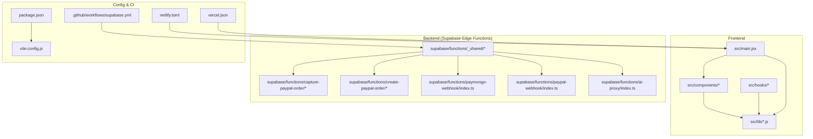
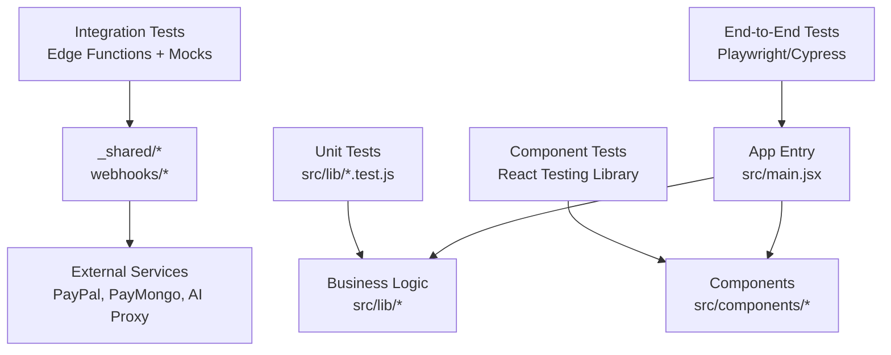
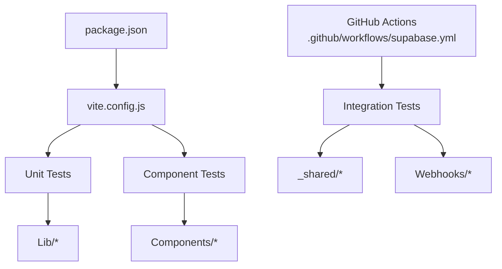

# Testing Strategy

<cite>
**Referenced Files in This Document**
- [package.json](file://package.json)
- [vite.config.js](file://vite.config.js)
- [netlify.toml](file://netlify.toml)
- [vercel.json](file://vercel.json)
- [.github/workflows/supabase.yml](file://.github/workflows/supabase.yml)
- [src/lib/csv.test.js](file://src/lib/csv.test.js)
- [src/lib/entitlement.test.js](file://src/lib/entitlement.test.js)
- [src/lib/followups.test.js](file://src/lib/followups.test.js)
- [src/lib/missing.test.js](file://src/lib/missing.test.js)
- [src/lib/redflags.test.js](file://src/lib/redflags.test.js)
- [src/lib/samples.test.js](file://src/lib/samples.test.js)
- [src/lib/scoring.test.js](file://src/lib/scoring.test.js)
- [src/lib/share.test.js](file://src/lib/share.test.js)
- [src/lib/stats.test.js](file://src/lib/stats.test.js)
- [src/lib/sync.test.js](file://src/lib/sync.test.js)
- [supabase/functions/_shared/paypal.test.ts](file://supabase/functions/_shared/paypal.test.ts)
</cite>

## Table of Contents
1. Introduction
2. Project Structure
3. Core Components
4. Architecture Overview
5. Detailed Component Analysis
6. Dependency Analysis
7. Performance Considerations
8. Troubleshooting Guide
9. Conclusion
10. Appendices

## Introduction
This document defines the testing strategy for ApplyGuard PH, covering unit tests for business logic, component testing patterns, integration tests for external services, test organization, mocking strategies, continuous integration setup, performance and load testing, end-to-end testing procedures, best practices, code coverage requirements, debugging techniques, tool configuration, and test data management. It is designed to be accessible to both technical and non-technical stakeholders while providing actionable guidance grounded in the repository’s current structure.

## Project Structure
The project follows a feature-oriented layout with:
- Frontend application under src/, including components, hooks, lib utilities, and entry points.
- Supabase Edge Functions under supabase/functions/ for backend integrations (billing, webhooks, AI proxy).
- Configuration files for build and deployment (package.json, vite.config.js, netlify.toml, vercel.json).
- GitHub Actions workflow under .github/workflows/.
- Existing unit tests colocated next to their modules using the *.test.js convention in src/lib/, and a TypeScript test file in supabase/functions/_shared/paypal.test.ts.

[No sources needed since this diagram shows conceptual workflow, not actual code structure]

**Section sources**
- [package.json](file://package.json)
- [vite.config.js](file://vite.config.js)
- [netlify.toml](file://netlify.toml)
- [vercel.json](file://vercel.json)
- [.github/workflows/supabase.yml](file://.github/workflows/supabase.yml)

## Core Components
This section outlines the primary areas where testing should focus:
- Business logic libraries under src/lib/: CSV parsing, entitlements, follow-ups, missing items, red flags, samples, scoring, sharing, stats, sync. These are ideal candidates for unit tests due to deterministic inputs/outputs.
- Supabase functions under supabase/functions/_shared/: PayPal helpers and runtime utilities. These integrate with third-party APIs and require careful mocking and contract validation.
- Webhook handlers under supabase/functions/paymongo-webhook/ and paypal-webhook/: Must validate signatures, payloads, and idempotency.
- UI components under src/components/: Should be tested for rendering, user interactions, and state changes via component tests.

Key responsibilities:
- Unit tests verify pure or isolated logic with deterministic assertions.
- Integration tests validate contracts with external services using mocks or sandbox environments.
- Component tests ensure UI correctness and interaction flows.
- End-to-end tests simulate real user journeys across frontend and backend.

**Section sources**
- [src/lib/csv.test.js](file://src/lib/csv.test.js)
- [src/lib/entitlement.test.js](file://src/lib/entitlement.test.js)
- [src/lib/followups.test.js](file://src/lib/followups.test.js)
- [src/lib/missing.test.js](file://src/lib/missing.test.js)
- [src/lib/redflags.test.js](file://src/lib/redflags.test.js)
- [src/lib/samples.test.js](file://src/lib/samples.test.js)
- [src/lib/scoring.test.js](file://src/lib/scoring.test.js)
- [src/lib/share.test.js](file://src/lib/share.test.js)
- [src/lib/stats.test.js](file://src/lib/stats.test.js)
- [src/lib/sync.test.js](file://src/lib/sync.test.js)
- [supabase/functions/_shared/paypal.test.ts](file://supabase/functions/_shared/paypal.test.ts)

## Architecture Overview
Testing architecture aligns with the application layers:
- Unit tests run against src/lib/ modules without network dependencies.
- Integration tests target Supabase Edge Functions with mocked HTTP clients and service stubs.
- Component tests render React components in isolation, simulating events and state updates.
- E2E tests orchestrate full flows from UI to backend endpoints.

[No sources needed since this diagram shows conceptual workflow, not actual code structure]

## Detailed Component Analysis

### Unit Testing Strategy for Business Logic
Focus on src/lib/ modules that implement core algorithms and transformations:
- CSV parsing and transformation
- Entitlement checks and pricing calculations
- Follow-up scheduling and reminders
- Missing item detection and recommendations
- Red flag identification rules
- Sample generation and normalization
- Scoring and statistics aggregation
- Sharing/export utilities
- Sync operations and conflict resolution

Approach:
- Use a lightweight JavaScript test runner compatible with Vite and Node.
- Organize tests alongside source files using the *.test.js naming convention.
- Assert deterministic outputs for given inputs; avoid flaky timing.
- Keep tests fast and isolated; no network calls.

Best practices:
- Parameterized tests for multiple input scenarios.
- Snapshot tests only when output format is stable and intentional.
- Clear error paths for invalid inputs and edge cases.

**Section sources**
- [src/lib/csv.test.js](file://src/lib/csv.test.js)
- [src/lib/entitlement.test.js](file://src/lib/entitlement.test.js)
- [src/lib/followups.test.js](file://src/lib/followups.test.js)
- [src/lib/missing.test.js](file://src/lib/missing.test.js)
- [src/lib/redflags.test.js](file://src/lib/redflags.test.js)
- [src/lib/samples.test.js](file://src/lib/samples.test.js)
- [src/lib/scoring.test.js](file://src/lib/scoring.test.js)
- [src/lib/share.test.js](file://src/lib/share.test.js)
- [src/lib/stats.test.js](file://src/lib/stats.test.js)
- [src/lib/sync.test.js](file://src/lib/sync.test.js)

### Component Testing Patterns
Target React components under src/components/:
- Render minimal UI trees with required props and context.
- Simulate user interactions (clicks, form submissions, navigation).
- Validate state transitions and side effects via spies/stubs.
- Avoid testing implementation details; assert observable behavior.

Recommendations:
- Use React Testing Library for queries and assertions.
- Mock external dependencies (e.g., storage, analytics, billing) at the module level.
- Keep fixtures small and focused; reuse shared helpers for common setups.

[No sources needed since this section provides general guidance]

### Integration Testing for External Services
Focus on Supabase Edge Functions and shared utilities:
- PayPal order creation and capture flows
- Webhook handling for PayMongo and PayPal
- AI proxy routing and request shaping

Approach:
- Mock HTTP clients used by functions to isolate external calls.
- Validate request/response contracts, headers, and status codes.
- Test webhook signature verification and payload parsing.
- Ensure idempotency and error recovery paths.

Mocking strategies:
- Replace fetch or HTTP client implementations with test doubles.
- Provide deterministic responses for success, failure, and partial failures.
- Verify retries and backoff behaviors if implemented.

**Section sources**
- [supabase/functions/_shared/paypal.test.ts](file://supabase/functions/_shared/paypal.test.ts)

### Continuous Integration Setup
Automate testing in CI:
- Run unit and integration tests on every push and pull request.
- Cache dependencies to speed up builds.
- Publish test results and coverage reports.
- Gate merges on passing tests and coverage thresholds.

Configuration anchors:
- package.json scripts for running tests and coverage.
- Vite configuration for environment variables and test compatibility.
- GitHub Actions workflow for Supabase-related tasks.
- Deployment configs for Netlify and Vercel to ensure consistent environments.

**Section sources**
- [package.json](file://package.json)
- [vite.config.js](file://vite.config.js)
- [.github/workflows/supabase.yml](file://.github/workflows/supabase.yml)
- [netlify.toml](file://netlify.toml)
- [vercel.json](file://vercel.json)

### Performance Testing, Load Testing, and E2E Procedures
Performance and load testing:
- Identify hotspots in scoring, CSV processing, and sync operations.
- Use benchmarking tools to measure throughput and latency.
- Simulate realistic datasets to validate memory usage and CPU time.

Load testing:
- Model concurrent users interacting with webhooks and API endpoints.
- Monitor function execution times and error rates under load.
- Tune timeouts and retry policies based on observed metrics.

End-to-end testing:
- Orchestrate flows from UI submission through backend processing to final outcomes.
- Use browser automation to drive user journeys.
- Isolate E2E runs from production by pointing to staging environments.

[No sources needed since this section provides general guidance]

### Best Practices
- Keep tests deterministic and independent.
- Prefer small, focused tests over large monolithic suites.
- Use descriptive names that convey intent and scenario.
- Maintain clear separation between unit, integration, and E2E concerns.
- Regularly review and prune obsolete tests.

[No sources needed since this section provides general guidance]

### Code Coverage Requirements
- Set minimum thresholds for line, branch, and function coverage.
- Exclude generated or trivial code from coverage reporting.
- Track coverage trends over time and alert on regressions.
- Require coverage gates in CI pipelines.

[No sources needed since this section provides general guidance]

### Debugging Techniques for Failing Tests
- Enable verbose logging and stack traces in test runners.
- Use interactive debugging modes provided by your test framework.
- Isolate failing tests with selective execution flags.
- Capture snapshots or logs around critical sections to diagnose drift.
- Reproduce failures locally with the same environment variables and fixtures.

[No sources needed since this section provides general guidance]

### Testing Tools Configuration
- Align test runner with Vite and Node versions defined in package.json.
- Configure environment variables for Supabase and third-party sandboxes.
- Set up coverage reporters and artifact uploads in CI.
- Ensure consistent dependency caching across CI jobs.

**Section sources**
- [package.json](file://package.json)
- [vite.config.js](file://vite.config.js)

### Test Data Management Strategies
- Centralize fixtures and sample datasets under dedicated directories.
- Version control synthetic data but keep sensitive information out of repositories.
- Use factories or builders to generate varied inputs deterministically.
- Separate test-only data from production seeds.

[No sources needed since this section provides general guidance]

## Dependency Analysis
Testing dependencies map closely to application boundaries:
- Unit tests depend only on src/lib/ modules.
- Integration tests depend on Supabase functions and mockable HTTP clients.
- Component tests depend on React Testing Library and minimal app context.
- E2E tests depend on browser automation and staging environments.

**Diagram sources**
- [package.json](file://package.json)
- [vite.config.js](file://vite.config.js)
- [.github/workflows/supabase.yml](file://.github/workflows/supabase.yml)

**Section sources**
- [package.json](file://package.json)
- [vite.config.js](file://vite.config.js)
- [.github/workflows/supabase.yml](file://.github/workflows/supabase.yml)

## Performance Considerations
- Keep unit tests fast by avoiding heavy computations; use smaller datasets.
- Parallelize test execution where possible to reduce CI duration.
- Profile integration tests to identify slow external calls and optimize mocks.
- Monitor memory usage in E2E runs to prevent resource exhaustion.

[No sources needed since this section provides general guidance]

## Troubleshooting Guide
Common issues and resolutions:
- Flaky tests caused by timers or randomness: replace with controlled clocks and deterministic seeds.
- Network errors in integration tests: ensure proper mocking and fallback responses.
- Environment variable mismatches: centralize config and validate presence in CI.
- Coverage gaps: add targeted tests for uncovered branches and error paths.

[No sources needed since this section provides general guidance]

## Conclusion
ApplyGuard PH’s testing strategy emphasizes fast, reliable unit tests for core logic, robust integration tests for external services, and clear component and E2E procedures. By organizing tests co-located with source files, adopting strong mocking strategies, enforcing coverage thresholds, and automating in CI, the team can maintain high quality and confidence across releases.

## Appendices

### Appendix A: Existing Test File Inventory
- src/lib/csv.test.js
- src/lib/entitlement.test.js
- src/lib/followups.test.js
- src/lib/missing.test.js
- src/lib/redflags.test.js
- src/lib/samples.test.js
- src/lib/scoring.test.js
- src/lib/share.test.js
- src/lib/stats.test.js
- src/lib/sync.test.js
- supabase/functions/_shared/paypal.test.ts

**Section sources**
- [src/lib/csv.test.js](file://src/lib/csv.test.js)
- [src/lib/entitlement.test.js](file://src/lib/entitlement.test.js)
- [src/lib/followups.test.js](file://src/lib/followups.test.js)
- [src/lib/missing.test.js](file://src/lib/missing.test.js)
- [src/lib/redflags.test.js](file://src/lib/redflags.test.js)
- [src/lib/samples.test.js](file://src/lib/samples.test.js)
- [src/lib/scoring.test.js](file://src/lib/scoring.test.js)
- [src/lib/share.test.js](file://src/lib/share.test.js)
- [src/lib/stats.test.js](file://src/lib/stats.test.js)
- [src/lib/sync.test.js](file://src/lib/sync.test.js)
- [supabase/functions/_shared/paypal.test.ts](file://supabase/functions/_shared/paypal.test.ts)